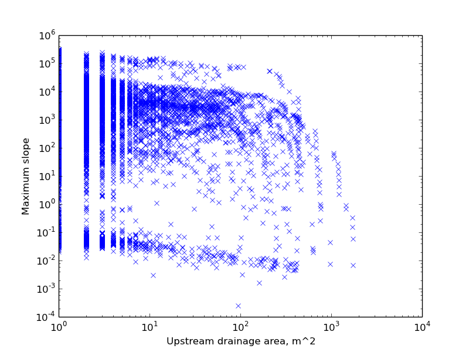

==========================================================
Using Landlab's coupled component capabilities: a tutorial
==========================================================

Landlab is designed as a modular modelling tool. Existing component modules describing
individual geological, geomorphological, and climatic processes can be loaded into a
landlab driver script and run with the minimum of fuss. This document briefly illustrates
how this works in practice, using examples of linear and nonlinear diffusion, dN flow 
routing, and a stream power based fluvial erosion component.

Note that the advantages of many of these modules is that they implement implicit methods,
or are otherwise accelerated above what could be quickly coded up by hand using the
grid methods. In particular, 
:class:`landlab.components.flow_routing.route_flow_dn.FlowRouter` 
is considerably faster than the equivalent grid method 
:func:`landlab.RasterModelGrid.calculate_steepest_descent_across_adjacent_cells`,
exploiting the Braun-Willett (2013) "Fastscape" flow routing algorithms.

Typically, components require you to pass them the model grid object as an input, and
often also a variable representing time elapsed. They normally also demand that you are
storing data on the grid as fields, and might require you to use specific naming 
conventions for those fields. This should all be documented in the docstrings for any
given component.

Example 1: Using the diffusion components
=========================================

A typical Landlab driver has the structure:

    - Import Python packages and Landlab components
    - Import parameters needed to run the model from a .txt file using the ModelParameterDictionary
    - Create an instance of the grid
    - Set up that grid, e.g., boundary conditions, data on the grid
    - Instantiate the component objects
    - Create a loop to actually run the processes, and update the BCs (e.g., uplift)
    - Output, e.g., save data, prep data for plotting, and plot

Open up **landlab/examples/diffusion_driver_2.py** and have a look at it to see how it
follows this structure. It's heavily commented for clarity. It's set up to allow you
to alternate between linear and nonlinear diffusive models, hence the fact we import
both components in lines 1 & 2.

Run the model with linear diffusion, then run it with nonlinear diffusion by switching
which of lines 55 and 56 is commented out. Note that both of these modules are set up to
include uplift internally, so it doesn't need to be manually added in the loop. You can 
run most easily either from the command line using ``python diffusion_driver_2.py``, or
with ``execfile('diffusion_driver_2.py')`` from inside a Python environment (e.g.,
iPython, Canopy, Spyder).

Feel free to play around with the parameters in the input file (which we identify in 
line 10).

It's also worth taking a look at the plotting routines seen from lines 59 onwards:

.. code-block:: python

        for i in xrange(nt):
            #mg = diffuse.diffuse(mg, i*dt) #nonlinear diffusion
            mg = lin_diffuse.diffuse(mg) #linear diffusion
        
            #Plot a Xsection north-south through the middle of the data, once per loop
            pylab.figure(1)
            elev_r = mg.node_vector_to_raster(mg['node']['planet_surface__elevation'])
            im = pylab.plot(mg.dx*np.arange(nrows), elev_r[:,int(ncols//2)])

            print 'Completed loop ', i

        print 'Completed the simulation. Plotting...'
        
        #Finalize and plot:
        #put a title on figure 1
        pylab.figure(1)
        pylab.title('N-S cross_section')
        pylab.xlabel('Distance')
        pylab.ylabel('Elevation')
        
        #figure 2 is the map of the final elevations
        elev = mg['node']['planet_surface__elevation']
        elev_r = mg.node_vector_to_raster(elev)
        pylab.figure(2)
        im = pylab.imshow(elev_r, cmap=pylab.cm.RdBu)  # display a colored image
        pylab.colorbar(im) #add a colorbar
        pylab.title('Topography at end of run') #add a title
        
        pylab.show() #this line displays all of the figures you've issued plot commands for, since you last called show()
        
    
Note the ways we can plot both cross-sections and raster views of the data with minimal
code, the former exploiting the power of Python's `slicing syntax 
<http://wiki.scipy.org/Tentative_NumPy_Tutorial#head-864862d3f2bb4c32f04260fac61eb4ef34788c4c>`_.

Example 2: Using the stream power law component, simple channel profiling
=========================================================================

The driver ``stream_power_driver.py`` illustrates use of the flow routing and stream
power modules together. It also shows the use of the simple channel profiling tool,
:mod:`landlab.plot.channel_profile`.

It follows the same basic driver framework as illustrated in example 1, above. This time,
we leave the top and bottom boundaries of the grid as open, fixed gradient (line 27)::

    mg.set_inactive_boundaries(False, True, False, True)
    
The stream power module is again implicit, designed to allow the model to take larger
timesteps while remaining stable. It is also designed to interface with the route_flow_dn
component, using its output fields 'upstream_ID_order', 'links_to_flow_receiver', 
'drainage_area', and 'flow_receiver' (see the docstrings for the class 
:class:`landlab.components.route_flow.fastscape_stream_power.SPEroder`).
Note that in this case, neither the flow router nor stream power components implicitly
include uplift, so we need to manually include the uplift in the loop::

    for i in xrange(10):
        mg['node']['planet_surface__elevation'][mg.core_nodes] += uplift_per_step
        mg = fr.route_flow(grid=mg)
        mg = sp.erode(mg)

Run the code. The code as it is downloaded is deliberately designed to stop running
while channel networks are still cutting back into the uplifting plateau, as is 
particularly clear in figure 2 of the output. Extend the runtime in the input file
to see the model reach steady state.
It is left to the reader as an exercise to check they understand why each figure looks 
like it does!

Note that the best information on each module is normally found in its docstring.
This can be accessed directly from an interactive python session:

.. code-block:: python

        from landlab.components.flow_routing import route_flow_dn
        help(route_flow_dn)

...or by looking up the module in the online documentation. The easiest way is to follow
the links from the `Landlab ReadTheDocs main page <landlab.readthedocs.org>`_, clicking
*landlab package* under the *API documentation* section. Alternatively, you can enter
the links directly, based on module name:

    `<http://landlab.readthedocs.org/en/latest/landlab.components.flow_routing.html>`_
    `<http://landlab.readthedocs.org/en/latest/landlab.components.stream_power.html>`_

Example 3: Module interaction, and coupling failure
===================================================

Now we're familiar with both diffusive and stream power modules in Landlab, it would be
nice to run them together. ``landlab.examples.coupled_driver.py`` shows an attempt at 
this.

Open it up and have a look. The form of the file should be familiar by now. As before,
we import, instantiate, set up grid, then loop. The basic principle of the looping is
as it has been before:

.. code-block:: python

        #perform the loops:
        for i in xrange(nt):
            #mg = diffuse.diffuse(mg, i*dt)
            mg = lin_diffuse.diffuse(mg, dt)
            mg = fr.route_flow(grid=mg)
            mg = sp.erode(mg)

Notice that again we don't need to include the uplift explicitly, as the diffuser 
incorporates it implicitly. We initialize only the linear diffusion at first.

Linear diffusion model
----------------------

Run the script. It should run stably, and you will again see the set of output graphs
you first saw as part of the stream power exercise. At first glance, everything looks
good. As expected, we still get a dendritic drainage network, but this time - unlike in
the pure stream power case - near the ridges the surface is not channelized and we instead
see diffusively dominated "hillslopes". This is particularly evident in the topography
(figure 2 of the output).

However, all is not entirely well. Take a closer look at Figure 1 of the output, the map
of water discharge over the surface. A possible output is illustrated below:  

.. figure:: broken_coupled_Q.png
    :figwidth: 80%
    :align: center
    
Note the sudden drop in discharge midway downstream visible in the top center of the
figure. You'll probably have one or more of these visible in your output too. Once you
have seen this feature in Figure 1, you'll also be able to see that it has an effect on
the bulk topography of the equivalent valley in the topographic map of Figure 2.

This is clearly an artefact. What's going on? Essentially, at these locations the 
diffusion module is managing to produce a small bump in the fluvial long profile, and so
in the next iteration of the routing and stream power components, flow is dammed at this 
point. Because neither of these modules has any mechanism of damming or ponding built
into it, the flow just terminates here. This is clearly not physically plausible.

The best solution would be to incorporate some model description of flow ponding and
breach into the flow routing module. However, it might also be possible to suppress this
effect by turning down the explicit timestep used in the model. You can experiment with 
this possibility.

Nonlinear diffusion model
-------------------------

Now switch to the nonlinear diffusion component. If you haven't changed any of the 
settings in the driver, you'll immediately end up with problems - the run will possibly 
crash out somewhere near the end, complaining about receiving an empty sequence in the 
``channel_profile.py`` plotting module. Mysterious. If you are paying careful attention
to the script as it runs, you'll also see it dramatically slow down somewhere around
loop 15, which is a clue to what's going on. 

If you reduce the total run time to ~20, so
it terminates before the crash, you'll see what actually is happening here. A look at the 
total  relief on these landscapes shows it to be on the order of 10^5 km (!), and slopes 
(Fig. 5) can get up to ~10^7. However, you will probably still see things that look like 
bizarre drainage networks in the surface:

.. figure:: nonlinear_coupled_topo.png
    :figwidth: 80%
    :align: center
    
.. figure:: nonlinear_coupled_Q.png
    :figwidth: 80%
    :align: center
    

The slopes are a clue as to what is going on here - 
the nonlinear module is unable to process slopes which are already above the angle of
repose when an iteration begins, and the vast majority of this landscape consists of such 
slopes. Why? **The fluvial module is capable of locally oversteepening the landscape to 
beyond the critical angle of repose, which it then passes back to the diffusion component.**
This causes the numerical instabilities in the output in this case - *on top of* the same
kind of considerations we saw in the linear case.

You'll find that by playing around with the input parameters, it is possible to stabilize
the output for the nonlinear model for some combinations of variables. However, the
underlying problem is that the nonlinear diffuser just cannot cope with angles that exceed
its inbuilt angle of repose. We (the LL core development team) have fixing this on our
to-do list, but haven't got to it yet. However, we have included it here as a salutary 
warning to the adventurous Landlab developer - if you're going to go coupling existing
landlab components, it's best to have a good handle on their limitations before you just 
stitch them together!