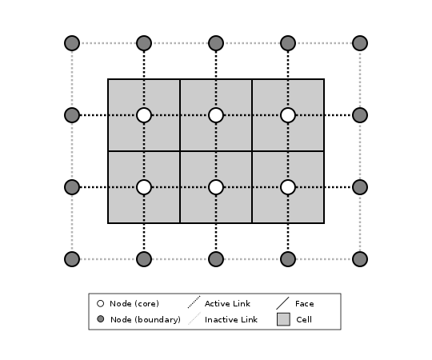
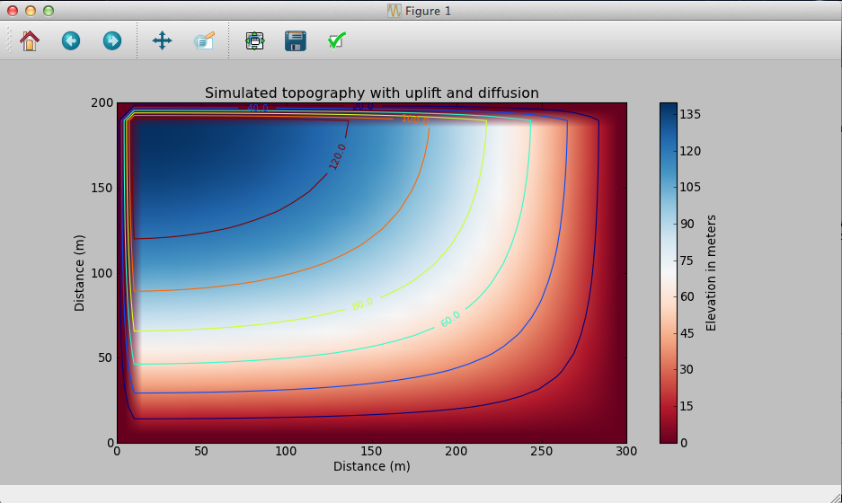
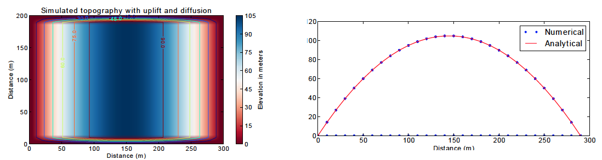
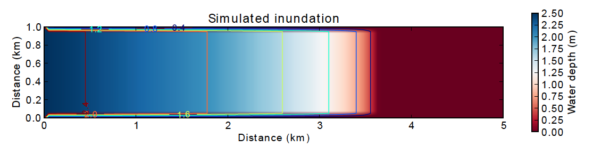
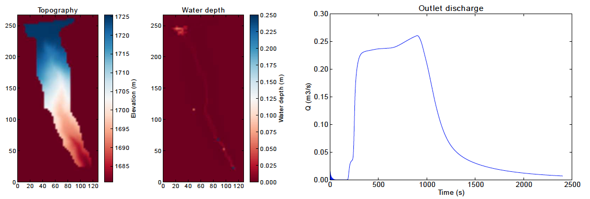
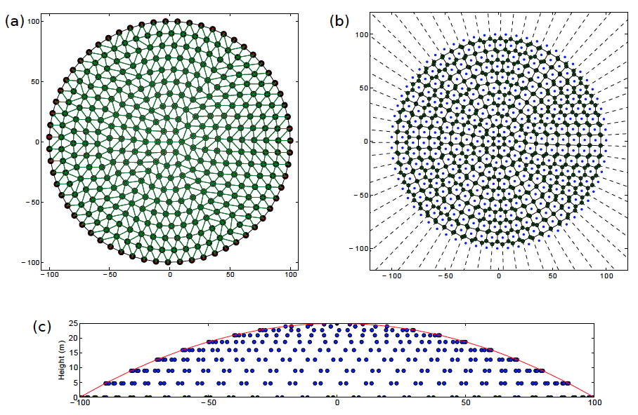

========================================================================
Building Simple Models with Landlab's Gridding Library: A Tutorial Guide
========================================================================

When creating a two-dimensional simulation model, often the most time-consuming and
error-prone task involves writing the code to set up the underlying grid. Irregular
(or "unstructured") grids are especially tricky to implement. Landlab's **ModelGrid**
package makes this process much easier, by providing a set of library routines for
creating and managing a 2D grid, attaching data to the grid, performing common input
and output operations, and  providing library functions that handle common numerical 
operations such as calculating a field of gradients for a particular state variable. 
By taking care of much of the overhead involved in writing grid-management code, 
**ModelGrid** is designed to help you build 2D models quickly and efficiently, freeing you
to concentration on the science behind the code.

Some of the things you can do with **ModelGrid** include:

- Create and configure a structured or unstructured grid in a one or a few lines of code
- Create various data arrays attached to the grid
- Easily implement staggered-grid finite-difference / finite-volume schemes
- Calculate gradients in state variables in a single line
- Calculate net fluxes in/out of grid cells in a single line
- Set up and run "link-based" cellular automaton models
- Switch between structured and unstructured grids without needing to change the rest of
  the code
- Develop complete, 2D numerical finite-volume or finite-difference models much more
  quickly and efficiently than would be possible using straight C, Fortran, Matlab, or 
  Python code

Some of the Landlab capabilities that work with **ModelGrid** to enable easy numerical modeling include:

- Easily read in model parameters from a formatted text file
- Write grid and data output to netCDF files for import into open-source visualization 
  packages such as ParaView and VisIt
- Create grids from ArcGIS-formatted ascii files
- Create models by coupling together your own and/or pre-built process components 
- Use models built by others from process components

This document provides a basic introduction to building applications using
**ModelGrid**. It covers: (1) how grids are represented, and (2) a set of tutorial examples
that illustrate how to build models using simple scripts.

How a Grid is Represented
=========================

Basic Grid Elements
-------------------

.. _grid:

.. figure:: images/grid_schematic_ab.png
    :figwidth: 80%
    :align: center
	
    Figure 1: Elements of a model grid. The main grid elements are nodes, links, and faces. 
    Less commonly used elements include corners, patches, and junctions. In the 
    spring 2015 version of Landlab, **ModelGrid** can implement raster (a) and 
    Voronoi-Delaunay (b) grids, as well as radial and hexagonal grids (not shown).
    (Note that not all links patches are shown, and only one representative cell is 
    shaded.)

:ref:`Figure 1 <grid>` illustrates how **ModelGrid** represents a simulation grid. The
grid contains a set of *(x,y)* points called *nodes*. In a typical
finite-difference or finite-volume model, nodes are the locations at which one tracks 
scalar state variables, such as water depth, land elevation, sea-surface elevation,
or temperature. 

Each adjacent pair of nodes is connected by a line segment known as
a *link*. A link has both a position in space, denoted
by the coordinates of the two bounding nodes, and a direction: a link
runs from one node (known as its *from-node* or "tail-node*) to another (its *to-node* or *head-node*). 

Every node in the grid interior is associated with a polygon known as a *cell* (illustrated,
for example, by the shaded square region in :ref:`Figure 1a <grid>`). Each cell is 
bounded by a set of line segments known as *faces*, which it shares with its neighboring
cells.

In the simple case of a regular (raster) grid, the cells are square, the nodes
are the center points of the cells (:ref:`Figure 1a <grid>`), and the links and faces have
identical length (equal to the node spacing). In a Voronoi-Delaunay grid, the
cells are Voronoi polygons (also known as Theissen polygons)
(:ref:`Figure 1b <grid>`). In this case, each cell represents the surface area that
is closer to its own node than to any other node in the grid. The faces then
represent locations that are equidistant between two neighboring nodes. Other grid
configurations are possible as well. The spring 2015 version of Landlab includes
support for hexagonal and radial grids, which are specialized versions of the 
Voronoi-Delaunay grid shown in :ref:`Figure 1b <grid>`. Note that the node-link-cell-face
topology is general enough to represent other types of grid; for example, one could use
**ModelGrid's** data structures to implement a quad-tree grid, 
or a Delaunay-Voronoi grid in which cells are triangular elements with
nodes at their circumcenters.

Creating a grid is easy.  The first step is to import Landlab's RasterModelGrid class (this 
assumes you have installed landlab and are working in your favorite Python environment):

>>> from landlab import RasterModelGrid

Now, create a regular (raster) grid with 10 rows and 40 columns, with a node spacing (dx) of 5:

>>> mg = RasterModelGrid(10, 40, 5)

*mg* is a grid object. This grid has 400 ( 10*40 ) nodes.  It has 2,330 ( 40*(30-1) + 30*(40-1) ) links.

Adding Data to a Landlab Grid Element using Fields
--------------------------------------------------

Landlab has a data structure called *fields* that will store data associated with different types
of grid elements.  Fields are convenient because 1) fields create data arrays of the proper length for 
the associated data type and 2) fields attach these data to the grid, so that any piece of code that has 
access to the grid also has access to the data stored in fields. Suppose you would like like to
track the elevation at each node.  The following code creates a data field (array) called *elevation* and 
the number of elements in the array is the number of nodes:

>>> z = mg.add_zeros('node', 'elevation')

Here *z* is an array of zeros.  You can that *z* has the same length as the number of nodes:

>>> len(z)
400

Note that *z* is a deep copy of the data stored in the model field.  This means that if you change z, you
also change the data in the ModelGrid's elevation field.  You can also change values directly in the ModelGrid's 
elevation field:

>>> mg.at_node['elevation'][5] = 1000

Now the sixth element in the model's elevation field array, or in *z*, is equal to 1000.  (Remember that the first 
element of a Python array has an index of 0 (zero).

You can see all of the field data at the nodes on *mg* with the following:

>>> mg.at_node.keys()
['elevation']

You may recognize this as a dictionary-type structure, where 
the keys are the names (as strings) of the data arrays. 

There are currently no data assigned to the links, as apparent by the following:

>>> mg. at_link.keys()
[]

Fields can store data at nodes, cells, links, faces, core_nodes, core_cells, active_links, and active_faces.
Core nodes and cells are ones on which the model is performing operations, and active links 
connect two core nodes or a core node with an open boundary node.  The meanings of core, boundary, active and inactive are
described in more detail below [LINK TO BOUNDARY CONDITIONS].  Note that when initializing a field, the singular of the grid  
element type is provided:

>>> veg = mg.add_ones('cell', 'percent_vegetation')
>>> mg.at_cell.keys()
['percent_vegetation']

Note that here *veg* is an array of ones, that has the same length as the number of cells.  Note that there are
no cells around the edge of a grid, so there are less cells than nodes:

>>> len(mg.at_cell['percent_vegetation'])
304

As you can see, fields are convenient because you don't have to keep track of how many nodes, links, cells, etc. 
there are on the grid.  Further it is easy for any part of the code to query what data are already associated with the grid
and operate on these data.

Representing Gradients in a Landlab Grid
----------------------------------------

Finite-difference and finite-volume models usually need to calculate spatial
gradients in one or more scalar variables, and often these gradients are
evaluated between pairs of adjacent nodes. ModelGrid makes these calculations
easier for programmers by providing built-in functions to calculate gradients
along links, and allowing applications to associate an array of gradient values
with their corresponding links or edges. The tutorial examples below illustrate how
this capability can be used to create models of processes such as diffusion and
overland flow.  

Other Grid Elements
-------------------

The cell vertices are called *corners* (:ref:`Figure 1, solid squares <grid>`).
Each face is therefore a line segment connecting two corners. The intersection
of a face and a link (or directed edge) is known as a *junction*
(:ref:`Figure 1, open diamonds <grid>`). Often, it is useful to calculate scalar
values (say, ice thickness in a glacier) at nodes, and vector values (say, ice
velocity) at junctions. This approach is sometimes referred to as a
staggered-grid scheme. It lends itself naturally to finite-volume methods, in
which one computes fluxes of mass, momentum, or energy across cell faces, and
maintains conservation of mass within cells.  (In the spring 2015 version of Lanlab, 
there are no supporting functions for the use of junctions.)

Notice that the links also enclose a set of polygons that are offset from the
cells. These secondary polygons are known as *patches* (:ref:`Figure 1,
dotted <grid>`). This means that any grid comprises two complementary tesselations: one
made of cells, and one made of patches. If one of these is a Voronoi
tessellation, the other is a Delaunay triangulation. For this reason, Delaunay
triangulations and Voronoi diagrams are said to be dual to one another: for any
given Delaunay triangulation, there is a unique corresponding Voronoi diagram. With **ModelGrid,** one can
create a mesh with Voronoi polygons as cells and Delaunay triangles as patches
(:ref:`Figure 1b <grid>`). Alternatively, with a raster grid, one simply has
two sets of square elements that are offset by half the grid spacing
(:ref:`Figure 1a <grid>`). Whatever the form of the tessellation, **ModelGrid** keeps
track of the geometry and topology of the grid.

Managing Grid Boundaries
========================

.. _raster4x5:

    Figure 2: Illustration of a simple four-row by five-column raster grid created with
    :class:`~landlab.grid.raster.RasterModelGrid`. By default, all perimeter
    nodes are tagged as open (fixed value) boundaries, and all interior cells
    are tagged as core. An active link is one that connects either
    two core nodes, or one core node and one open boundary node.

.. _raster4x5openclosed:

    Figure 3: Illustration of a simple four-row by five-column raster grid with a
    combination of open and closed boundaries.

An important component of any numerical model is the method for handling
boundary conditions. In general, it's up to the application developer to manage
boundary conditions for each variable. However, **ModelGrid** makes this task a bit
easier by tagging nodes that are treated as boundaries (*boundary nodes*) and those that are treated as regular nodes belonging to the interior computational domain (*core nodes*). It also allows you to de-activate ("close")
portions of the grid perimeter, so that they effectively act as walls.

Let's look first at how ModelGrid treats its own geometrical boundaries. The
outermost elements of a grid are nodes and links (as opposed to corners and
faces). For example, :ref:`Figure 2 <raster4x5>` shows a sketch of a regular
four-row by five-column grid created by RasterModelGrid. The edges of the grid
are composed of nodes and links. Only the inner six nodes have cells around
them; the remaining 14 nodes form the perimeter of the grid.

All nodes are tagged as either *boundary* or *core*. Those on the
perimeter of the grid are automatically tagged as boundary nodes. Nodes on the
inside are *core* by default, but it is possible to tag some of them as
*boundary* instead (this would be useful, for example, if you wanted to
represent an irregular region, such as a watershed, inside a regular grid). In the example 
shown in :ref:`Figure 2 <raster4x5>`, all the interior nodes are *core*, and all
perimeter nodes are *open boundary*. 

Boundary nodes are flagged as either *open* or *closed*, and links are tagged as 
either *active* or *inactive*. An *active link*
is one that joins either two core nodes, or one *core* and one
*open boundary* node (:ref:`Figure 3 <raster4x5openclosed>`). You can use this
distinction in models to implement closed boundaries by performing flow
calculations only on active links, as the following simple example illustrates.

Examples
========

This section illustrates Landlab's grid capabilities through the use of several examples, 
including a 2D numerical model of diffusion and a model of overland-flow routing.

Example #1: Modeling Diffusion on a Raster Grid
-----------------------------------------------

The following is a simple example in which we use **ModelGrid** to build an explicit, 
finite-volume, staggered-grid model of diffusion. The mathematics of diffusion describe 
several different phenomena, including heat conduction in solids, chemical diffusion 
of solutes, transport of momentum in a viscous shear flow, and transport of 
soil on hillslopes. To make this example concrete, we will use the hillslope evolution as 
our working case study, though in fact the solution could apply to any of these systems.

To work through this example, you can type in and run the code below, or run the file
*diffusion_with_model_grid.py*, which is located in the Landlab developer distribution
under *docs/model_grid_guide*. The complete source code for the diffusion model is listed 
below. Line numbers are 
included to make it easier to refer to particular lines of code (of course, these numbers 
are not part of the source code). After the listing, we will take a closer look at each 
piece of the code in turn. Output from the the diffusion model is shown in 
:ref:`Figure 3 <diff1>`.

.. code-block:: python

	#! /usr/env/python
	"""

	2D numerical model of diffusion, implemented using Landlab's ModelGrid module.
	Provides a simple tutorial example of ModelGrid functionality.

	Last updated GT May 2014

	"""

	from landlab import RasterModelGrid
	import pylab, time

	def main():
		"""
		In this simple tutorial example, the main function does all the work: 
		it sets the parameter values, creates and initializes a grid, sets up 
		the state variables, runs the main loop, and cleans up.
		"""
	
		# INITIALIZE
	
		# User-defined parameter values
		numrows = 20          # number of rows in the grid
		numcols = 30          # number of columns in the grid
		dx = 10.0             # grid cell spacing
		kd = 0.01             # diffusivity coefficient, in m2/yr
		uplift_rate = 0.0001  # baselevel/uplift rate, in m/yr
		num_time_steps = 10000 # number of time steps in run
	
		# Derived parameters
		dt = 0.1*dx**2 / kd    # time-step size set by CFL condition
	
		# Create and initialize a raster model grid
		mg = RasterModelGrid(numrows, numcols, dx)
	
		# Set the boundary conditions
		mg.set_closed_boundaries_at_grid_edges(False, False, True, True)

		# Set up scalar values
		z = mg.add_zeros('node', 'Elevation')            # node elevations
	
		# Get a list of the core cells
		core_cells = mg.get_core_cell_node_ids()

		# Display a message, and record the current clock time
		print( 'Running diffusion_with_model_grid.py' )
		print( 'Time-step size has been set to ' + str( dt ) + ' years.' )
		start_time = time.time()

		# RUN
	
		# Main loop
		for i in range(0, num_time_steps):
		
			# Calculate the gradients and sediment fluxes
			g = mg.calculate_gradients_at_active_links(z)
			qs = -kd*g
		
			# Calculate the net deposition/erosion rate at each node
			dqsds = mg.calculate_flux_divergence_at_nodes(qs)
		
			# Calculate the total rate of elevation change
			dzdt = uplift_rate - dqsds
			
			# Update the elevations
			z[core_cells] = z[core_cells] + dzdt[core_cells] * dt

		# FINALIZE

		# Get a 2D array version of the elevations
		zr = mg.node_vector_to_raster(z)
	
		# Create a shaded image
		pylab.close()  # clear any pre-existing plot
		im = pylab.imshow(zr, cmap=pylab.cm.RdBu, extent=[0,numcols*dx,0,numrows*dx],
						  origin='lower')
		# add contour lines with labels
		cset = pylab.contour(zr, extent=[0,numcols*dx,numrows*dx,0], hold='on',
							 origin='image')
		pylab.clabel(cset, inline=True, fmt='%1.1f', fontsize=10)
	
		# add a color bar on the side
		cb = pylab.colorbar(im)
		cb.set_label('Elevation in meters')
	
		# add a title and axis labels
		pylab.title('Simulated topography with uplift and diffusion')
		pylab.xlabel('Distance (m)')
		pylab.ylabel('Distance (m)')

		# Display the plot
		pylab.show()
		print('Run time = '+str(time.time()-start_time)+' seconds')

	if __name__ == "__main__":
		main()
	   

.. _diff1:

    Figure 4: Output from the hillslope diffusion model.
    
Below we explore how the code works line-by-line.

Importing Packages
>>>>>>>>>>>>>>>>>>

.. code-block:: python

	from landlab import RasterModelGrid
	import pylab, time

We start by importing the grid class ``RasterModelGrid`` from the ``landlab`` package (note that the ``landlab`` package must first be installed; see instructions under :ref:`Installing Landlab <install>`). We'll also import ``pylab`` so we can plot the results, and ``time`` so we can report the time it takes to run the model.

Setting the User-Defined Parameters
>>>>>>>>>>>>>>>>>>>>>>>>>>>>>>>>>>>

.. code-block:: python

		# User-defined parameter values
		numrows = 20          # number of rows in the grid
		numcols = 30          # number of columns in the grid
		dx = 10.0             # grid cell spacing
		kd = 0.01             # diffusivity coefficient, in m2/yr
		uplift_rate = 0.0001  # baselevel/uplift rate, in m/yr
		num_time_steps = 10000 # number of time steps in run

The first thing we'll do in the ``main()`` function is set a group of user-defined parameters. The size of the grid is set by ``numrows`` and ``numcols``, with cell spacing ``dx``. In this example, we have a 20 by 30 grid with 10 m grid spacing, so our domain represents a 200 by 300 m rectangular patch of land. The diffusivity coefficient ``kd`` describes the efficiency of soil creep, while the ``uplift_rate`` indicates how fast the land is rising relative to base level along its boundaries. Finally, we set how many time steps we want to compute.

Note that the code for our simple program lives inside a ``main()`` function. This isn't strictly necessary---we could have put the code in the file without a ``main()`` function and it would work just fine when we run it---but it is good Python practice, and will be helpful later on.

Calculating Derived Parameters
>>>>>>>>>>>>>>>>>>>>>>>>>>>>>>

.. code-block:: python

		# Derived parameters
		dt = 0.1*dx**2 / kd    # time-step size set by CFL condition
		
Next, we calculate the values of parameters that are derived from the user-defined parameters. In this case, we have just one: the time-step size, which is set by the Courant-Friedrichs-Lewy condition for an explicit, finite-difference solution to the diffusion equation (to be on the safe side, we multiply the ratio :math:`\Delta x^2 / k_d` by 0.1 instead of the theoretical limit of 1/2). With the parameter values above, :math:`\Delta t = 1000` years, so our total run duration will be one million years. Remember, though, that the same code could be used for any diffusion application with a source term. For instance, we could model conductive heat flow, with :math:`k_d` representing thermal diffusivity and ``uplift_rate`` representing heat input by, for example, radioactive decay in the earth's crust.

Creating and Configuring the Grid
>>>>>>>>>>>>>>>>>>>>>>>>>>>>>>>>>

.. code-block:: python

    # Create and initialize a raster model grid
    mg = RasterModelGrid(numrows, numcols, dx)
    
    # Set the boundary conditions
    mg.set_closed_boundaries_at_grid_edges(False, False, True, True)

Our model grid is created with a call to ``RasterModelGrid()``. (Object-oriented programmers will recognize this as the syntax for creating a new object---in this case a
raster model grid.) The variable ``mg`` now contains a ``RasterModelGrid`` object that has
been configured with 20 rows and 30 columns.

For our boundary conditions, we would like to keep the nodes along the bottom and right edges of the grid fixed at zero elevation. We also want to have the top and left boundaries represent ridge-lines with a fixed horizontal position and no flow of sediment in or out. To accomplish this, we call the ``set_closed_boundaries_at_grid_edges()`` method. (Note: the term *method* is object-oriented parlance for a function that belongs to a particular class of object, and is always called in reference to a particular object). The method takes four boolean arguments, which indicate whether there should be closed boundary condition on the bottom, right, top, and left sides of the grid. Here we have set the flag to ``True`` for the top and left sides. This means that the links connecting the interior nodes to the perimeter nodes along these two sides will be flagged as inactive, just as illustrated (with a smaller grid) in :ref:`Figure 3 <raster4x5openclosed>`. As we'll see in a moment, we will simply not bother to calculate any mass flux across these closed boundaries.

Creating Data
>>>>>>>>>>>>>

.. code-block:: python

    # Set up scalar values
    z = mg.add_zeros('node', 'Elevation')            # node elevations

Our state variable, :math:`z(x,y,t)`, represents the land surface elevation. One of the unique aspects of ModelGrid is that grid-based variables like :math:`z` are represented as 1D rather than 2D Numpy arrays. Why do it this way, if we have a regular grid that naturally lends itself to 2D arrays? The answer is that we might want to have an irregular, unstructured grid, which is much easier to handle with 1D arrays of values. By using 1D arrays for all types of ModelGrid, we allow the user to switch seamlessly between structured and unstructured grids.

We create our data structure for :math:`z` values with  ``add_zeros()``, a ModelGrid method that creates and returns a 1D Numpy array filled with zeros (behind the scenes, it also "attaches" the array to the grid; we'll see later why this is useful). The length of the array is equal to the number of nodes in the grid (:math:`20\times 30=600`), which makes sense because we want to have an elevation value associated with every node in the grid.

When we update elevation values, we will want to operate only on the core nodes. To help with this, we use the ``core_nodes`` property (a *property* in Python is essentially a variable that belongs to an object, which you can access but not modify directly). This property contains a 1D numpy array of integers that represent the node ID numbers associated with all of the core nodes (of which there are :math:`18\times 28 = 504`). Finally, we display a message to tell the user that we're about to run and with what time step size.

Main Loop
>>>>>>>>>

.. code-block:: python

		# Main loop
		for i in range(0, num_time_steps):

Our model implements a finite-volume solution to the diffusion equation. The idea here is that we calculate sediment fluxes around the perimeter of each cell. We then integrate these fluxes forward in time to calculate the net change in volume, which is divided by the cell's surface area to obtain an equivalent change in height. The numerical solution is given by:

.. math::

	\begin{equation}
	\frac{d z_i}{dt} \approx \frac{z^{T+1}_i-z^T_i}{\Delta t}
	= - \frac{1}{\Lambda_i} \sum_{j=1}^{N_i} \mathbf{q}_{Sij}^T \lambda_{ij}.
	\label{eq:dzdt}
	\end{equation}

Here, :math:`z_i^T` is the elevation at node :math:`i` at time step :math:`T`, :math:`t` is time, :math:`\Lambda_i` is the surface area of cell :math:`i`, :math:`N_i` is the number of nodes adjacent to :math:`i` (called the node's *neighbors*), :math:`\mathbf{q}_{Sij}^T` is the sediment flux per unit face width from cell :math:`i` to cell :math:`j`, and :math:`\lambda_{ij}` is the width of the face between cells :math:`i` and :math:`j`. The flux between a pair of adjacent cells is the product of the slope (positive upward) between their associated nodes, :math:`\mathbf{S}_{ij}`, and a transport coefficient, :math:`k_d`,

.. math::

	\begin{equation}
	\mathbf{q}_{Sij} = - k_d \mathbf{S}_{ij} = - k_d \frac{z_j-z_i}{L_{ij}}
	\end{equation}

where :math:`L_{ij}` is the length of the link connecting nodes :math:`i` and :math:`j`. Notice that elevation values (which are scalars) are associated with nodes, while slopes and sediment fluxes (which are vectors) are associated with links and faces. If we want to think of the slopes and fluxes as being calculated at a particular point, that point is the junction between a link and its corresponding face :ref:`Figure 1 <grid>`.

Because we are using a regular (raster) grid with node spacing :math:`\Delta x`, the face width and link length are both equal to :math:`\Delta x` everywhere, and the cell area :math:`\Lambda=\Delta x^2`. This would not be true, however, for an unstructured grid.

Calculating gradients and sediment fluxes
>>>>>>>>>>>>>>>>>>>>>>>>>>>>>>>>>>>>>>>>>

.. code-block:: python
		
			# Calculate the gradients and sediment fluxes
			g = mg.calculate_gradients_at_active_links(z)
			qs = -kd*g

In order to calculate new elevation values, the first quantity we need to know is the gradient (slope) values between all the node pairs. We can calculate this in a single line of code using ModelGrid's ``calculate_gradients_at_active_links()`` method. This method takes a single argument: a 1D numpy array of scalar values associated with nodes. The length of this array must be the same as the number of nodes in the grid. The method calculates the gradients in ``z`` between each pair of nodes. It returns a 1D numpy array, ``g`` (for gradient), the size of which is the same as the number of active links in the grid (the difference between active and inactive links is illustrated in :ref:`Figure 2 <raster4x5>` and :ref:`3 <raster4x5openclosed>`). The sign of each value of ``g`` is positive when the slope runs uphill from a link's *from-node* to its *to-node*, and negative otherwise.

To calculate the sediment fluxes, we multiply each gradient value by the transport coefficient ``kd``. The minus sign simply means that the sediment goes downhill: where the gradient is negative, the flux should be positive, and vice versa. Here, we are taking advantage of numpy's ability to perform mathematical operations on entire arrays in a single line of code, rather than having to write out a ``for`` loop. The line ``qs = -kd*g`` in our code multiplies ``ks`` by every value of ``g``, and returns the result as a numpy array the same size as ``g``.

Calculating net fluxes in and out of cells
>>>>>>>>>>>>>>>>>>>>>>>>>>>>>>>>>>>>>>>>>>

.. code-block:: python
		
			# Calculate the net deposition/erosion rate at each node
			dqsds = mg.calculate_flux_divergence_at_nodes(qs)
		
Now that we know the unit flux associated with each link and its corresponding cell face, the next thing we need to do is add up the total flux around the perimeter of each cell. In other words, we need to calculate the summation in equation above. Landlab allows us to do this in one line of code, by calling the ``calculate_flux_divergence_at_nodes()`` method. This method takes a single argument: a 1D Numpy array containing the flux per unit width at each face in the grid. The method multiplies each unit flux by its corresponding face width, adds up the fluxes across each face for each cell, and divides the result by the surface area of the cell. It returns a 1D Numpy array that contains the net rate of change of volume per unit cell area. The length of this array is the same as the number of nodes in the grid. We will store the result in ``dqsds``.

If the boundary nodes around the grid perimeter do not have associated cells, why do we bother calculating net fluxes for them? In fact, we do not need to; we could have called the method ``calculate_flux_divergence_at_core_cells()`` instead. This would have given us an array the length of the number of core cells, not nodes (there is one every core node has a corresponding core cell). There are two reasons to do the net flux calculation at all nodes. The first is simply that the node-based method is slightly faster than the cell-based version. The second is that by using nodes, we retain some information about the flow of mass into the open boundary nodes. This could be useful in testing whether our model correctly balances mass (though we do not actually use that capability in this example).

Updating elevations
>>>>>>>>>>>>>>>>>>>

.. code-block:: python
		
			# Calculate the total rate of elevation change
			dzdt = uplift_rate - dqsds
			
			# Update the elevations
			z[core_cells] = z[core_cells] + dzdt[core_cells] * dt

When we calculated flux divergence, we got back an array of numbers, ``dqsds``, that represents the rate of gain or loss of sediment volume per unit area at each node. Now we need to combine this information with the source term---representing vertical motion of the soil relative to the base level at the model's fixed boundaries---in order to calculate the total rate of elevation change at the nodes. Once we've calculated rates of change, we update all node elevations by simply multiplying ``dzdt`` by our time step size. We do not want to change the elevations of the boundary nodes, however, and so we perform the update only on the interior cells. Because we are using numpy arrays, we can isolate the core nodes simply by putting our array of node IDs for core nodes inside square brackets. 

Plotting the Results
>>>>>>>>>>>>>>>>>>>>

.. code-block:: python

		# Get a 2D array version of the elevations
		zr = mg.node_vector_to_raster(z)
	
		# Create a shaded image
		pylab.close()  # clear any pre-existing plot
		im = pylab.imshow(zr, cmap=pylab.cm.RdBu, extent=[0,numcols*dx,0,numrows*dx],
						  origin='lower')
		# add contour lines with labels
		cset = pylab.contour(zr, extent=[0,numcols*dx,numrows*dx,0], hold='on',
							 origin='image')
		pylab.clabel(cset, inline=True, fmt='%1.1f', fontsize=10)
	
		# add a color bar on the side
		cb = pylab.colorbar(im)
		cb.set_label('Elevation in meters')
	
		# add a title and axis labels
		pylab.title('Simulated topography with uplift and diffusion')
		pylab.xlabel('Distance (m)')
		pylab.ylabel('Distance (m)')

		# Display the plot
		pylab.show()
		print('Run time = '+str(time.time()-start_time)+' seconds')

The last section of the ``main`` function plots the result of our calculation. We do this using pylab's ``imshow`` and ``contour`` functions to create a colored image of topography overlain by contours. To use these functions, we need our elevations to be ordered in a 2D array. We obtain a 2D array version of our ``z`` values through a call to RasterModelGrid's ``node_vector_to_raster()`` method.

Running the ``main()`` function
>>>>>>>>>>>>>>>>>>>>>>>>>>>>>>>

.. code-block:: python

	if __name__ == "__main__":
		main()

The last two lines of code are standard Python syntax. They will execute the ``main`` function when the code is run, but not when the code is simply imported as a module.

That's it. The 2D diffusion code is less than 100 lines long. In fact, only about 20 of these actually implement the diffusion calculation; the rest handle plotting, comments, blank lines, etc.

Checking against the analytical solution
>>>>>>>>>>>>>>>>>>>>>>>>>>>>>>>>>>>>>>>>

To test the diffusion model against an analytical solution, we can change the setup to have closed boundaries on two opposite sides, by modifying line 39 to read:

.. code:: python

	mg.set_closed_boundaries_at_grid_edges(True, False, True, False)

This change makes the solution identical in the `y` direction, so that we can compare it with a 1D analytical solution. For a 1D steady state configuration with a constant source term (baselevel lowering) and two fixed boundaries, the elevation field is a parabola:

.. math::

	z(x') = \frac{U}{2K_d} \left( L^2 - x'^2 \right),

where :math:`L` is the half-length of the domain and :math:`x'` is a transformed :math:`x` coordinate such that :math:`x'=0` at the ridge crest. The numerical solution fits the analytical solution quite well (:ref:`Figure 5 <diffan>`).

.. _diffan:

    Figure 5: Output from the hillslope diffusion model, compared with the analytical solution (right, red curve).

Example #2: Overland Flow
-------------------------

In this second example, we look at an implementation of the storage-cell algorithm of Bates et al. (2010) [1]_ for modeling flood inundation. In this example, we will use a flat terrain, and prescribe a water depth of 2.5 meters at the left side of the grid. This will create a wave that travels from left to right across the grid. The output is shown in :ref:`Figure 6 <inundation>`.

.. _inundation:

    
    Figure 6: Simulated flood-wave propagation.

Overland Flow Code Listing
>>>>>>>>>>>>>>>>>>>>>>>>>>

The source code listed below can also be found in the file *overland_flow_with_model_grid.py*.

.. code-block:: python

	#! /usr/env/python
	"""
	2D numerical model of shallow-water flow over topography, using the
	Bates et al. (2010) algorithm for storage-cell inundation modeling.

	Last updated GT May 2014
	"""

	from landlab import RasterModelGrid
	import pylab, time
	import numpy as np

	def main():
		"""
		In this simple tutorial example, the main function does all the work: 
		it sets the parameter values, creates and initializes a grid, sets up 
		the state variables, runs the main loop, and cleans up.
		"""
	
		# INITIALIZE
	
		# User-defined parameter values
		numrows = 20
		numcols = 100
		dx = 50.
		n = 0.03              # roughness coefficient
		run_time = 1800       # duration of run, seconds
		h_init = 0.001        # initial thin layer of water (m)
		h_boundary = 2.5      # water depth at left side (m) 
		g = 9.8
		alpha = 0.2           # time-step factor (ND; from Bates et al., 2010)
	
		# Derived parameters
		ten_thirds = 10./3.   # pre-calculate 10/3 for speed
		elapsed_time = 0.0    # total time in simulation
		report_interval = 2.  # interval to report progress (seconds)
		next_report = time.time()+report_interval   # next time to report progress
	
		# Create and initialize a raster model grid
		mg = RasterModelGrid(numrows, numcols, dx)
	
		# Set up boundaries. We'll have the right and left sides open, the top and
		# bottom closed. The water depth on the left will be 5 m, and on the right 
		# just 1 mm.
		mg.set_closed_boundaries_at_grid_edges(True, False, True, False)
	
		# Set up scalar values
		z = mg.add_zeros('node', 'Land_surface__elevation')   # land elevation
		h = mg.add_zeros('node', 'Water_depth') + h_init     # water depth (m)
		q = mg.create_active_link_array_zeros()  # unit discharge (m2/s)
		dhdt = mg.add_zeros('node', 'Water_depth_time_derivative')
	
		# Left side has deep water
		leftside = mg.left_edge_node_ids()
		h[leftside] = h_boundary
	
		# Get a list of the core nodes
		core_nodes = mg.core_nodes

		# Display a message
		print( 'Running ...' )
		start_time = time.time()

		# RUN
	
		# Main loop
		while elapsed_time < run_time:
			
			# Report progress
			if time.time()>=next_report:
				print('Time = '+str(elapsed_time)+' ('
					  +str(100.*elapsed_time/run_time)+'%)')
				next_report += report_interval
		
			# Calculate time-step size for this iteration (Bates et al., eq 14)
			dtmax = alpha*mg.dx/np.sqrt(g*np.amax(h))
		
			# Calculate the effective flow depth at active links. Bates et al. 2010
			# recommend using the difference between the highest water-surface
			# and the highest bed elevation between each pair of nodes.
			zmax = mg.max_of_link_end_node_values(z)
			w = h+z   # water-surface height
			wmax = mg.max_of_link_end_node_values(w)
			hflow = wmax - zmax
		
			# Calculate water-surface slopes
			water_surface_slope = mg.calculate_gradients_at_active_links(w)
	   
			# Calculate the unit discharges (Bates et al., eq 11)
			q = (q-g*hflow*dtmax*water_surface_slope)/ \
				(1.+g*hflow*dtmax*n*n*abs(q)/(hflow**ten_thirds))
		
			# Calculate water-flux divergence and time rate of change of water depth
			# at nodes
			dhdt = -mg.calculate_flux_divergence_at_nodes(q)
		
			# Second time-step limiter (experimental): make sure you don't allow
			# water-depth to go negative
			if np.amin(dhdt) < 0.:
				shallowing_locations = np.where(dhdt<0.)
				time_to_drain = -h[shallowing_locations]/dhdt[shallowing_locations]
				dtmax2 = alpha*np.amin(time_to_drain)
				dt = np.min([dtmax, dtmax2])
			else:
				dt = dtmax
		
			# Update the water-depth field
			h[core_nodes] = h[core_nodes] + dhdt[core_nodes]*dt
		
			# Update current time
			elapsed_time += dt

	  
		# FINALIZE
	
		# Get a 2D array version of the elevations
		hr = mg.node_vector_to_raster(h)
	
		# Create a shaded image
		pylab.close()  # clear any pre-existing plot
		image_extent = [0, 0.001*dx*numcols, 0, 0.001*dx*numrows] # in km
		im = pylab.imshow(hr, cmap=pylab.cm.RdBu, extent=image_extent)
		pylab.xlabel('Distance (km)', fontsize=12)
		pylab.ylabel('Distance (km)', fontsize=12)
	
		# add contour lines with labels
		cset = pylab.contour(hr, extent=image_extent)
		pylab.clabel(cset, inline=True, fmt='%1.1f', fontsize=10)
	
		# add a color bar on the side
		cb = pylab.colorbar(im)
		cb.set_label('Water depth (m)', fontsize=12)
	
		# add a title
		pylab.title('Simulated inundation')

		# Display the plot
		pylab.show()
		print('Done.')
		print('Total run time = '+str(time.time()-start_time)+' seconds.')

	if __name__ == "__main__":
		main()

Packages
>>>>>>>>

.. code-block:: python

	from landlab import RasterModelGrid
	import pylab, time
	import numpy as np

For this program, we'll need ModelGrid as well as the pylab, time, and numpy packages.

User-Defined Parameters
>>>>>>>>>>>>>>>>>>>>>>>

.. code-block:: python

		# User-defined parameter values
		numrows = 20
		numcols = 100
		dx = 50.
		n = 0.03              # roughness coefficient
		run_time = 1800       # duration of run, seconds
		h_init = 0.001        # initial thin layer of water (m)
		h_boundary = 2.5      # water depth at left side (m) 
		g = 9.8
		alpha = 0.2           # time-step factor (ND; from Bates et al., 2010)
	

Several of the user-defined parameters are the same as those used in the diffusion example: the dimensions and cell size of our raster grid, and the duration of the run. Here the duration is in seconds. In addition, we need to specify the Manning roughness coefficient (``n``), the initial water depth (here set to 1 mm), the water depth along the left-hand boundary, gravitational acceleration, and a time-step factor.

Derived Parameters
>>>>>>>>>>>>>>>>>>

.. code-block:: python

		# Derived parameters
		ten_thirds = 10./3.   # pre-calculate 10/3 for speed
		elapsed_time = 0.0    # total time in simulation
		report_interval = 2.  # interval to report progress (seconds)
		next_report = time.time()+report_interval   # next time to report progress
	
Here, we pre-calculate the value of 10/3 so as to avoid repeating a division operation throughout the main loop. We also set up some variables to track the progress of the run. The elapsed time refers here to model time. In this model, we use a variable time-step size, and so rather than counting through a predetermined number of iterations, we instead keep track of the elapsed run time and halt the simulation when we reach the desired run duration.

The ``report_interval`` refers to clock time rather than run time. Every two seconds of clock time, we will report the percentage completion to the user, so that he/she is aware that the run is progressing and has an idea how much more is left to go. The variable ``next_report`` keeps track of the next time (on the clock) to report progress to the user.

Setting up the grid and state variables
>>>>>>>>>>>>>>>>>>>>>>>>>>>>>>>>>>>>>>>

.. code-block:: python

    # Create and initialize a raster model grid
    mg = RasterModelGrid(numrows, numcols, dx)
    
    # Set up boundaries. We'll have the right and left sides open, the top and
    # bottom closed. The water depth on the left will be 5 m, and on the right 
    # just 1 mm.
    mg.set_closed_boundaries_at_grid_edges(True, False, True, False)
    
    # Set up scalar values
    z = mg.add_zeros('node', 'Land_surface__elevation')   # land elevation
    h = mg.add_zeros('node', 'Water_depth') + h_init     # water depth (m)
    q = mg.create_active_link_array_zeros()  # unit discharge (m2/s)
    dhdt = mg.add_zeros('node', 'Water_depth_time_derivative')
    
    # Left side has deep water
    leftside = mg.left_edge_node_ids()
    h[leftside] = h_boundary
    
    # Get a list of the core nodes
    core_nodes = mg.core_nodes

Next, we create and configure a raster grid. In this example, we'll have the left and right boundaries open and the top and bottom closed; we set this up with a call to ``set_closed_boundaries_at_grid_edges()`` on line 47.

Our key variables are as follows: land elevation, ``z`` (which remains constant and uniform at zero in this example), water depth, ``h`` (which starts out at ``h_init``), discharge per unit width, ``q``, and the rate of change of water depth, ``dhdt``. Three of these---elevation, depth, and :math:`dh/dt`---are scalars that are evaluated at nodes. The fourth, discharge, is evaluated at active links.

In this example, we will have the left boundary maintain a fixed water depth of 2.5 m. To accomplish this, we first obtain a list of the ID numbers of the boundary nodes that lie along the left grid edge by calling RasterModelGrid's ``left_edge_node_ids()`` method, which returns a Numpy array containing the IDs. We then use them to set the new depth values on the following line. Finally, we obtain a list of core node IDs, just as we did in the diffusion example.

Main loop, part 1
>>>>>>>>>>>>>>>>>

.. code-block:: python

    # Main loop
    while elapsed_time < run_time:
        
        # Report progress
        if time.time()>=next_report:
            print('Time = '+str(elapsed_time)+' ('
                  +str(100.*elapsed_time/run_time)+'%)')
            next_report += report_interval
        
        # Calculate time-step size for this iteration (Bates et al., eq 14)
        dtmax = alpha*mg.dx/np.sqrt(g*np.amax(h))
        
        # Calculate the effective flow depth at active links. Bates et al. 2010
        # recommend using the difference between the highest water-surface
        # and the highest bed elevation between each pair of nodes.
        zmax = mg.max_of_link_end_node_values(z)
        w = h+z   # water-surface height
        wmax = mg.max_of_link_end_node_values(w)
        hflow = wmax - zmax
        
        # Calculate water-surface slopes
        water_surface_slope = mg.calculate_gradients_at_active_links(w)
      
        # Calculate the unit discharges (Bates et al., eq 11)
        q = (q-g*hflow*dtmax*water_surface_slope)/ \
            (1.+g*hflow*dtmax*n*n*abs(q)/(hflow**ten_thirds))
        
The main loop uses a ``while`` rather than a ``for`` loop because the time-step size is variable. We begin with a block of code that prints the percentage completion to the screen every two seconds. After this, we calculate a maximum time-step size size using the formula of Bates et al. (2010) [1]_, which depends on grid-cell spacing and on the shallow water wave celerity, :math:`\sqrt{g h}`. For water depth, we use the maximum value in the grid, because it is this value that will have the greatest celerity and therefore be most restrictive.

The next several lines calculate unit discharge values along each active link. To do this, we need to know the effective water depth at each of these locations. Bates et al. (2010) [1]_ recommend using the difference between the highest water-surface elevation and the highest bed-surface elevation at each pair of adjacent nodes---that is, at each active link. To find these maximum values, we call the ``active_link_max()`` method, first with bed elevation, and then with water-surface elevation, ``w``. The resulting effective flow depths at the active links are stored in Numpy array called ``hflow``. 

Calculating discharge also requires us to know the water-surface gradient at each active link. We find this by calling ``calculate_gradients_at_active_links`` and passing it the water-surface height. We then have everything we need to calculate the discharge values using the Bates et al. (2010) [1]_ formula, which is done with the line

.. code::

        q = (q-g*hflow*dtmax*water_surface_slope)/ \
            (1.+g*hflow*dtmax*n*n*abs(q)/(hflow**ten_thirds))

Main loop, part 2
>>>>>>>>>>>>>>>>>

.. code-block:: python

        # Calculate water-flux divergence and time rate of change of water depth
        # at nodes
        dhdt = -mg.calculate_flux_divergence_at_nodes(q)
        
        # Second time-step limiter (experimental): make sure you don't allow
        # water-depth to go negative
        if np.amin(dhdt) < 0.:
            shallowing_locations = np.where(dhdt<0.)
            time_to_drain = -h[shallowing_locations]/dhdt[shallowing_locations]
            dtmax2 = alpha*np.amin(time_to_drain)
            dt = np.min([dtmax, dtmax2])
        else:
            dt = dtmax
        
        # Update the water-depth field
        h[core_nodes] = h[core_nodes] + dhdt[core_nodes]*dt
        
        # Update current time
        elapsed_time += dt

Because we have no source term in the flow equations---we are assuming there is no rainfall or infiltration to add or remove water in each cell---the rate of depth change is equal to :math:`-\nabla q`, the divergence of water discharge. Just as in the diffusion example, we can calculate the flux divergence in a single line with help from the ``calculate_flux_divergence_at_nodes()`` method.

The next block of code provides a second limit on time-step size, designed to prevent water depth from becoming negative. At some locations in the grid, it is possible that the rate of change of water depth will be negative, meaning that the water depth is becoming shallower over time. If we were to extrapolate this shallowing too far into the future, by taking too big a time step, we could end up with negative water depth. To avoid this situation, we first determine whether there are any locations where ``dhdt`` is negative, using the Numpy ``amin`` function. If there are, we call the Numpy ``where`` function to obtain a list of the node IDs at which the water depth is shallowing. The next line calculates the time it would take to reach zero water thickness. We then find the minimum of these time intervals, and multiply it by the ``alpha`` time-step parameter. This ensures that we won't actually completely drain any cells of water. Finally, we determine which limiting time-step is smaller: ``dtmax``, which reflects the limitation due to fluid velocity, or ``dtmax2``, which is the limitation due to cell drainage. If no cells have :math:`dh/dt<0`, then we simply use the fluid-velocity time step size.

We then update the values of water depth at all core nodes. Finally, we increment the total elapsed time.

Plotting the results
>>>>>>>>>>>>>>>>>>>>

.. code-block:: python

    # Get a 2D array version of the elevations
    hr = mg.node_vector_to_raster(h)
    
    # Create a shaded image
    pylab.close()  # clear any pre-existing plot
    image_extent = [0, 0.001*dx*numcols, 0, 0.001*dx*numrows] # in km
    im = pylab.imshow(hr, cmap=pylab.cm.RdBu, extent=image_extent)
    pylab.xlabel('Distance (km)', fontsize=12)
    pylab.ylabel('Distance (km)', fontsize=12)
    
    # add contour lines with labels
    cset = pylab.contour(hr, extent=image_extent)
    pylab.clabel(cset, inline=True, fmt='%1.1f', fontsize=10)
    
    # add a color bar on the side
    cb = pylab.colorbar(im)
    cb.set_label('Water depth (m)', fontsize=12)
    
    # add a title
    pylab.title('Simulated inundation')

    # Display the plot
    pylab.show()
    print('Done.')
    print('Total run time = '+str(time.time()-start_time)+' seconds.')

The final portion of the code uses the RasterModelGrid ``node_vector_to_raster()`` method along with some Pylab functions to create a color image plus contour plot of the water depth at the end of the run. This part of the code is essentially the same as what we used in the diffusion example.

Example 3: Overland Flow using a DEM
------------------------------------

In the next example, we create a version of the storage-cell overland-flow model that uses a digital elevation model (DEM) for the topography, and has the flow fed by rain rather than by a boundary input. In walking through the code, we'll focus only on those aspects that are new. The code is set up to run for 40 minutes (2400 seconds) of flow, which takes about 78 seconds to execute on a 2.7 Ghz Intel Core i7 processor. The complete code listing is below. Output is shown in :ref:`Figure 7 <olflowdem>`.

.. _olflowdem:

    
    Figure 7: Output from a model of overland flow run on a DEM. Left: images showing 
    topography, and water depth at end of run. Right: hydrograph at catchment outlet.

.. code-block:: python

	#! /usr/env/python
	"""
	2D numerical model of shallow-water flow over topography read from a DEM, using
	the Bates et al. (2010) algorithm for storage-cell inundation modeling.

	Last updated GT May 2014
	"""

	from landlab.io import read_esri_ascii
	import time
	import os
	import pylab
	import numpy as np

	def main():
		"""
		In this simple tutorial example, the main function does all the work: 
		it sets the parameter values, creates and initializes a grid, sets up 
		the state variables, runs the main loop, and cleans up.
		"""
	
		# INITIALIZE
	
		# User-defined parameter values
		dem_name = 'ExampleDEM/west_bijou_gully.asc'
		outlet_row = 82
		outlet_column = 38
		next_to_outlet_row = 81
		next_to_outlet_column = 38
		n = 0.06              # roughness coefficient (Manning's n)
		h_init = 0.001        # initial thin layer of water (m)
		g = 9.8               # gravitational acceleration (m/s2)
		alpha = 0.2           # time-step factor (ND; from Bates et al., 2010)
		run_time = 2400       # duration of run, seconds
		rainfall_mmhr = 100   # rainfall rate, in mm/hr
		rain_duration = 15*60 # rainfall duration, in seconds
	
		# Derived parameters
		rainfall_rate = (rainfall_mmhr/1000.)/3600.  # rainfall in m/s
		ten_thirds = 10./3.   # pre-calculate 10/3 for speed
		elapsed_time = 0.0    # total time in simulation
		report_interval = 5.  # interval to report progress (seconds)
		next_report = time.time()+report_interval   # next time to report progress
		DATA_FILE = os.path.join(os.path.dirname(__file__), dem_name)
	
		# Create and initialize a raster model grid by reading a DEM
		print('Reading data from "'+str(DATA_FILE)+'"')
		(mg, z) = read_esri_ascii(DATA_FILE)
		print('DEM has ' + str(mg.number_of_node_rows) + ' rows, ' +
			  str(mg.number_of_node_columns) + ' columns, and cell size ' + str(mg.dx)) + ' m'
	
		# Modify the grid DEM to set all nodata nodes to inactive boundaries
		mg.set_nodata_nodes_to_closed(z, 0) # set nodata nodes to inactive bounds
	
		# Set the open boundary (outlet) cell. We want to remember the ID of the 
		# outlet node and the ID of the interior node adjacent to it. We'll make
		# the outlet node an open boundary.
		outlet_node = mg.grid_coords_to_node_id(outlet_row, outlet_column)
		node_next_to_outlet = mg.grid_coords_to_node_id(next_to_outlet_row, next_to_outlet_column)
		mg.set_fixed_value_boundaries(outlet_node)

		# Set up state variables
		h = mg.add_zeros('node', 'Water_depth') + h_init     # water depth (m)
		q = mg.create_active_link_array_zeros()       # unit discharge (m2/s)
	
		# Get a list of the core nodes
		core_nodes = mg.core_nodes
	
		# To track discharge at the outlet through time, we create initially empty
		# lists for time and outlet discharge.
		q_outlet = []
		t = []
		q_outlet.append(0.)
		t.append(0.)
		outlet_link = mg.active_link_connecting_node_pair(outlet_node, node_next_to_outlet)
	
		# Display a message
		print( 'Running ...' )
		start_time = time.time()

		# RUN
	
		# Main loop
		while elapsed_time < run_time:
		
			# Report progress
			if time.time()>=next_report:
				print('Time = '+str(elapsed_time)+' ('
					  +str(100.*elapsed_time/run_time)+'%)')
				next_report += report_interval
		
			# Calculate time-step size for this iteration (Bates et al., eq 14)
			dtmax = alpha*mg.dx/np.sqrt(g*np.amax(h))
		
			# Calculate the effective flow depth at active links. Bates et al. 2010
			# recommend using the difference between the highest water-surface
			# and the highest bed elevation between each pair of cells.
			zmax = mg.max_of_link_end_node_values(z)
			w = h+z   # water-surface height
			wmax = mg.max_of_link_end_node_values(w)
			hflow = wmax - zmax
		
			# Calculate water-surface slopes
			water_surface_slope = mg.calculate_gradients_at_active_links(w)
	   
			# Calculate the unit discharges (Bates et al., eq 11)
			q = (q-g*hflow*dtmax*water_surface_slope)/ \
				(1.+g*hflow*dtmax*n*n*abs(q)/(hflow**ten_thirds))
		
			# Calculate water-flux divergence at nodes
			dqds = mg.calculate_flux_divergence_at_nodes(q)
		
			# Update rainfall rate
			if elapsed_time > rain_duration:
				rainfall_rate = 0.
		
			# Calculate rate of change of water depth
			dhdt = rainfall_rate-dqds
		
			# Second time-step limiter (experimental): make sure you don't allow
			# water-depth to go negative
			if np.amin(dhdt) < 0.:
				shallowing_locations = np.where(dhdt<0.)
				time_to_drain = -h[shallowing_locations]/dhdt[shallowing_locations]
				dtmax2 = alpha*np.amin(time_to_drain)
				dt = np.min([dtmax, dtmax2])
			else:
				dt = dtmax
		
			# Update the water-depth field
			h[core_nodes] = h[core_nodes] + dhdt[core_nodes]*dt
			h[outlet_node] = h[node_next_to_outlet]
		
			# Update current time
			elapsed_time += dt
		
			# Remember discharge and time
			t.append(elapsed_time)
			q_outlet.append(q[outlet_link])
		
	  
		# FINALIZE
	
		# Set the elevations of the nodata cells to the minimum active cell
		# elevation (convenient for plotting)
		z[np.where(z<=0.)] = 9999            # temporarily change their elevs ...
		zmin = np.amin(z)                    # ... so we can find the minimum ...
		z[np.where(z==9999)] = zmin          # ... and assign them this value.

		# Get a 2D array version of the water depths and elevations
		hr = mg.node_vector_to_raster(h)
		zr = mg.node_vector_to_raster(z)
	
		# Clear previous plots
		pylab.figure(1)
		pylab.close()
		pylab.figure(2)
		pylab.close()
	
		# Plot discharge vs. time
		pylab.figure(1)
		pylab.plot(np.array(t), np.array(q_outlet)*mg.dx)
		pylab.xlabel('Time (s)')
		pylab.ylabel('Q (m3/s)')
		pylab.title('Outlet discharge')
	
		# Plot topography
		pylab.figure(2)
		pylab.subplot(121)
		im = pylab.imshow(zr, cmap=pylab.cm.RdBu,
						  extent=[0, mg.number_of_node_columns * mg.dx,
								  0, mg.number_of_node_rows * mg.dx])
		cb = pylab.colorbar(im)
		cb.set_label('Elevation (m)', fontsize=12)
		pylab.title('Topography')
	
		# Plot water depth
		pylab.subplot(122)
		im2 = pylab.imshow(hr, cmap=pylab.cm.RdBu,
						   extent=[0, mg.number_of_node_columns * mg.dx,
								   0, mg.number_of_node_rows * mg.dx])
		pylab.clim(0, 0.25)
		cb = pylab.colorbar(im2)
		cb.set_label('Water depth (m)', fontsize=12)
		pylab.title('Water depth')
	
		# Display the plots
		pylab.show()
		print('Done.')
		print('Total run time = '+str(time.time()-start_time)+' seconds.')

	if __name__ == "__main__":
		main()

Loading modules
>>>>>>>>>>>>>>>

.. code-block:: python

	from landlab.io import read_esri_ascii
	import time
	import os
	import pylab
	import numpy as np

In order to import the DEM, we will use Landlab's ``read_esri_ascii`` function, so we need to import this. We also need the ``time`` module for timekeeping, ``os`` for manipulating path names, ``pylab`` for plotting, and ``numpy`` for numerical operations. 

User-defined variables
>>>>>>>>>>>>>>>>>>>>>>

.. code-block:: python

    # User-defined parameter values
    dem_name = 'ExampleDEM/west_bijou_gully.asc'
    outlet_row = 82
    outlet_column = 38
    next_to_outlet_row = 81
    next_to_outlet_column = 38
    n = 0.06              # roughness coefficient (Manning's n)
    h_init = 0.001        # initial thin layer of water (m)
    g = 9.8               # gravitational acceleration (m/s2)
    alpha = 0.2           # time-step factor (ND; from Bates et al., 2010)
    run_time = 2400       # duration of run, seconds
    rainfall_mmhr = 100   # rainfall rate, in mm/hr
    rain_duration = 15*60 # rainfall duration, in seconds

We will obtain topography from a 3-m resolution digital elevation model (DEM) of a small gully watershed in the West Bijou Creek drainage basin, east-central Colorado, USA. The drainage area of this catchment is about one hectare. The topography derives from airborne lidar data. The DEM is contained in an ArcInfo-format ascii file called *west_bijou_gully.asc*, located in the *ExampleDEM* folder.

In this example, we will allow flow through a single outlet cell, which we need to flag as a fixed-value boundary. We will also monitor discharge at the outlet. To accomplish these tasks, we need the row and column of the cell that will be used as the outlet and the cell next to it.

Our run will apply water as rainfall, with a rate given by ``rainfall_mmhr`` and a duration given by ``rain_duration``. In fact, in this simple model, we won't allow any infiltration, so the rainfall rate is actually a runoff rate.

Derived parameters
>>>>>>>>>>>>>>>>>>

.. code-block:: python

    # Derived parameters
    rainfall_rate = (rainfall_mmhr/1000.)/3600.  # rainfall in m/s
    ten_thirds = 10./3.   # pre-calculate 10/3 for speed
    elapsed_time = 0.0    # total time in simulation
    report_interval = 5.  # interval to report progress (seconds)
    next_report = time.time()+report_interval   # next time to report progress
    DATA_FILE = os.path.join(os.path.dirname(__file__), dem_name)

In this block of code, we convert the rainfall rate from millimeters per hour to meters per second. We also find the full path name of the input DEM by combining the pathname of the python code file (which is stored in ``__file__``) with the specified DEM file name. We take advantage of the ``dirname`` and ``join`` functions in the OS module.

Reading and initializing the DEM
>>>>>>>>>>>>>>>>>>>>>>>>>>>>>>>>

.. code-block:: python

    # Create and initialize a raster model grid by reading a DEM
    print('Reading data from "'+str(DATA_FILE)+'"')
    (mg, z) = read_esri_ascii(DATA_FILE)
    print('DEM has ' + str(mg.number_of_node_rows) + ' rows, ' +
          str(mg.number_of_node_columns) + ' columns, and cell size ' + str(mg.dx)) + ' m'
    
    # Modify the grid DEM to set all nodata nodes to inactive boundaries
    mg.set_nodata_nodes_to_closed(z, 0) # set nodata nodes to inactive bounds

Landlab's IO module allows us to read an ArcInfo ascii-format DEM with a call to the ``read_esri_ascii()`` method. The function creates and returns a ``RasterModelGrid`` of the correct size and resolution, as well as a Numpy array of node elevation values. In this example, we know that the DEM contains elevations for a small watershed; nodes outside the watershed have a no-data value of zero. We don't want any flow to cross the watershed perimeter except at a single outlet cell. The call to the ModelGrid method ``set_nodata_nodes_to_closed()`` accomplishes this by identifying all nodes for which the corresponding value in ``z`` equals the specified no-data value of zero.

Setting up the watershed outlet
>>>>>>>>>>>>>>>>>>>>>>>>>>>>>>>

.. code-block:: python

    # Set the open boundary (outlet) cell. We want to remember the ID of the 
    # outlet node and the ID of the interior node adjacent to it. We'll make
    # the outlet node an open boundary.
    outlet_node = mg.grid_coords_to_node_id(outlet_row, outlet_column)
    node_next_to_outlet = mg.grid_coords_to_node_id(next_to_outlet_row, 
                                                    next_to_outlet_column)
    mg.set_fixed_value_boundaries(outlet_node)

We will handle the outlet by keeping the water-surface slope the same as the bed-surface slope along the link that leads to the outlet boundary node. To accomplish this, the first thing we need to do is find the ID of the outlet node and the core node adjacent to it. We already know what the row and column numbers of these nodes are; to obtain the corresponding node ID, we use ModelGrid's ``grid_coords_to_node_id`` method. We then convert the outlet node to a fixed-value (i.e., open) boundary with the ``set_fixed_value_boundaries`` method. (Note that in doing this, we've converted what was a core node into a fixed boundary; had we converted a no-data node, we would end up with a waterfall at the outlet because the no-data nodes all have zero elevation, while the interior nodes all have elevations above 1600 m).

Preparing to track discharge at the outlet
>>>>>>>>>>>>>>>>>>>>>>>>>>>>>>>>>>>>>>>>>>

.. code-block:: python

    # To track discharge at the outlet through time, we create initially empty
    # lists for time and outlet discharge.
    q_outlet = []
    t = []
    q_outlet.append(0.)
    t.append(0.)
    outlet_link = mg.active_link_connecting_node_pair(outlet_node, 
                                                          node_next_to_outlet)

For this model, it would be nice to track discharge through time at the watershed outlet. To do this, we create two new lists: one for the time corresponding to each iteration, and one for the outlet discharge. Using lists will be slightly slower than using pre-defined Numpy arrays, but avoids forcing us to guess how many iterations there will be (recall that time-step size depends on the flow conditions in any given iteration). We append zeros to each list to represent the starting condition. To find out which active link represents the watershed outlet, we use ModelGrid's ``active_link_connecting_node_pair()`` method. This method takes a pair of node IDs as arguments. If the nodes are connected by an active link, it returns the ID of that active link; otherwise, it returns ``ModelGrid.BAD_INDEX_VALUE``.

Main loop
>>>>>>>>>

.. code-block:: python

        # Update rainfall rate
        if elapsed_time > rain_duration:
            rainfall_rate = 0.
        
        # Calculate rate of change of water depth
        dhdt = rainfall_rate-dqds

Most of the main loop is identical to what we saw in Example 2, and here we will only list the parts that are new or different. One difference is that we now have a source term that represents rainfall and runoff. The code listed above sets the rainfall rate to zero when the elapsed time is greater than the rainfall duration. It also adds ``rainfall_rate`` as a source term when computing :math:`dh/dt`.

.. code-block:: python

        # Update the water-depth field
        h[core_nodes] = h[core_nodes] + dhdt[core_nodes]*dt
        h[outlet_node] = h[node_next_to_outlet]

After updating water depth values for the core nodes, we also need to update the water depth at the outlet boundary so that it matches the depth at the adjacent node.

.. code-block:: python

        # Remember discharge and time
        t.append(elapsed_time)
        q_outlet.append(q[outlet_link])

The last few lines in the main loop keep track of discharge at the outlet by appending the current time and discharge to their respective lists.

Plotting the result
>>>>>>>>>>>>>>>>>>>

The plotting section is similar to what we saw in the previous two examples. One difference is that we now use two figures: one for the topography and water depth, and one for outlet discharge over time. We also use Pylab's sub-plot capability to place images of topography and water depth side by side.

Using a Different Grid Type
---------------------------

As noted earlier, Landlab provides several different types of grid. Available grids (as of this writing) are listed in the table below. Grids are designed using Python classes, with 
more specialized grids inheriting properties and behavior from more general types. The
class heirarchy is given in the second column, **Inherits from**. 

=======================   =======================   ==================   ================
Grid type                 Inherits from             Node arrangement     Cell geometry
=======================   =======================   ==================   ================
``RasterModelGrid``       ``ModelGrid``             raster               squares
``VoronoiDelaunayGrid``   ``ModelGrid``             Delaunay triangles   Voronoi polygons
``HexModelGrid``          ``VoronoiDelaunayGrid``   triagonal            hexagons
``RadialModelGrid``       ``VoronoiDelaunayGrid``   concentric           Voronoi polygons
=======================   =======================   ==================   ================

In a *VoronoiDelaunay* grid, a set of node coordinates is given as an initial condition. Landlab then forms a
Delaunay triangulation, so that the links between nodes are the edges of the triangles, and the cells are Voronoi polygons. A *HexModelGrid* is a special type of *VoronoiDelaunay* grid in which the Voronoi cells happen to be regular hexagons. In a *RadialModelGrid*, nodes
are created in concentric circles and then connected to form a Delaunay triangulation (again with Voronoi polygons as cells). The next example illustrates the use of a 
*RadialModelGrid*.

Hillslope diffusion with a radial grid
--------------------------------------

Suppose that we wanted to model the long-term evolution, via hillslope soil creep, of a volcanic island. A radial, semi-structured arrangement of grid nodes might be a good solution. To start, we'll look at the highly idealized case of a perfectly circular island that is subject to uniform baselevel lowering along its edges (as if it were shaped like a gigantic undersea column, and sea-level were steadily falling). We can implement such a model simply by making a few small changes to our previous diffusion-model code. 

A radial model grid is defined by specifying a number of concentric ``shells'' of a given radial spacing. We'll change portion of the original (raster) diffusion code that sets up grid geometry to the following:

.. code-block:: python

    # User-defined parameter values
    num_shells=10         # number of radial "shells" in the grid
    #numcols = 30         # not needed for a radial model grid
    dr = 10.0             # grid cell spacing

Note that we have changed ``dx`` to ``dr``; ``dr`` represents the distance between concentric "shells" of nodes. To create a RadialModelGrid instead of a RasterModelGrid, we simply replace the name of the object ``RasterModelGrid`` with ``RadialModelGrid``.

.. code-block:: python

    # Create and initialize a radial model grid
    mg = RadialModelGrid(num_shells, dr)

Finally, because our grid is now no longer a simple raster, we need to modify our plotting code. Here we'll replace the original plotting commands 
with the following:

.. code-block:: python

    # Plot the points, colored by elevation
    import numpy
    maxelev = numpy.amax(z)
    for i in range(mg.number_of_nodes):
        mycolor = str(z[i]/maxelev)
        pylab.plot(mg.node_x[i], mg.node_y[i], 'o', color=mycolor, ms=10)
    
    mg.display_grid()
    
    # Plot the points from the side, with analytical solution
    pylab.figure(3)
    L = num_shells*dr
    xa = numpy.arange(-L, L+dr, dr)
    z_analytical = (uplift_rate/(4*kd))*(L*L-xa*xa)
    pylab.plot(mg.node_x, z, 'o')
    pylab.plot(xa, z_analytical, 'r-')
    pylab.xlabel('Distance from center (m)')
    pylab.ylabel('Height (m)')
    
    pylab.show()

The result of our run is shown below.

    Figure 8: Hillslope diffusion model implemented with a radial model grid. (a) Nodes and links. Green nodes are active interior points, and red nodes are open boundaries. Active links in green; inactive links in black. Node gray shading is proportional to height. (b) Voronoi diagram, highlighting cells. Blue dots are nodes, and green circles are corners (cell vertices. Lines are faces (Voronoi polygon edges, sometimes called "Voronoi ridges"). Dashed lines show orientation of undefined Voronoi edges. (c) Side view of model, showing nodes (blue dots) in comparison with analytical solution (red curve). All axes in meters.

Where to go next?
=================

All of the codes in these exercises are available in the Landlab distribution, under the folder *docs/model_grid_guide*.

 
.. [1] Bates, P., M. Horritt, and T. Fewtrell (2010), A simple inertial formulation of the shallow water equations for efficient two-dimensional flood inundation modelling, Journal of Hydrology, 387(1), 33–45.
