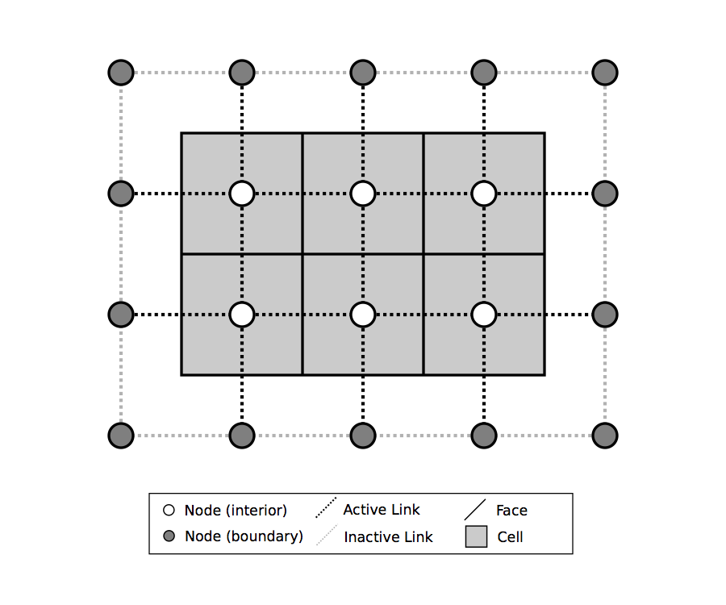
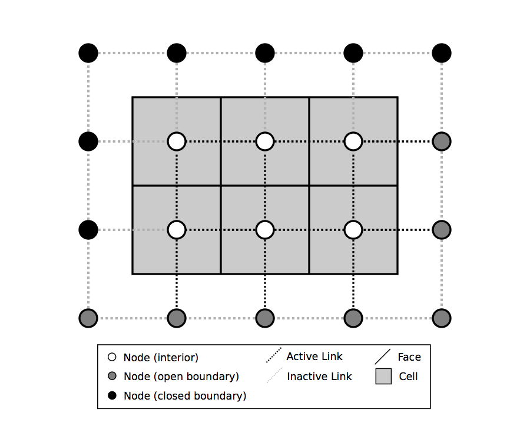

========================================================================
Building Simple Models with Landlab's Gridding Library: A Tutorial Guide
========================================================================

(NOTE: currently, this web version of the Model Grid Guide is incomplete and not fully 
formatted. You can obtain a :download:`PDF version here <model_grid_guide/model_grid_description_and_guide.pdf>`.)

When creating a two-dimensional simulation model, often the most time-consuming and
error-prone task involves writing the code to set up the underlying grid. Irregular
(or ``unstructured'') grids are especially tricky to implement. Landlab's **ModelGrid**
package makes this process much easier, by providing a set of library routines for
creating and managing a 2D grid, attaching data to the grid, performing common input
and output operations, and  providing library functions that handle common numerical 
operations such as calculating a field of gradients for a particular state variable. 
By taking care of much of the overhead involved in writing grid-management code, 
**ModelGrid** is designed to help you build 2D models quickly and efficiently, freeing you
to concentration on the science behind the code.

Some of the things you can do with **ModelGrid** include:

- Create and configure a structured or unstructured grid in a one or a few lines of code
- Create various data arrays attached to the grid
- Easily implement staggered-grid finite-difference / finite-volume schemes
- Calculate gradients in state variables in a single line
- Calculate net fluxes in/out of grid cells in a single line
- Easily read in model parameters from a formatted text file
- Write grid and data output to netCDF files for import into open-source visualization 
  packages such as ParaView and VisIt
- Set up and run ``link-based'' cellular automaton models
- Switch between structured and unstructured grids without needing to change the rest of
  the code
- Develop complete, 2D numerical finite-volume or finite-difference models much more
  quickly and efficiently than would be possible using straight C, Fortran, Matlab, or 
  Python code
- Create models by coupling together your own and/or pre-built process components (note 
  that this capability is still under development as of Spring 2014)
- Use models built by others from process components

This document provides a basic introduction to building applications using
**ModelGrid**. It covers: (1) how grids are represented, and (2) a set of tutorial examples
that illustrate how to build models using simple scripts.

How a Grid is Represented
=========================

Basic Grid Elements
-------------------

.. _grid:

.. figure:: grid_schematic.png
    :scale: 50 %

    Elements of a model grid. The main grid elements are nodes, links, and faces. 
    Less commonly used elements include corners, patches, and junctions. In the 
    spring 2014 version of Landlab, **ModelGrid** can implement raster (a) and 
    Voronoi-Delaunay (b) grids, as well as radial and hexagonal grids (not shown).
    (Note that not all links patches are shown, and only one representative cell is 
    shaded.)

:ref:`Figure 1 <grid>` illustrates how **ModelGrid** represents a simulation grid. The
grid contains a set of *(x,y)* points called *nodes*. In a typical
finite-difference or finite-volume model, nodes are the locations at which one tracks 
scalar state variables, such as water depth, land elevation, sea-surface elevation,
or temperature. 

Each adjacent pair of nodes is connected by a line segment known as
a *link*. A link has both a position in space, denoted
by the coordinates of the two bounding nodes, and a direction: a link
runs from one node (know as its ``from node'') to another (its ``to node''). 

Every node in the grid interior is associated with a polygon known as a ``cell`` (illustrated,
for example, by the shaded square region in :ref:`Figure 1a <grid>`). Each cell is 
bounded by a set of line segments known as *faces*, which it shares with its neighboring
cells.

In the simple case of a regular (raster) grid, the cells are square, the nodes
are the center points of the cells (:ref:`Figure 1a <grid>`), and the links and faces have
identical length (equal to the node spacing). In a Voronoi-Delaunay grid, the
cells are Voronoi polygons (also known as Theissen polygons)
(:ref:`Figure 1b <grid>`). In this case, each cell represents the surface area that
is closer to its own node than to any other node in the grid. The faces then
represent locations that are equidistant between two neighboring nodes. Other grid
configurations are possible as well. The spring 2014 version of Landlab includes
support for hexagonal and radial grids, which are specialized versions of the 
Voronoi-Delaunay grid shown in :ref:`Figure 1b <grid>`. Note that the node-link-cell-face
topology is general enough to represent other types of grid; for example, one could use
**ModelGrid's** data structures to implement a quad-tree grid (:ref:`Figure 1c <grid>`), 
or a Delaunay-Voronoi grid in which cells are triangular elements with
nodes at their circumcenters (:ref:`Figure 1d <grid>`).

Representing Gradients in a Landlab Grid
----------------------------------------

Finite-difference and finite-volume models usually need to calculate spatial
gradients in one or more scalar variables, and often these gradients are
evaluated between pairs of adjacent nodes. ModelGrid makes these calculations
easier for programmers by providing built-in functions to calculate gradients
along links, and allowing applications to associate an array of gradient values
with their corresponding links or edges. The tutorial examples below illustrate how
this capability can be used to create models of processes such as diffusion and
overland flow.

Other Grid Elements
-------------------

The cell vertices are called ``corners`` (:ref:`Figure 1, solid squares <grid>`).
Each face is therefore a line segment connecting two corners. The intersection
of a face and a link (or directed edge) is known as a ``junction``
(:ref:`Figure 1, open diamonds <grid>`). Often, it is useful to calculate scalar
values (say, ice thickness in a glacier) at nodes, and vector values (say, ice
velocity) at junctions. This approach is sometimes referred to as a
staggered-grid scheme. It lends itself naturally to finite-volume methods, in
which one computes fluxes of mass, momentum, or energy across cell faces, and
maintains conservation of mass within cells
\citep[e.g.,][]{versteeg2007introduction}.

Notice that the links also enclose a set of polygons that are offset from the
cells. These secondary polygons are known as ``patches`` (:ref:`Figure 1,
dotted <grid>`). This means that any grid comprises two complementary tesselations: one
made of cells, and one made of patches. If one of these is a Voronoi
tessellation, the other is a Delaunay triangulation. For this reason, Delaunay
triangulations and Voronoi diagrams are said to be dual to one another: for any
given Delaunay triangulation, there is a unique corresponding Voronoi diagram
\citep[e.g.,][]{braun1997modelling,tucker2001object}. With ModelGrid, one can
create a mesh with either Voronoi polygons or Delaunay triangles as cells
(:ref:`Figure 1b and d <grid>`). Alternatively, with a raster grid, one simply has
two sets of square elements that are offset by half the grid spacing
(:ref:`Figure 1a <grid>`). Whatever the form of the tessellation, **ModelGrid** keeps
track of the geometry and topology of the grid. For example, one can call
various ModelGrid functions to obtain lists of the *(x,y)* coordinates of
nodes, corners, and junctions; get lists of neighbors for any cell; get the
endpoints of any link or directed edge, and so on. These functions are listed
and described below. 

Managing Grid Boundaries
========================

.. _raster4x5:

    Illustration of a simple four-row by five-column raster grid created with
    :class:`~landlab.grid.raster.RasterModelGrid`. By default, all perimeter
    nodes are tagged as open (fixed value) boundaries, and all interior cells
    are tagged as core. An active link is one that connects either
    two core nodes, or one core node and one open boundary node.

.. _raster4x5openclosed:

    Illustration of a simple four-row by five-column raster grid with a
    combination of open and closed boundaries.

An important component of any numerical model is the method for handling
boundary conditions. In general, it's up to the application developer to manage
boundary conditions for each variable. However, **ModelGrid** makes this task a bit
easier by providing lists of nodes and links that lie along the boundary of the
grid, and those that lie in the interior. It also allows you to de-activate
portions of the grid perimeter, so that they effectively act as walls.

Let's look first at how ModelGrid treats its own geometrical boundaries. The
outermost elements of a grid are nodes and links (as opposed to corners and
faces). For example, :ref:`Figure 2 <raster4x5>` shows a sketch of a regular
four-row by five-column grid created by RasterModelGrid. The edges of the grid
are composed of nodes and links. Only the inner six nodes have cells around
them; the remaining 14 nodes form the perimeter of the grid.

All nodes are tagged as either *boundary* or *core*. Those on the
perimeter of the grid are automatically tagged as boundary nodes. Nodes on the
inside are *core* by default, but it is possible to tag some of them as
*boundary* instead (this would be useful, for example, if you wanted to
represent an irregular region, such as a watershed, inside a regular grid). In the example 
shown in :ref:`Figure 2 <raster4x5>`, all the interior nodes are *core*, and all
perimeter nodes are *open boundary*. 

Boundary nodes are flagged as either *open* or *closed*, and links are tagged as 
either *active* or *inactive*. An *active link*
is one that joins either two core nodes, or one *core* and one
*open boundary* node (:ref:`Figure 3 <raster4x5openclosed>`). You can use this
distinction in models to implement closed boundaries by performing flow
calculations only on active links, as the following simple example illustrates.

Example #1: Diffusion
=====================

The following is a simple tutorial in which we use **ModelGrid** to build an explicit, 
finite-volume, staggered-grid model of diffusion. The mathematics of diffusion describe 
quite a few different phenomena, among them heat conduction in solids, chemical diffusion 
of dissolved material, transport of momentum in a viscous shear flow, and transport of 
soil on hillslopes. To make this exercise concrete, we will use the latter as our working 
example, though in fact the solution could apply to any of these systems.

To work through this example, you can type in and run the code below, or run the file
*diffusion_with_model_grid.py*, which is located in the Landlab developer distribution
under *docs/model_grid_guide*. The complete source code for the diffusion model is listed below. Line numbers are 
included to make it easier to refer to particular lines of code (of course, these numbers 
are not part of the source code). After the listing, we will take a closer look at each 
piece of the code in turn. Output from the the diffusion model is shown in 
Figure~\ref{basicdiffmod}.

.. code:: python number-lines : 1

