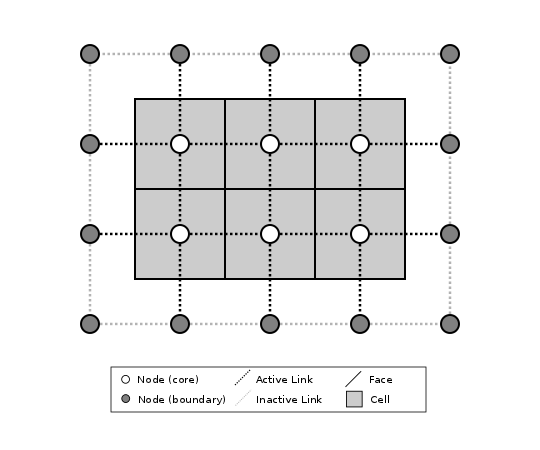
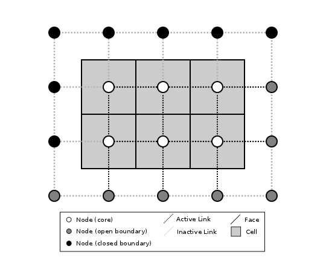

========================================================================
Introduction to Landlab's Gridding Library
========================================================================

When creating a two-dimensional simulation model, often the most time-consuming and
error-prone task involves writing the code to set up the underlying grid. Irregular
(or "unstructured") grids are especially tricky to implement. Landlab's **ModelGrid**
package makes this process much easier, by providing a set of library routines for
creating and managing a 2D grid, attaching data to the grid, performing common input
and output operations, and  providing library functions that handle common numerical 
operations such as calculating a field of gradients for a particular state variable. 
By taking care of much of the overhead involved in writing grid-management code, 
**ModelGrid** is designed to help you build 2D models quickly and efficiently, freeing you
to concentration on the science behind the code.

Some of the things you can do with **ModelGrid** include:

- Create and configure a structured or unstructured grid in a one or a few lines of code
- Create various data arrays attached to the grid
- Easily implement staggered-grid finite-difference / finite-volume schemes
- Calculate gradients in state variables in a single line
- Calculate net fluxes in/out of grid cells in a single line
- Set up and run "link-based" cellular automaton models
- Switch between structured and unstructured grids without needing to change the rest of
  the code
- Develop complete, 2D numerical finite-volume or finite-difference models much more
  quickly and efficiently than would be possible using straight C, Fortran, Matlab, or 
  Python code

Some of the Landlab capabilities that work with **ModelGrid** to enable easy numerical modeling include:

- Easily read in model parameters from a formatted text file
- Write grid and data output to netCDF files for import into open-source visualization 
  packages such as ParaView and VisIt
- Create grids from ArcGIS-formatted ascii files
- Create models by coupling together your own and/or pre-built process components 
- Use models built by others from process components

This document provides a basic introduction to building applications using
**ModelGrid**. It covers: (1) how grids are represented, and (2) a set of tutorial examples
that illustrate how to build models using simple scripts.

How a Grid is Represented
=========================

Basic Grid Elements
-------------------

.. _grid:

.. figure:: images/grid_schematic_ab.png
    :figwidth: 80%
    :align: center
	
    Figure 1: Elements of a model grid. The main grid elements are nodes, links, and faces. 
    Less commonly used elements include corners, patches, and junctions. In the 
    spring 2015 version of Landlab, **ModelGrid** can implement raster (a) and 
    Voronoi-Delaunay (b) grids, as well as radial and hexagonal grids (not shown).
    (Note that not all links patches are shown, and only one representative cell is 
    shaded.)

:ref:`Figure 1 <grid>` illustrates how **ModelGrid** represents a simulation grid. The
grid contains a set of *(x,y)* points called *nodes*. In a typical
finite-difference or finite-volume model, nodes are the locations at which one tracks 
scalar state variables, such as water depth, land elevation, sea-surface elevation,
or temperature. 

Each adjacent pair of nodes is connected by a line segment known as
a *link*. A link has both a position in space, denoted
by the coordinates of the two bounding nodes, and a direction: a link
runs from one node (known as its *from-node* or "tail-node*) to another (its *to-node* or *head-node*). 

Every node in the grid interior is associated with a polygon known as a *cell* (illustrated,
for example, by the shaded square region in :ref:`Figure 1a <grid>`). Each cell is 
bounded by a set of line segments known as *faces*, which it shares with its neighboring
cells.

In the simple case of a regular (raster) grid, the cells are square, the nodes
are the center points of the cells (:ref:`Figure 1a <grid>`), and the links and faces have
identical length (equal to the node spacing). In a Voronoi-Delaunay grid, the
cells are Voronoi polygons (also known as Theissen polygons)
(:ref:`Figure 1b <grid>`). In this case, each cell represents the surface area that
is closer to its own node than to any other node in the grid. The faces then
represent locations that are equidistant between two neighboring nodes. Other grid
configurations are possible as well. The spring 2015 version of Landlab includes
support for hexagonal and radial grids, which are specialized versions of the 
Voronoi-Delaunay grid shown in :ref:`Figure 1b <grid>`. Note that the node-link-cell-face
topology is general enough to represent other types of grid; for example, one could use
**ModelGrid's** data structures to implement a quad-tree grid, 
or a Delaunay-Voronoi grid in which cells are triangular elements with
nodes at their circumcenters.

Creating a grid is easy.  The first step is to import Landlab's RasterModelGrid class (this 
assumes you have installed landlab and are working in your favorite Python environment):

>>> from landlab import RasterModelGrid

Now, create a regular (raster) grid with 10 rows and 40 columns, with a node spacing (dx) of 5:

>>> mg = RasterModelGrid(10, 40, 5)

*mg* is a grid object. This grid has 400 ( 10*40 ) nodes.  It has 2,330 ( 40*(30-1) + 30*(40-1) ) links.

Adding Data to a Landlab Grid Element using Fields
--------------------------------------------------

Landlab has a data structure called *fields* that will store data associated with different types
of grid elements.  Fields are convenient because 1) fields create data arrays of the proper length for 
the associated data type and 2) fields attach these data to the grid, so that any piece of code that has 
access to the grid also has access to the data stored in fields. Suppose you would like like to
track the elevation at each node.  The following code creates a data field (array) called *elevation* and 
the number of elements in the array is the number of nodes:

>>> z = mg.add_zeros('node', 'elevation')

Here *z* is an array of zeros.  You can that *z* has the same length as the number of nodes:

>>> len(z)
400

Note that *z* is a deep copy of the data stored in the model field.  This means that if you change z, you
also change the data in the ModelGrid's elevation field.  You can also change values directly in the ModelGrid's 
elevation field:

>>> mg.at_node['elevation'][5] = 1000

Now the sixth element in the model's elevation field array, or in *z*, is equal to 1000.  (Remember that the first 
element of a Python array has an index of 0 (zero).

You can see all of the field data at the nodes on *mg* with the following:

>>> mg.at_node.keys()
['elevation']

You may recognize this as a dictionary-type structure, where 
the keys are the names (as strings) of the data arrays. 

There are currently no data assigned to the links, as apparent by the following:

>>> mg. at_link.keys()
[]

Fields can store data at nodes, cells, links, faces, core_nodes, core_cells, active_links, and active_faces.
Core nodes and cells are ones on which the model is performing operations, and active links 
connect two core nodes or a core node with an open boundary node.  The meanings of core, boundary, active and inactive are
described in more detail below [LINK TO BOUNDARY CONDITIONS].  Note that when initializing a field, the singular of the grid  
element type is provided:

>>> veg = mg.add_ones('cell', 'percent_vegetation')
>>> mg.at_cell.keys()
['percent_vegetation']

Note that here *veg* is an array of ones, that has the same length as the number of cells.  Note that there are
no cells around the edge of a grid, so there are less cells than nodes:

>>> len(mg.at_cell['percent_vegetation'])
304

As you can see, fields are convenient because you don't have to keep track of how many nodes, links, cells, etc. 
there are on the grid.  Further it is easy for any part of the code to query what data are already associated with the grid
and operate on these data.

Representing Gradients in a Landlab Grid
----------------------------------------

Finite-difference and finite-volume models usually need to calculate spatial
gradients in one or more scalar variables, and often these gradients are
evaluated between pairs of adjacent nodes. ModelGrid makes these calculations
easier for programmers by providing built-in functions to calculate gradients
along links, and allowing applications to associate an array of gradient values
with their corresponding links or edges. The tutorial examples on the following
pages illustrate how this capability can be used to create models of processes 
such as diffusion and overland flow.  

Here we simply illustrate the method for 
calculating gradients on the links.  Remember that we have already created the 
elevation array z, which is also accesible from the elevation field on *mg*.

>>> gradients = mg. calculate_gradients_at_active_links(z)

Now gradients have been calculated at all links that are active, or links on which 
flow is possible (see boundary conditions below).  

Other Grid Elements
-------------------

The cell vertices are called *corners* (:ref:`Figure 1, solid squares <grid>`).
Each face is therefore a line segment connecting two corners. The intersection
of a face and a link (or directed edge) is known as a *junction*
(:ref:`Figure 1, open diamonds <grid>`). Often, it is useful to calculate scalar
values (say, ice thickness in a glacier) at nodes, and vector values (say, ice
velocity) at junctions. This approach is sometimes referred to as a
staggered-grid scheme. It lends itself naturally to finite-volume methods, in
which one computes fluxes of mass, momentum, or energy across cell faces, and
maintains conservation of mass within cells.  (In the spring 2015 version of Lanlab, 
there are no supporting functions for the use of junctions.)

Notice that the links also enclose a set of polygons that are offset from the
cells. These secondary polygons are known as *patches* (:ref:`Figure 1,
dotted <grid>`). This means that any grid comprises two complementary tesselations: one
made of cells, and one made of patches. If one of these is a Voronoi
tessellation, the other is a Delaunay triangulation. For this reason, Delaunay
triangulations and Voronoi diagrams are said to be dual to one another: for any
given Delaunay triangulation, there is a unique corresponding Voronoi diagram. With **ModelGrid,** one can
create a mesh with Voronoi polygons as cells and Delaunay triangles as patches
(:ref:`Figure 1b <grid>`). Alternatively, with a raster grid, one simply has
two sets of square elements that are offset by half the grid spacing
(:ref:`Figure 1a <grid>`). Whatever the form of the tessellation, **ModelGrid** keeps
track of the geometry and topology of the grid.

Managing Grid Boundaries
========================

.. _raster4x5:

    Figure 2: Illustration of a simple four-row by five-column raster grid created with
    :class:`~landlab.grid.raster.RasterModelGrid`. By default, all perimeter
    nodes are tagged as open (fixed value) boundaries, and all interior cells
    are tagged as core. An active link is one that connects either
    two core nodes, or one core node and one open boundary node.

.. _raster4x5openclosed:

    Figure 3: Illustration of a simple four-row by five-column raster grid with a
    combination of open and closed boundaries.

An important component of any numerical model is the method for handling
boundary conditions. In general, it's up to the application developer to manage
boundary conditions for each variable. However, **ModelGrid** makes this task a bit
easier by tagging nodes that are treated as boundaries (*boundary nodes*) and those that are treated as regular nodes belonging to the interior computational domain (*core nodes*). It also allows you to de-activate ("close")
portions of the grid perimeter, so that they effectively act as walls.

Let's look first at how ModelGrid treats its own geometrical boundaries. The
outermost elements of a grid are nodes and links (as opposed to corners and
faces). For example, :ref:`Figure 2 <raster4x5>` shows a sketch of a regular
four-row by five-column grid created by RasterModelGrid. The edges of the grid
are composed of nodes and links. Only the inner six nodes have cells around
them; the remaining 14 nodes form the perimeter of the grid.

All nodes are tagged as either *boundary* or *core*. Those on the
perimeter of the grid are automatically tagged as boundary nodes. Nodes on the
inside are *core* by default, but it is possible to tag some of them as
*boundary* instead (this would be useful, for example, if you wanted to
represent an irregular region, such as a watershed, inside a regular grid). In the example 
shown in :ref:`Figure 2 <raster4x5>`, all the interior nodes are *core*, and all
perimeter nodes are *open boundary*. 

Boundary nodes are flagged as either *open* or *closed*, and links are tagged as 
either *active* or *inactive*. An *active link*
is one that joins either two core nodes, or one *core* and one
*open boundary* node (:ref:`Figure 3 <raster4x5openclosed>`). You can use this
distinction in models to implement closed boundaries by performing flow
calculations only on active links, as the following simple example illustrates.

Using a Different Grid Type
===========================

As noted earlier, Landlab provides several different types of grid. Available grids (as of this writing) are listed in the table below. Grids are designed using Python classes, with 
more specialized grids inheriting properties and behavior from more general types. The
class heirarchy is given in the second column, **Inherits from**. 

=======================   =======================   ==================   ================
Grid type                 Inherits from             Node arrangement     Cell geometry
=======================   =======================   ==================   ================
``RasterModelGrid``       ``ModelGrid``             raster               squares
``VoronoiDelaunayGrid``   ``ModelGrid``             Delaunay triangles   Voronoi polygons
``HexModelGrid``          ``VoronoiDelaunayGrid``   triagonal            hexagons
``RadialModelGrid``       ``VoronoiDelaunayGrid``   concentric           Voronoi polygons
=======================   =======================   ==================   ================

In a *VoronoiDelaunay* grid, a set of node coordinates is given as an initial condition. Landlab then forms a
Delaunay triangulation, so that the links between nodes are the edges of the triangles, and the cells are Voronoi polygons. A *HexModelGrid* is a special type of *VoronoiDelaunay* grid in which the Voronoi cells happen to be regular hexagons. In a *RadialModelGrid*, nodes
are created in concentric circles and then connected to form a Delaunay triangulation (again with Voronoi polygons as cells). The next example illustrates the use of a 
*RadialModelGrid*.
