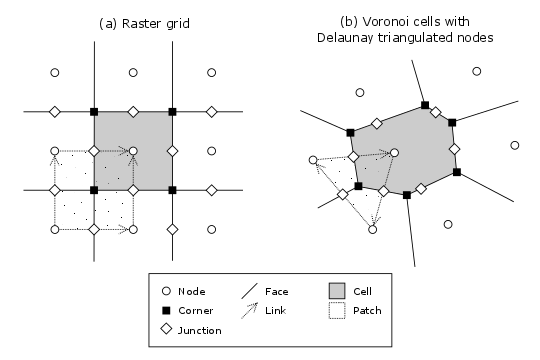

.. _model_grid_description:

Introduction to Landlab's Gridding Library
===========================================

When creating a two-dimensional simulation model, often the most time-consuming and
error-prone task involves writing the code to set up the underlying grid. Irregular
(or "unstructured") grids are especially tricky to implement. Landlab's **ModelGrid**
package makes this process much easier, by providing a set of library routines for
creating and managing a 2D grid, attaching data to the grid, performing common input
and output operations, and  providing library functions that handle common numerical 
operations such as calculating a field of gradients for a particular state variable. 
By taking care of much of the overhead involved in writing grid-management code, 
**ModelGrid** is designed to help you build 2D models quickly and efficiently, freeing you
to concentration on the science behind the code.

Some of the things you can do with **ModelGrid** include:

- Create and configure a structured or unstructured grid in a one or a few lines of code
- Create various data arrays attached to the grid
- Easily implement staggered-grid finite-difference / finite-volume schemes
- Calculate gradients in state variables in a single line
- Calculate net fluxes in/out of grid cells in a single line
- Set up and run "link-based" cellular automaton models
- Switch between structured and unstructured grids without needing to change the rest of
  the code
- Develop complete, 2D numerical finite-volume or finite-difference models much more
  quickly and efficiently than would be possible using straight C, Fortran, Matlab, or 
  Python code

Some of the Landlab capabilities that work with **ModelGrid** to enable easy numerical modeling include:

- Easily read in model parameters from a formatted text file
- Write grid and data output to netCDF files for import into open-source visualization 
  packages such as ParaView and VisIt
- Create grids from ArcGIS-formatted ascii files
- Create models by coupling together your own and/or pre-built process components 
- Use models built by others from process components

This document provides a basic introduction to building applications using
**ModelGrid**. It covers: (1) how grids are represented, and (2) a set of tutorial examples
that illustrate how to build models using simple scripts.

How a Grid is Represented
=========================

Basic Grid Elements
-------------------

.. _grid:

	
    *Figure 1*: Elements of a model grid. The main grid elements are nodes, links, cells, 
    and faces. 
    Less commonly used elements include corners, patches, and junctions. In the 
    spring 2015 version of Landlab, **ModelGrid** can implement raster (a) and 
    Voronoi-Delaunay (b) grids. Ordered subtypes of Voronoi-Delaunay grids - radial 
    and hexagonal - are also available.
    (Note that not all links and atches are shown, and only one representative cell is 
    shaded.)

:ref:`Figure 1 <grid>` illustrates how **ModelGrid** represents a simulation grid. The
grid contains a set of *(x,y)* points called *nodes*. In a typical
finite-difference or finite-volume model, nodes are the locations at which one tracks 
scalar state variables, such as water depth, land elevation, sea-surface elevation,
or temperature. 

Each adjacent pair of nodes is connected by a line segment known as
a *link*. A link has both a position in space, denoted
by the coordinates of the two bounding nodes, and a direction: a link
runs from one node (known as its *from-node* or *tail-node*) to another 
(its *to-node* or *head-node*). 

Every node in the grid interior is associated with a polygon known as a *cell* (illustrated,
for example, by the shaded square region in :ref:`Figure 1a <grid>`). Each cell is 
bounded by a set of line segments known as *faces*, which it shares with its neighboring
cells.

In the simple case of a regular (raster) grid, the cells are square, the nodes
are the center points of the cells (:ref:`Figure 1a <grid>`), and the links and faces have
identical length (equal to the node spacing). In a Voronoi-Delaunay grid, the
cells are Voronoi polygons (also known as Theissen polygons)
(:ref:`Figure 1b <grid>`). In this case, each cell represents the surface area that
is closer to its own node than to any other node in the grid. The faces then
represent locations that are equidistant between two neighboring nodes. Other grid
configurations are possible as well. The spring 2015 version of Landlab includes
support for hexagonal and radial grids, which are specialized versions of the 
Voronoi-Delaunay grid shown in :ref:`Figure 1b <grid>`. Note that the node-link-cell-face
topology is general enough to represent other types of grid; for example, one could use
**ModelGrid's** data structures to implement a quad-tree grid, 
or a Delaunay-Voronoi grid in which cells are triangular elements with
nodes at their circumcenters.

Creating a grid is easy.  The first step is to import Landlab's 
:class:`~landlab.grid.raster.RasterModelGrid` class (this 
assumes you have installed landlab and are working in your favorite Python environment):

>>> from landlab import RasterModelGrid

Now, create a regular (raster) grid with 10 rows and 40 columns, with a node spacing (dx) of 5:

>>> mg = RasterModelGrid(10, 40, 5.)

*mg* is a grid object. This grid has 400 ( 10*40 ) nodes.  It has 2,330 ( 40*(30-1) + 30*(40-1) ) links.

.. _fields:

Adding Data to a Landlab Grid Element using Fields
--------------------------------------------------

Landlab has a data structure called *fields* that will store data associated with different types
of grid elements.  Fields are convenient because 1) fields create data arrays of the proper length for 
the associated data type and 2) fields attach these data to the grid, so that any piece of code that has 
access to the grid also has access to the data stored in fields. Suppose you would like like to
track the elevation at each node.  The following code creates a data field (array) called *elevation* and 
the number of elements in the array is the number of nodes:

>>> z = mg.add_zeros('node', 'elevation')

Here *z* is an array of zeros.  You can that *z* has the same length as the number of nodes:

>>> z.size  #or len(z)
400

Note that *z* is a reference to the data stored in the model field.  This means that if you change z, you
also change the data in the ModelGrid's elevation field.  You can also change values directly in the ModelGrid's 
elevation field:

>>> mg.at_node['elevation'][5] = 1000.

or the alternative notation:

>>> mg['node']['elevation'][5]
1000.

Now the sixth element in the model's elevation field array, or in *z*, is equal to 1000.  (Remember that the first 
element of a Python array has an index of 0 (zero).

You can see all of the field data at the nodes on *mg* with the following:

>>> mg.at_node.keys()
['elevation']

You may recognize this as a dictionary-type structure, where 
the keys are the names (as strings) of the data arrays. 

There are currently no data assigned to the links, as apparent by the following:

>>> mg.at_link.keys()
[]

It is also possible, and indeed, often quite useful, to initialize a field from an
existing numpy array of data. You can do this with the 
:func:`~landlab.field.grouped.ModelDataFields.add_field` method.
This method also allows slightly more granular control over how the method gets created,
e.g., you can force a copy of the data to be made, or you can assign units to the field.

>>> import numpy as np
>>> elevs_in = np.random.rand(mg.number_of_nodes)
>>> mg.add_field('node', 'elevation', elevs_in, units='m', copy=True, noclobber=True)

..
    Dan has taken all reference to active_links, core_cells, etc out of this
    section, as it's not best practice.

Fields can store data at nodes, cells, links, faces, patches, junctions, and corners (though the 
latter two or three are very rarely, if ever, used). Which of these you select is 
described in Landlab jargon as that field's *centering* or *group*, and you will 
sometimes see this  as an input to various grid methods.

Access only the core nodes, active links, or some other subset of node values using the
properties available through the modelgrid:

>>> core_node_elevs = mg.at_node['elevation'][mg.core_nodes]

Note that when initializing a field, the singular of the grid  
element type is provided:

>>> veg = mg.add_ones('cell', 'percent_vegetation')
>>> mg.at_cell.keys()
['percent_vegetation']

Note that here *veg* is an array of ones, that has the same length as the number of cells.  Note that there are
no cells around the edge of a grid, so there are less cells than nodes:

>>> mg.at_cell['percent_vegetation'].size
304

As you can see, fields are convenient because you don't have to keep track of how many nodes, links, cells, etc. 
there are on the grid.  Further it is easy for any part of the code to query what data are already associated with the grid
and operate on these data.

You are free to call your fields whatever you want. However, many Landlab components 
require that you use :ref:`Landlab’s standard names <standard_names>`. 
The standard names required can be 
accessed individually for each component with the properties 
*component_instance._input_var_names* and *component_instance._output_var_names* 
(returned as dictionaries), and should also be listed in the docstring for each component.

We also maintain this list of all the :ref:`Landlab standard names <standard_name_list>`.

..
    We don't have a standard list yet. We should.
    internal link goes on "direct compatibility"

Our fields also offer direct compatibility with `CSDMS’s standard naming system for 
variables <http://csdms.colorado.edu/wiki/CSDMS_Standard_Names>`_. 
However, note that, for ease of use and readability, Landlab standard 
names are typically much shorter than CSDMS standard names. We anticipate that future 
Landlab versions will be able to automatically map from Landlab standard names to CSDMS 
standard names as part of Landlab’s built-in `Basic Model Interface for CSDMS 
compatibility <http://csdms.colorado.edu/wiki/BMI_Description>`_.

The following gives an overview of the commands you can use to interact with the grid fields.

Field initialization
^^^^^^^^^^^^^^^^^^^^

* grid.add_empty(group, name, units=’-’)
* grid.add_ones(group, name, units=’-’)
* grid.add_zeros(group, name, units=’-’)

“group” is one of ‘node’, ‘link’, ‘cell’, ‘face’, ‘corner’, ‘junction’, ‘patch’

“name” is a string giving the field name

“units” (optional) is the units associated with the field values.

Field creation from existing data
^^^^^^^^^^^^^^^^^^^^^^^^^^^^^^^^^

* grid.add_field(group, name, value_array, units=’-’, copy=False, noclobber=False)

Arguments as above, plus:

“value_array” is a correctly sized numpy array of data from which you want to create the field.

“copy” (optional) if True adds a *copy* of value_array to the field; if False, creates a reference to value_array.

“noclobber” (optional) if True, raises an exception if a field called name already exists.

Field access
^^^^^^^^^^^^

* grid.at_node or grid[‘node’]
* grid.at_cell or grid[‘cell’]
* grid.at_link or grid[‘link’]
* grid.at_face or grid[‘face’]
* grid.at_corner or grid[‘corner’]
* grid.at_junction or grid[‘junction’]
* grid.at_patch or grid[‘patch’]

Each of these is then followed by the field name as a string in square brackets, e.g.,

>>> grid.at_node[‘my_field_name’] #or 
>>> grid[‘node’][‘my_field_name’]

You can also use these commands to create fields from existing arrays, 
as long as you don’t want to take advantage of the added control “add_field()” gives you.

Representing Gradients in a Landlab Grid
----------------------------------------

Finite-difference and finite-volume models usually need to calculate spatial
gradients in one or more scalar variables, and often these gradients are
evaluated between pairs of adjacent nodes. ModelGrid makes these calculations
easier for programmers by providing built-in functions to calculate gradients
along links, and allowing applications to associate an array of gradient values
with their corresponding links or edges. The `tutorial examples 
<http://nbviewer.ipython.org/github/landlab/drivers/tree/master/notebooks/>`_ 
on the following
pages illustrate how this capability can be used to create models of processes 
such as diffusion and overland flow.

Here we simply illustrate the method for 
calculating gradients on the links.  Remember that we have already created the 
elevation array z, which is also accesible from the elevation field on *mg*.

>>> gradients = mg.calculate_gradients_at_active_links(z)

Now gradients have been calculated at all links that are active, or links on which 
flow is possible (see boundary conditions below).  

Other Grid Elements
-------------------

The cell vertices are called *corners* (:ref:`Figure 1, solid squares <grid>`).
Each face is therefore a line segment connecting two corners. The intersection
of a face and a link (or directed edge) is known as a *junction*
(:ref:`Figure 1, open diamonds <grid>`). Often, it is useful to calculate scalar
values (say, ice thickness in a glacier) at nodes, and vector values (say, ice
velocity) at junctions. This approach is sometimes referred to as a
staggered-grid scheme. It lends itself naturally to finite-volume methods, in
which one computes fluxes of mass, momentum, or energy across cell faces, and
maintains conservation of mass within cells.  (In the spring 2015 version of Lanlab, 
there are no supporting functions for the use of junctions, but support is imminent.)

Notice that the links also enclose a set of polygons that are offset from the
cells. These secondary polygons are known as *patches* (:ref:`Figure 1,
dotted <grid>`). This means that any grid comprises two complementary tesselations: one
made of cells, and one made of patches. If one of these is a Voronoi
tessellation, the other is a Delaunay triangulation. For this reason, Delaunay
triangulations and Voronoi diagrams are said to be dual to one another: for any
given Delaunay triangulation, there is a unique corresponding Voronoi diagram. 
With **ModelGrid,** one can
create a mesh with Voronoi polygons as cells and Delaunay triangles as patches
(:ref:`Figure 1b <grid>`). Alternatively, with a raster grid, one simply has
two sets of square elements that are offset by half the grid spacing
(:ref:`Figure 1a <grid>`). Whatever the form of the tessellation, **ModelGrid** keeps
track of the geometry and topology of the grid. patches can be useful for processes
like calculating the mean gradient at a node, incorporating influence from its
neighbors.

Managing Grid Boundaries
========================

An important component of any numerical model is the method for handling
boundary conditions. In general, it's up to the application developer to manage
boundary conditions for each variable. However, **ModelGrid** makes this task a bit
easier by tagging nodes that are treated as boundaries (*boundary nodes*) 
and those that are treated as regular nodes belonging to the interior 
computational domain (*core nodes*). It also allows you to de-activate ("close")
portions of the grid perimeter, so that they effectively act as walls.

Let's look first at how ModelGrid treats its own geometrical boundaries. The
outermost elements of a grid are nodes and links (as opposed to corners and
faces). For example, :ref:`Figure 2 <raster4x5>` shows a sketch of a regular
four-row by five-column grid created by RasterModelGrid. The edges of the grid
are composed of nodes and links. Only the inner six nodes have cells around
them; the remaining 14 nodes form the perimeter of the grid.

.. _raster4x5:

.. figure:: images/example_raster_grid.png
    :figwidth: 80%
    :align: center

    Figure 2: Illustration of a simple four-row by five-column raster grid created with
    :class:`~landlab.grid.raster.RasterModelGrid`. By default, all perimeter
    nodes are tagged as open (fixed value) boundaries, and all interior cells
    are tagged as core. An active link is one that connects either
    two core nodes, or one core node and one open boundary node.

All nodes are tagged as either *boundary* or *core*. Those on the
perimeter of the grid are automatically tagged as boundary nodes. Nodes on the
inside are *core* by default, but it is possible to tag some of them as
*boundary* instead (this would be useful, for example, if you wanted to
represent an irregular region, such as a watershed, inside a regular grid). In the example 
shown in :ref:`Figure 2 <raster4x5>`, all the interior nodes are *core*, and all
perimeter nodes are *open boundary*. 

Boundary nodes are flagged as either *open* or *closed*, and links are tagged as 
either *active* or *inactive* (:ref:`Figure 3 <raster4x5openclosed>`).

.. _raster4x5openclosed:

.. figure:: images/example_raster_grid_with_closed_boundaries.png
    :figwidth: 80 %
    :align: center

    Figure 3: Illustration of a simple four-row by five-column raster grid with a
    combination of open and closed boundaries.

A closed boundary is one at which no flux is permitted enter or leave, ever.
By definition, all links coming into or out of a closed boundary node must be inactive. 
There is effectively no value assigned to a closed boundary; it will probably have a 
BAD_INDEX_VALUE or null value of some kind.
An open boundary is one at which flux can enter or leave, but whose value is controlled 
by some boundary condition rule, updated at the end of each timestep.

An *active link*
is one that joins either two core nodes, or one *core* and one
*open boundary* node (:ref:`Figure 3 <raster4x5openclosed>`). You can use this
distinction in models to implement closed boundaries by performing flow
calculations only on active links, as seen in `this tutorial 
<http://nbviewer.ipython.org/github/landlab/drivers/tree/master/notebooks/LandlabFaultScarpDemo.ipynb>`_.

.. _bc_details:

Boundary condition details and methods
--------------------------------------

A call to mg.node_status returns the codes representing the boundary condition
of each node in the grid. There are 5 possible types:

* CORE (Type 0)
* OPEN FIXED VALUE (Type 1)
* OPEN FIXED GRADIENT (Type 2)
* OPEN LOOPED (Type 3)
* CLOSED (Type 4)

A number of different methods are available to you to interact with (i.e., set and 
update) boundary conditions at nodes. Landlab is smart enough to automatically 
initialize new grids with fixed value boundary conditions at all perimeters and core 
nodes for all interior nodes, but if you want something else, you’ll need to modify 
the boundary conditions.

If you are working with a simple landlab raster where all interior nodes are core and 
all perimeter nodes are boundaries, you will find useful the set of commands:

* mg.set_closed_boundaries_at_grid_edges(bottom, left, top, right)
* mg.set_fixed_value_boundaries_at_grid_edges(bottom, left, top, right)
* mg.set_fixed_gradient_boundaries(bottom, left, top, right, gradient_in=nan, gradient_of=’topographic__elevation’)
* mg.set_looped_boundaries(top_bottom_are_looped, left_right_are_looped)

Where bottom, left, top, right are all booleans. See the relevant docstring for each 
method for more detailed information.

If you are working with an imported irregularly shaped raster grid, you can close nodes 
which have some fixed NODATA value in the raster using:

* mg.set_nodata_nodes_to_closed(node_data, nodata_value)

Note that all of these commands will treat the status of node links as slave to the 
status of the nodes, as indicated in :ref:`Figure 3 <raster4x5openclosed>`. 
Links will be set to active or inactive according to what you set the node boundary 
conditions as, when you call each method.

If you are working on an irregular grid, or want to do something more complicated 
with your raster boundary conditions, you will need to modify the grid.node_status 
array by hand, using indexes to node IDs. When you’re done, be sure to call 
:func:`~landlab.grid.base.ModelGrid.update_links_nodes_cells_to_new_BCs` 
to ensure internal consistency between 
the boundary conditions of the various grid elements.

Note that while setting Landlab boundary conditions on the grid is straightforward, it 
is up to the individual developer of each Landlab component to ensure it is compatible 
with these boundary condition schemes! Almost all existing components work fine with 
core, closed, and fixed_value conditions, but some may struggle with fixed_gradient, 
and most will struggle with looped. If you’re working with the component library, take 
a moment to check your components can understand your implemented boundary conditions! 
See the :ref:`Component Developer’s Guide <dev_components>` for more information.

Using a Different Grid Type
===========================

As noted earlier, Landlab provides several different types of grid. Available grids 
(as of this writing) are listed in the table below. Grids are designed using Python 
classes, with more specialized grids inheriting properties and behavior from more 
general types. The class heirarchy is given in the second column, **Inherits from**. 

=======================   =======================   ==================   ================
Grid type                 Inherits from             Node arrangement     Cell geometry
=======================   =======================   ==================   ================
``RasterModelGrid``       ``ModelGrid``             raster               squares
``VoronoiDelaunayGrid``   ``ModelGrid``             Delaunay triangles   Voronoi polygons
``HexModelGrid``          ``VoronoiDelaunayGrid``   triagonal            hexagons
``RadialModelGrid``       ``VoronoiDelaunayGrid``   concentric           Voronoi polygons
=======================   =======================   ==================   ================

:class:`~landlab.grid.raster.RasterModelGrid` gives a regular (square) grid, initialized
with *number_of_node_rows*, *number_of_node_columns*, and a *spacing*.
In a :class:`~landlab.grid.voronoi.VoronoiDelaunayGrid`, a set of node coordinates 
is given as an initial condition. 
Landlab then forms a Delaunay triangulation, so that the links between nodes are the 
edges of the triangles, and the cells are Voronoi polygons. 
A :class:`~landlab.grid.hex.HexModelGrid` is a 
special type of VoronoiDelaunayGrid in which the Voronoi cells happen to be 
regular hexagons.
In a :class:`~landlab.grid.radial.RadialModelGrid`, nodes are created in concentric 
circles and then connected to 
form a Delaunay triangulation (again with Voronoi polygons as cells). 
.. The next example illustrates the use of a RadialModelGrid.

Importing a DEM
===============

Landlab offers the methods :func:`~landlab.io.esri_ascii.read_esri_ascii` and 
:func:`~landlab.io.netcdf.read_netcdf` to allow ingestion of
existing digital elevation models as raster grids.

**read_esri_ascii** allows import of an ARCmap formatted ascii file (.asc or .txt) 
as a grid.
It returns a tuple, containing the grid and the elevations in Landlab ID order.
Use the *name* keyword to add the elevation to a field in the imported grid.

>>> from landlab.io import read_esri_ascii
>>> (mg, z) = read_esri_ascii('myARCoutput.txt', name='topographic__elevation')
>>> mg.at_node.keys()
['topographic__elevation']

**read_netcdf** allows import of the open source netCDF format for DEMs. Fields will
automatically be created according to the names of variables found in the file.
Returns a :class:`~landlab.grid.raster.RasterModelGrid`.

>>> from landlab.io.netcdf import read_netcdf
>>> mg = read_netcdf('mynetcdf.nc')

After import, you can use :func:`~landlab.grid.base.ModelGrid.set_nodata_nodes_to_closed` 
to handle the boundary conditions in your imported DEM.

Equivalent methods for output are also available for both esri 
(:func:`~landlab.io.esri_ascii.write_esri_ascii`) and netCDF 
(:func:`~landlab.io.netcdf.write_netcdf`) formats.

.. _Plotting:

Plotting and Visualization
==========================

Visualising a Grid
------------------

Landlab offers a set of matplotlib-based plotting routines for your data. These exist 
in the landlab.plot library. You’ll also need to import some basic plotting functions 
from pylab (or matplotlib) to let you control your plotting output: at a minimum **show** 
and **figure**. The most useful function is called 
:func:`~landlab.plot.imshow.imshow_node_grid`, and is imported 
and used as follows:

>>> from landlab.plot.imshow import imshow_node_grid
>>> from pylab import show, figure
>>> mg = RasterModelGrid(50,50, 1.) #make a grid to plot
>>> z = mg.node_x *0.1 #make an arbitrary sloping surface
>>> #create the data as a field
>>> mg.add_field(‘node’, ‘topographic_elevation’, z, units=’meters’, 
                 copy=True)
>>> figure(‘Elevations from the field’) #new fig, with a name
>>> imshow_node_grid(mg, ‘topographic_elevation’)
>>> figure(‘You can also use values directly, not fields’)
>>> #...but if you, do you’ll lose the units, figure naming capabilities, etc
>>> imshow_node_grid(mg, z)
>>> show()

Note that :func:`~landlab.plot.imshow.imshow_node_grid` 
is clever enough to examine the grid object you pass it, 
work out whether the grid is irregular or regular, and plot the data appropriately.

By default, Landlab uses a Python colormap called *‘pink’*. This was a deliberate choice 
to improve Landlab’s user-friendliness to the colorblind in the science community. 
Nonetheless, you can easily override this colorscheme using the keyword *cmap* as an 
argument to imshow_node_grid. Other useful built in colorschemes are *‘bone’* (black 
to white), *'jet'*, (blue to red, through green), *‘Blues’* (white to blue), and 
*‘terrain’* (blue-green-brown-white)  (note these names are case sensitive). 
See `the matplotlib reference guide 
<http://matplotlib.org/examples/color/colormaps_reference.html>`_ for more options. 
Note that imshow_node_grid takes many of the same keyword arguments as, and is designed
to resemble, the standard matplotlib function `imshow 
<http://matplotlib.org/users/image_tutorial.html>`_. See also the method help for more
details.
In particular, note you can set the maximum and minimum you want for your colorbar using
the keywords *vmin* and *vmax*, much as in similar functions in the matplotlib library.

Visualising transects through your data
---------------------------------------

If you are working with a regular grid, it is trivial to plot horizontal and vertical 
sections through your data. The grid provides the method 
:func:`~landlab.grid.raster.RasterModelGrid.node_vector_to_raster`, which 
will turn a Landlab 1D node data array into a two dimensional rows*columns numpy array, 
which you can then take slices of. e.g., we can do this:

>>> from pylab import plot, show
>>> mg = RasterModelGrid(10,10, 1.)
>>> z = mg.node_x *0.1
>>> my_section = mg.node_vector_to_raster(z, flip_vertically=True)[:,5]
>>> my_ycoords = mg.node_vector_to_raster(mg.node_y, flip_vertically=True)[:,5]
>>> plot(my_ycoords, my_section)
>>> show()

Visualizing river profiles
--------------------------

Landlab provides a (still somewhat experimental) basic stream profiler. It is also found 
in the :mod:`~landlab.plot.channel_profile` library. The key function is called 
:func:`~landlab.plot.channel_profile.analyze_channel_network_and_plot`, 
though you can also call the functions in :mod:`~landlab.plot.channel_profile` 
individually. It was designed to interface with the flow_routing 
Landlab component, and assumes you already have most of the fields that that component 
produces in your grid (i.e., *'topographic_elevation'*, *'drainage_area'*, 
*'flow_receiver'*, and *'links_to_flow_receiver'*). It can also take three additional 
arguments:

* *number_of_channels* - an integer giving how many stream channels you want to extract 
  from the grid, default 1;
* *starting_nodes* - the ID, or list or array of IDs (per number_of_channels), of the 
  node at which the outlet of the channel you want to profile is at. Default is None, 
  which tells the profiler to start from the number_of_channels nodes with the highest 
  drainage areas that are boundary nodes;
* *threshold* - the threshold drainage area (in drainage area units, not pixels) to stop 
  tracing the channels upstream. Defaults to None, which tells the profiler to apply a 
  threshold of twice the smallest cell area in the grid.

The profiler will add a plot of elevation vs distance upstream to the currently active 
figure each time it is called. It also returns a 2-item tuple containing 
1. a number_of_channels-long list of **arrays of profile IDs in each stream**, arranged in 
upstream order, and 2. a number_of_channels-long list of **arrays of distances of those 
nodes upstream**. In this way, you can extract drainage areas or other pertinent surface 
metrics to use with a call to pylab.plot to get, e.g., slope-area, elevation-drainage 
area, etc plots.

See the `component tutorial 
<http://nbviewer.ipython.org/github/landlab/drivers/blob/master/notebooks/component_tutorial.ipynb>`_ 
for an example of the profiler in use.  
(Tutorials available as downloadable and executable file  from  
https://github.com/landlab/drivers/archive/master.zip.)

Please let the development team know if you would like a better profiler, or better yet, 
have coded one up for Landlab yourself and would like to contribute it!

Making Movies
-------------

Landlab does have an experimental movie making component. However, it has come to the 
developers’ attention that the matplotlib functions it relies on in turn demand that 
your machine already has installed one of a small set of highly temperamental open 
source video codecs. It is quite likely using the component in its current form is 
more trouble than it’s worth; however, the brave can take a look at the library 
:mod:`~landlab.plot.video_out`. We intend to improve video out in future Landlab releases.

For now, we advocate the approach of creating an animation by saving separately 
individual plots from, e.g., **plot()** or :func:`~landlab.plot.imshow.imshow_node_grid`, 
then stitching them together 
into, e.g., a gif using external software. Note it’s possible to do this directly from 
Preview on a Mac.
