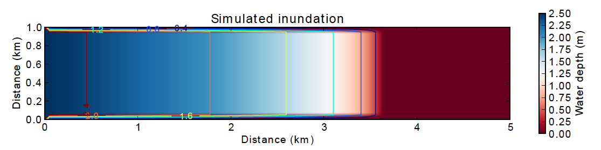

================================
Tutorial: Modeling Overland Flow
================================

In this example, we look at an implementation of the storage-cell algorithm of Bates et al. (2010) [1]_ for modeling flood inundation. In this example, we will use a flat terrain, and prescribe a water depth of 2.5 meters at the left side of the grid. This will create a wave that travels from left to right across the grid. The output is shown in :ref:`Figure 6 <inundation>`.  You can type up the code below, or download :download:`this example script <../model_grid_guide/overland_flow_with_model_grid.py>`.

.. _inundation:

    
    Figure 6: Simulated flood-wave propagation.

Overland Flow Code Listing
>>>>>>>>>>>>>>>>>>>>>>>>>>

The source code listed below can also be found in the file *overland_flow_with_model_grid.py*.

.. code-block:: python

	#! /usr/env/python
	"""
	2D numerical model of shallow-water flow over topography, using the
	Bates et al. (2010) algorithm for storage-cell inundation modeling.

	Last updated GT May 2014
	"""

	from landlab import RasterModelGrid
	import pylab, time
	import numpy as np

	def main():
		"""
		In this simple tutorial example, the main function does all the work: 
		it sets the parameter values, creates and initializes a grid, sets up 
		the state variables, runs the main loop, and cleans up.
		"""
	
		# INITIALIZE
	
		# User-defined parameter values
		numrows = 20
		numcols = 100
		dx = 50.
		n = 0.03              # roughness coefficient
		run_time = 1800       # duration of run, seconds
		h_init = 0.001        # initial thin layer of water (m)
		h_boundary = 2.5      # water depth at left side (m) 
		g = 9.8
		alpha = 0.2           # time-step factor (ND; from Bates et al., 2010)
	
		# Derived parameters
		ten_thirds = 10./3.   # pre-calculate 10/3 for speed
		elapsed_time = 0.0    # total time in simulation
		report_interval = 2.  # interval to report progress (seconds)
		next_report = time.time()+report_interval   # next time to report progress
	
		# Create and initialize a raster model grid
		mg = RasterModelGrid(numrows, numcols, dx)
	
		# Set up boundaries. We'll have the right and left sides open, the top and
		# bottom closed. The water depth on the left will be 5 m, and on the right 
		# just 1 mm.
		mg.set_closed_boundaries_at_grid_edges(True, False, True, False)
	
		# Set up scalar values
		z = mg.add_zeros('node', 'Land_surface__elevation')   # land elevation
		h = mg.add_zeros('node', 'Water_depth') + h_init     # water depth (m)
		q = mg.create_active_link_array_zeros()  # unit discharge (m2/s)
		dhdt = mg.add_zeros('node', 'Water_depth_time_derivative')
	
		# Left side has deep water
		leftside = mg.left_edge_node_ids()
		h[leftside] = h_boundary
	
		# Get a list of the core nodes
		core_nodes = mg.core_nodes

		# Display a message
		print( 'Running ...' )
		start_time = time.time()

		# RUN
	
		# Main loop
		while elapsed_time < run_time:
			
			# Report progress
			if time.time()>=next_report:
				print('Time = '+str(elapsed_time)+' ('
					  +str(100.*elapsed_time/run_time)+'%)')
				next_report += report_interval
		
			# Calculate time-step size for this iteration (Bates et al., eq 14)
			dtmax = alpha*mg.dx/np.sqrt(g*np.amax(h))
		
			# Calculate the effective flow depth at active links. Bates et al. 2010
			# recommend using the difference between the highest water-surface
			# and the highest bed elevation between each pair of nodes.
			zmax = mg.max_of_link_end_node_values(z)
			w = h+z   # water-surface height
			wmax = mg.max_of_link_end_node_values(w)
			hflow = wmax - zmax
		
			# Calculate water-surface slopes
			water_surface_slope = mg.calculate_gradients_at_active_links(w)
	   
			# Calculate the unit discharges (Bates et al., eq 11)
			q = (q-g*hflow*dtmax*water_surface_slope)/ \
				(1.+g*hflow*dtmax*n*n*abs(q)/(hflow**ten_thirds))
		
			# Calculate water-flux divergence and time rate of change of water depth
			# at nodes
			dhdt = -mg.calculate_flux_divergence_at_nodes(q)
		
			# Second time-step limiter (experimental): make sure you don't allow
			# water-depth to go negative
			if np.amin(dhdt) < 0.:
				shallowing_locations = np.where(dhdt<0.)
				time_to_drain = -h[shallowing_locations]/dhdt[shallowing_locations]
				dtmax2 = alpha*np.amin(time_to_drain)
				dt = np.min([dtmax, dtmax2])
			else:
				dt = dtmax
		
			# Update the water-depth field
			h[core_nodes] = h[core_nodes] + dhdt[core_nodes]*dt
		
			# Update current time
			elapsed_time += dt

	  
		# FINALIZE
	
		# Get a 2D array version of the elevations
		hr = mg.node_vector_to_raster(h)
	
		# Create a shaded image
		pylab.close()  # clear any pre-existing plot
		image_extent = [0, 0.001*dx*numcols, 0, 0.001*dx*numrows] # in km
		im = pylab.imshow(hr, cmap=pylab.cm.RdBu, extent=image_extent)
		pylab.xlabel('Distance (km)', fontsize=12)
		pylab.ylabel('Distance (km)', fontsize=12)
	
		# add contour lines with labels
		cset = pylab.contour(hr, extent=image_extent)
		pylab.clabel(cset, inline=True, fmt='%1.1f', fontsize=10)
	
		# add a color bar on the side
		cb = pylab.colorbar(im)
		cb.set_label('Water depth (m)', fontsize=12)
	
		# add a title
		pylab.title('Simulated inundation')

		# Display the plot
		pylab.show()
		print('Done.')
		print('Total run time = '+str(time.time()-start_time)+' seconds.')

	if __name__ == "__main__":
		main()

Packages
>>>>>>>>

.. code-block:: python

	from landlab import RasterModelGrid
	import pylab, time
	import numpy as np

For this program, we'll need ModelGrid as well as the pylab, time, and numpy packages.

User-Defined Parameters
>>>>>>>>>>>>>>>>>>>>>>>

.. code-block:: python

		# User-defined parameter values
		numrows = 20
		numcols = 100
		dx = 50.
		n = 0.03              # roughness coefficient
		run_time = 1800       # duration of run, seconds
		h_init = 0.001        # initial thin layer of water (m)
		h_boundary = 2.5      # water depth at left side (m) 
		g = 9.8
		alpha = 0.2           # time-step factor (ND; from Bates et al., 2010)
	

Several of the user-defined parameters are the same as those used in the diffusion example: the dimensions and cell size of our raster grid, and the duration of the run. Here the duration is in seconds. In addition, we need to specify the Manning roughness coefficient (``n``), the initial water depth (here set to 1 mm), the water depth along the left-hand boundary, gravitational acceleration, and a time-step factor.

Derived Parameters
>>>>>>>>>>>>>>>>>>

.. code-block:: python

		# Derived parameters
		ten_thirds = 10./3.   # pre-calculate 10/3 for speed
		elapsed_time = 0.0    # total time in simulation
		report_interval = 2.  # interval to report progress (seconds)
		next_report = time.time()+report_interval   # next time to report progress
	
Here, we pre-calculate the value of 10/3 so as to avoid repeating a division operation throughout the main loop. We also set up some variables to track the progress of the run. The elapsed time refers here to model time. In this model, we use a variable time-step size, and so rather than counting through a predetermined number of iterations, we instead keep track of the elapsed run time and halt the simulation when we reach the desired run duration.

The ``report_interval`` refers to clock time rather than run time. Every two seconds of clock time, we will report the percentage completion to the user, so that he/she is aware that the run is progressing and has an idea how much more is left to go. The variable ``next_report`` keeps track of the next time (on the clock) to report progress to the user.

Setting up the grid and state variables
>>>>>>>>>>>>>>>>>>>>>>>>>>>>>>>>>>>>>>>

.. code-block:: python

    # Create and initialize a raster model grid
    mg = RasterModelGrid(numrows, numcols, dx)
    
    # Set up boundaries. We'll have the right and left sides open, the top and
    # bottom closed. The water depth on the left will be 5 m, and on the right 
    # just 1 mm.
    mg.set_closed_boundaries_at_grid_edges(True, False, True, False)
    
    # Set up scalar values
    z = mg.add_zeros('node', 'Land_surface__elevation')   # land elevation
    h = mg.add_zeros('node', 'Water_depth') + h_init     # water depth (m)
    q = mg.create_active_link_array_zeros()  # unit discharge (m2/s)
    dhdt = mg.add_zeros('node', 'Water_depth_time_derivative')
    
    # Left side has deep water
    leftside = mg.left_edge_node_ids()
    h[leftside] = h_boundary
    
    # Get a list of the core nodes
    core_nodes = mg.core_nodes

Next, we create and configure a raster grid. In this example, we'll have the left and right boundaries open and the top and bottom closed; we set this up with a call to ``set_closed_boundaries_at_grid_edges()`` on line 47.

Our key variables are as follows: land elevation, ``z`` (which remains constant and uniform at zero in this example), water depth, ``h`` (which starts out at ``h_init``), discharge per unit width, ``q``, and the rate of change of water depth, ``dhdt``. Three of these---elevation, depth, and :math:`dh/dt`---are scalars that are evaluated at nodes. The fourth, discharge, is evaluated at active links.

In this example, we will have the left boundary maintain a fixed water depth of 2.5 m. To accomplish this, we first obtain a list of the ID numbers of the boundary nodes that lie along the left grid edge by calling RasterModelGrid's ``left_edge_node_ids()`` method, which returns a Numpy array containing the IDs. We then use them to set the new depth values on the following line. Finally, we obtain a list of core node IDs, just as we did in the diffusion example.

Main loop, part 1
>>>>>>>>>>>>>>>>>

.. code-block:: python

    # Main loop
    while elapsed_time < run_time:
        
        # Report progress
        if time.time()>=next_report:
            print('Time = '+str(elapsed_time)+' ('
                  +str(100.*elapsed_time/run_time)+'%)')
            next_report += report_interval
        
        # Calculate time-step size for this iteration (Bates et al., eq 14)
        dtmax = alpha*mg.dx/np.sqrt(g*np.amax(h))
        
        # Calculate the effective flow depth at active links. Bates et al. 2010
        # recommend using the difference between the highest water-surface
        # and the highest bed elevation between each pair of nodes.
        zmax = mg.max_of_link_end_node_values(z)
        w = h+z   # water-surface height
        wmax = mg.max_of_link_end_node_values(w)
        hflow = wmax - zmax
        
        # Calculate water-surface slopes
        water_surface_slope = mg.calculate_gradients_at_active_links(w)
      
        # Calculate the unit discharges (Bates et al., eq 11)
        q = (q-g*hflow*dtmax*water_surface_slope)/ \
            (1.+g*hflow*dtmax*n*n*abs(q)/(hflow**ten_thirds))
        
The main loop uses a ``while`` rather than a ``for`` loop because the time-step size is variable. We begin with a block of code that prints the percentage completion to the screen every two seconds. After this, we calculate a maximum time-step size size using the formula of Bates et al. (2010) [1]_, which depends on grid-cell spacing and on the shallow water wave celerity, :math:`\sqrt{g h}`. For water depth, we use the maximum value in the grid, because it is this value that will have the greatest celerity and therefore be most restrictive.

The next several lines calculate unit discharge values along each active link. To do this, we need to know the effective water depth at each of these locations. Bates et al. (2010) [1]_ recommend using the difference between the highest water-surface elevation and the highest bed-surface elevation at each pair of adjacent nodes---that is, at each active link. To find these maximum values, we call the ``active_link_max()`` method, first with bed elevation, and then with water-surface elevation, ``w``. The resulting effective flow depths at the active links are stored in Numpy array called ``hflow``. 

Calculating discharge also requires us to know the water-surface gradient at each active link. We find this by calling ``calculate_gradients_at_active_links`` and passing it the water-surface height. We then have everything we need to calculate the discharge values using the Bates et al. (2010) [1]_ formula, which is done with the line

.. code::

        q = (q-g*hflow*dtmax*water_surface_slope)/ \
            (1.+g*hflow*dtmax*n*n*abs(q)/(hflow**ten_thirds))

Main loop, part 2
>>>>>>>>>>>>>>>>>

.. code-block:: python

        # Calculate water-flux divergence and time rate of change of water depth
        # at nodes
        dhdt = -mg.calculate_flux_divergence_at_nodes(q)
        
        # Second time-step limiter (experimental): make sure you don't allow
        # water-depth to go negative
        if np.amin(dhdt) < 0.:
            shallowing_locations = np.where(dhdt<0.)
            time_to_drain = -h[shallowing_locations]/dhdt[shallowing_locations]
            dtmax2 = alpha*np.amin(time_to_drain)
            dt = np.min([dtmax, dtmax2])
        else:
            dt = dtmax
        
        # Update the water-depth field
        h[core_nodes] = h[core_nodes] + dhdt[core_nodes]*dt
        
        # Update current time
        elapsed_time += dt

Because we have no source term in the flow equations---we are assuming there is no rainfall or infiltration to add or remove water in each cell---the rate of depth change is equal to :math:`-\nabla q`, the divergence of water discharge. Just as in the diffusion example, we can calculate the flux divergence in a single line with help from the ``calculate_flux_divergence_at_nodes()`` method.

The next block of code provides a second limit on time-step size, designed to prevent water depth from becoming negative. At some locations in the grid, it is possible that the rate of change of water depth will be negative, meaning that the water depth is becoming shallower over time. If we were to extrapolate this shallowing too far into the future, by taking too big a time step, we could end up with negative water depth. To avoid this situation, we first determine whether there are any locations where ``dhdt`` is negative, using the Numpy ``amin`` function. If there are, we call the Numpy ``where`` function to obtain a list of the node IDs at which the water depth is shallowing. The next line calculates the time it would take to reach zero water thickness. We then find the minimum of these time intervals, and multiply it by the ``alpha`` time-step parameter. This ensures that we won't actually completely drain any cells of water. Finally, we determine which limiting time-step is smaller: ``dtmax``, which reflects the limitation due to fluid velocity, or ``dtmax2``, which is the limitation due to cell drainage. If no cells have :math:`dh/dt<0`, then we simply use the fluid-velocity time step size.

We then update the values of water depth at all core nodes. Finally, we increment the total elapsed time.

Plotting the results
>>>>>>>>>>>>>>>>>>>>

.. code-block:: python

    # Get a 2D array version of the elevations
    hr = mg.node_vector_to_raster(h)
    
    # Create a shaded image
    pylab.close()  # clear any pre-existing plot
    image_extent = [0, 0.001*dx*numcols, 0, 0.001*dx*numrows] # in km
    im = pylab.imshow(hr, cmap=pylab.cm.RdBu, extent=image_extent)
    pylab.xlabel('Distance (km)', fontsize=12)
    pylab.ylabel('Distance (km)', fontsize=12)
    
    # add contour lines with labels
    cset = pylab.contour(hr, extent=image_extent)
    pylab.clabel(cset, inline=True, fmt='%1.1f', fontsize=10)
    
    # add a color bar on the side
    cb = pylab.colorbar(im)
    cb.set_label('Water depth (m)', fontsize=12)
    
    # add a title
    pylab.title('Simulated inundation')

    # Display the plot
    pylab.show()
    print('Done.')
    print('Total run time = '+str(time.time()-start_time)+' seconds.')

The final portion of the code uses the RasterModelGrid ``node_vector_to_raster()`` method along with some Pylab functions to create a color image plus contour plot of the water depth at the end of the run. This part of the code is essentially the same as what we used in the diffusion example.
