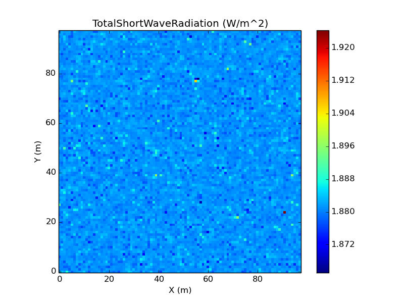
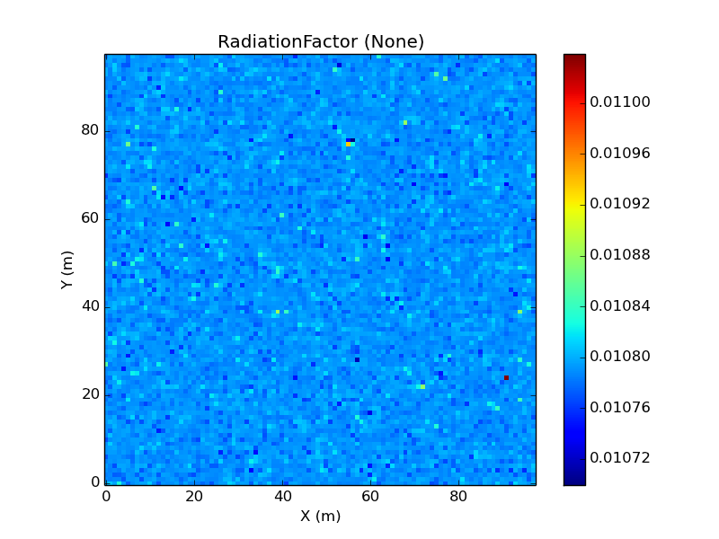

A Quick Tutorial for radiation_field Component
==============================================

This article is a step by step tutorial for a simple implementation of 
radiation_field.py, which is available the in 'radiation' package under 
'landlab/components'.

Article author: Sai Siddhartha Nudurupati (saisiddu@uw.edu) and Erkan Istanbulluoglu
Date: 22 May 2014
    
The radiation component calculates the total incoming shortwave radiation and
the relative radiation factor (ratio of total radiation incident on the surface
with respect to the total radiation incident on flat surface).
This example demonstrates a simple use case for ``radiation_field.py``.
In this example, a random elevation field of 100 m X 100 m is created. 
A raster grid with this elevation field and a cell area of :math:`1 m^2` each
is created. Total incident short wave radiation and radiation factor 
on a given Julian day (at noon) is calculated and plotted.

Import Landlab's raster grid library 'RasterModelGrid':

>>> from landlab import RasterModelGrid

Import the 'Radiation' class from the 'components' library, under radiation package:

>>> from landlab.components.radiation.radiation_field import Radiation

Import landlab's plotting function that has the capability of plotting
'fields' stored on the grid:

>>> from landlab.plot.imshow import imshow_field

Import the Numpy library. We will use the 'random' module from numpy for this
tutorial:

>>> import numpy as np

Import the Pyplot module from Matplotlib. This is a handy plotting library.
For easier access (and typing), import 'matplotlib.pyplot' using the short name 'plt':

>>> import matplotlib.pyplot as plt

The ``RasterModelGrid`` module creates a raster grid of size defined by its first
two arguments, with a spatial resolution defined by its third optional 
argument. Hence the grid has 100 X 100 nodes (a total of 10,000 nodes) with
spacing between two nodes being 1.0 unit:

>>> grid = RasterModelGrid(100,100, 1.)     

Create a random elevation field. The ``Numpy.random.rand`` function returns an
array of random numbers that follow a uniform distribution with range (0,1)
and with size defined by its argument.
                             
>>> elevation = np.random.rand(grid.number_of_nodes) * 1000

Create a nodal field called 'Elevation' on the grid, with units in meters, initially
populated with zeros.

>>> grid.add_zeros('node','Elevation', units = 'm')

This 'Elevation' field stored on the grid can be accessed as follows:

>>> grid['node']['Elevation'] = elevation

Instantiate an object of the ``Radiation`` class. This instantiation associates
the object 'rad' with the capabilities of the class 'Radiation'. This
initiation requires an input of a grid. Creation of the object
automatically associates this grid to the object ``rad``:

>>> rad = Radiation( grid )

Set random time for our example. Time is in years.  

>>> current_time = 0.56

The ``Radiation`` class has an update method (like a CSDMS BMI component). This 
method takes ``current_time`` as an input argument and calculates the total incident short-wave radiation incident on each cell at noon of the julian day represented
at the day and time given by the ``current_time`` input parameter. 
It also calculates the radiation factor, which
represents the ratio of total short-wave radiation incident on a grid cell
to that on a flat surface. Hence, the radiation factor will be 1.0 if the grid cell has a
slope of 0.0. To implement this operation, two cellular fields are created on the 
grid---one for actual radiation, and one for flat-surface-equivalent radiation.
Each of these arrays has a length equivalent to number of cells; 
each is stored in conjunction with the grid. 
Whenever this grid is transferred (passed as an argument), these two cellular fields go with them.

>>> rad.update( current_time )

Create a figure window available from pyplot library. This allows separating
figures while plotting multiple figures. 

>>> plt.figure(0)

Plot the cellular field 'TotalShortWaveRadiation' that is available on the
grid. ``imshow_field`` is a Landlab plotting tool that takes the following input arguments: 
a grid, the name of the variable to be plotted, and the type of field (whether
the variable plotted is defined on nodes, cells, links, or active links). 
It also reads optional inputs (keywords), 
grid_units (units of the grid X and Y axes, such as 'm' for meters). 
For more options, please refer
to the documentation for ``landlab.plot.imshow``.

>>> imshow_field(grid,'TotalShortWaveRadiation', values_at = 'cell', grid_units = ('m','m'))

The plot created can be saved using the Pyplot function ``savefig``. 
This file will be saved in the current directory that your
python shell is in. You can know the current directory by using the ``pwd`` ("present
working directory") 
command in the shell. (This documentation works if Enthought Canopy is used.
It might work for other packages too but is not tested by the author.)

>>> plt.savefig('Radiation')

Plot another figure.

>>> plt.figure(1)

Using Landlab plotting tool, let's plot another variable: 'RadiationFactor'.
    

>>> imshow_field(grid,'RadiationFactor', values_at = 'cell', grid_units = ('m','m'))

Save this figure.
        
>>> plt.savefig('RadiationFactor')

Depending on what Python package you are using, figure windows generated by pyplot 
library may not pop up by default. If you don't see these figures, use Pyplot 
function ``show`` availabe in pyplot library to make the figures appear on screen:

>>> plt.show()

The results might look similar to the following figures:

.. _totalradiation:

	
    Figure 1: Plot of total incident shortwave radiation

.. _radiationfactor:

	
    Figure 2: Plot of radiation factor

Please note that this is a simple implementation of the *radiation_field*
component intended to familiarize you with its use. Please refer to the documentation
of ``landlab/components/radiation/radiation_field`` for more information on how to 
use this component.
