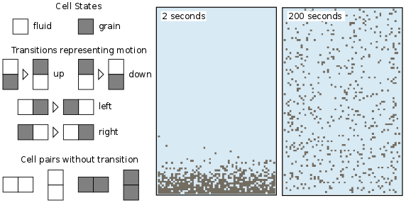
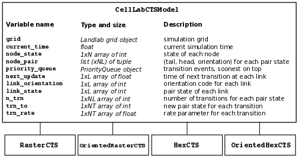
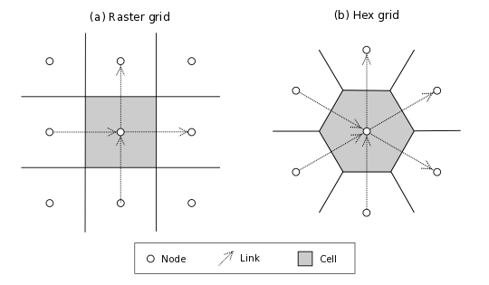
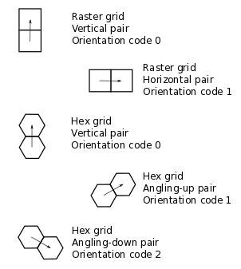

.. _celllab:

======================
CellLab-CTS User Guide
======================

Created: August 2015, Greg Tucker

Last updated: April 2020 GT 

Introduction
------------

CellLab-CTS is a Landlab module for building pairwise, continuous-time stochastic (CTS) cellular automata. Like other cellular automata, pairwise CTS models represent natural phenomena using a regular grid of cells; in the case of CellLab-CTS, the user can choose between square and hexagonal cells. Each cell has a given state, which is an integer code representing something about the nature or contents of that cell. Cells change state at random time intervals according to a user-defined transition rules. The transitions depend on the states of the neighboring cells, and in particular, of the states of each *pair* of adjacent cells. For example a pair with states 0 and 1 might undergo a transition to 1 and 1, or 3 and 0, etc.

This Users Manual provides instructions on how to write a model using CellLab-CTS, along with reference information about the classes and methods that CellLab-CTS provides. For further information about the theory, implementation, and design of CellLab-CTS, see Tucker et al. (2016). For background information on the theory of pairwise CTS models and example applications, see Narteau et al. (2001, 2009) and Rozier and Narteau (2014). For background on cellular automata in general, see Chopard and Droz (1998).

*Note on terminology:* In a CellLab-CTS model, the computational points—the objects that are normally called **cells** in a cellular automaton model—actually correspond with the **nodes** in a Landlab grid. Although Landlab grids also contain *cells*, which are defined as polygons that contain a node, Landlab grids do not have cells along the outmost ring of nodes around the grid. For example, a 4-row by 5-column Landlab raster grid has 20 nodes but only 6 cells (2 inner rows x 3 inner columns). For CellLab-CTS models, it is useful to include the perimeter nodes as "cells" for the purpose of handling boundary conditions. Therefore, CellLab-CTS treats all the **nodes** in the grid as if they were cells in a cellular automaton. This includes the perimeter nodes, for which Landlab does not formally define cells. For practical purposes, the distinction doesn't make much difference, but it is important to understand that CellLab-CTS works with arrays of grid nodes rather than the (shorter) arrays of grid cells. Henceforth, to avoid confusion, we will refer to **nodes**, which you should read as being synonymous with the usual meaning of "cell" in a cellular automaton.

*Prerequisites:* This manual assumes working knowledge of the Python programming language (any version), including basic familiarity with Python classes and objects. It also assumes a basic familiarity with Landlab grids. In addition, it will be helpful to have some familiarity with the Matplotlib and/or Pylab plotting libraries.

Writing a CellLab-CTS model
---------------------------

What is a CellLab-CTS model?
~~~~~~~~~~~~~~~~~~~~~~~~~~~~

A CellLab-CTS model is a Python program that creates and initializes one of the four types of ``CellLabCTSModel`` object, defines the possible cell states and transition rules, and calls the ``run`` method to execute the model. A CellLab-CTS model can be written in one of two basic ways. The first option is to write a simple Python script that imports the necessary ingredients. This approach is easy and versatile, and is recommended for first-time users, and/or those who are relatively unfamiliar with Python classes. The second option is to write your model as a subclass of one of the four existing CellLabModel subclasses (more on these below). The subclass approach is useful when you wish to use the *dynamic property updating* capability of CellLab-CTS—that is, for example, when you want to attach some form of additional data to the grid, and update the data at each transition event according to the state of the grid. In this manual, we will focus on the example of a simple script-based model.

Basic ingredients of a CellLab-CTS model
~~~~~~~~~~~~~~~~~~~~~~~~~~~~~~~~~~~~~~~~

The basic steps in most CellLab-CTS models are as follows:

1. Import the necessary CTS classes (and any other necessary packages). These include: one of the four CellLab-CTS model classes (described below), the ``Transition`` class, and (optionally) the ``CAPlotter`` class for graphical display.
2. Create and initialize a Landlab ``ModelGrid`` object: either a ``RasterModelGrid`` or a ``HexModelGrid``
3. Create a dictionary that defines the node states to be used
4. Create a list of Transition objects: one for each transition type in your model
5. Create an array with the initial state values in the grid
6. Instantiate and initialize one of the four CellLab-CTS classes
7. Set up plotting (if desired)
8. Run the model by calling the CellLab-CTS object's ``run`` method (perhaps pausing every so often to display the grid and/or write output to file)
9. Clean up

We will illustrate each of these steps using a simple example called ``isotropic_turbulent_suspension.py``. This program simulates the random motion of neutrally buoyant sediment particles that are immersed in a turbulent fluid: think of tea leaves in a jar of tea that you are stirring with an invisible spoon. Each random motion is simulated by simply swapping a fluid state and a particle state.

    Figure 1: A CellLab-CTS model of suspended sediment particles in an isotropic turbulent fluid.

Before diving into the example, however, it's useful to look at the four different types of CellLab-CTS model.

Types of CellLab-CTS model
~~~~~~~~~~~~~~~~~~~~~~~~~~

A CellLab-CTS grid can be either raster (regular grid of square cells) or hexagonal (trigonal grid of nodes with hexagonal cells). In addition, a CellLab-CTS model can be either *oriented* or *non-oriented*. An oriented model is one in which the spatial orientation of a node pair influences the types and/or of transition. For example, in an oriented raster model, a horizontal pair with states 0 and 1 might have a different set of potential transitions than a vertical pair with states 0 and 1. A non-oriented pair treats the sequence 0-1 the same regardless of whether the pair is vertical, horizontal, or (in the case of a hex grid) at any other angle.

With these different possibilities in mind, the four CellLab-CTS model types are:

1. ``RasterCTS:`` A non-oriented grid of square cells.
2. ``OrientedRasterCTS:`` An oriented grid of square cells, with two orientations (horizontal and vertical).
3. ``HexCTS``: A non-oriented grid of hexagons.
4. ``OrientedHexCTS:`` An oriented grid of hexagons, with three orientations. These can be: (1) vertical, (2) +30 degrees from horizontal (angling down/left to up/right), and (3) -30 degrees from horizontal (angling up/left to down/right). Or, alternatively, the three axes can be horizontal and +/-30 degrees from vertical (one determines this when instantiating the grid object, as illustrated below).

These four types are implemented as subclasses of the base class ``CellLabCTSModel``, as illustrated in Figure 2.

    Figure 2: CellLab-CTS class hierarchy and main data structures. N = number of grid nodes, L = number of grid links, NL = number of possible link (node pair) states, NT = maximum number of transitions for any link state.

Step 1: Importing CellLab-CTS
~~~~~~~~~~~~~~~~~~~~~~~~~~~~~

A CellLab-CTS application normally starts by importing the appropriate type of CTS model class, along with any other packages needed. Thus, our suspended-sediment model starts out as follows:

.. code-block:: python

	#!/usr/env/python

	"""
	isotropic_turbulent_suspension.py

	Example of a continuous-time, stochastic, pair-based cellular automaton model,
	which simulates the diffusion of suspended, neutrally buoyant particles in a
	turbulent fluid.

	Written by Greg Tucker, February 2015
	"""

	import time
	import matplotlib
	from numpy import where
	from landlab import RasterModelGrid
	from landlab.ca.celllab_cts import Transition, CAPlotter
	from landlab.ca.raster_cts import RasterCTS

Here, we're using a raster model, so we import Landlab's ``RasterModelGrid`` class. It will be a non-oriented raster model, so we import the ``RasterCTS`` class (rather than  ``OrientedRasterCTS``). We also import the ``CAPlotter`` class for help with graphical display (more on that below), as well as the ``Transition`` class. We need the Transition class to set up our pair transitions, which we explore next.

Setting up transitions
~~~~~~~~~~~~~~~~~~~~~~

Sequence matters!
>>>>>>>>>>>>>>>>>

A particular pair state is described by the two node states, and optionally by the pair's orientation. A key thing to understand here is that any particular pair sequence, such as 0 and 1, is *different from the sequence in reverse*. The pair 0-1 is not the same as the pair 1-0! This is true for all four types of model. So then which is which? To answer this question, we first need to recall that each pair corresponds to the two ends of a *link* in the Landlab grid. A link is simply a directed line segment that connects two neighboring nodes. Every link has a *tail* and a *head* (like the head of an arrow); the direction of the link is from tail to head. The rule for CellLab-CTS pairs is that the first number refers to the tail of the corresponding link, and the second refers to its head. Thus, the pair state 0-1 means that the tail node has state 0 and the head node has state 1.

By default, the links in a raster grid always run from down to up (for vertical links) or left to right (for horizontal links) (Figure 3). For example, with a 0-1 pair in a raster grid, the 0 is either the left-hand node (if it's a horizontal pair) or the bottom node (if the pair is vertical). In a default hex grid, the links point either (1) upward, (2) angling right and up 30 degrees, or (3) angling right and down 30 degrees. (Note that you also have the option of switching the grid orientation so that one of the principal axes is horizontal instead of vertical; in that case, the three orientations are horizontal, 30 degrees clockwise from vertical, and 30 degrees counter-clockwise from vertical).

    Figure 3: Illustration of nodes, links, and cells in a raster and hex grids. Note directions of links, which always "point" toward the upper-right hemisphere. The hex illustration shows a hex grid cell in vertical orientation; in horizontal orientation, links point rightward, up and right, and up and left.

How transitions are represented
>>>>>>>>>>>>>>>>>>>>>>>>>>>>>>>

Each transition type is described by the states of the tail and head nodes, and by the orientation of the pair. This information is encoded in a 3-element tuple. Recall that each pair is associated with a link. The first number is the state of the link's tail node, the second is the state of the link's head node, and the third is an *orientation code* that represents the pair's spatial orientation (Figure 4). In a non-oriented model, the orientation code is always zero. In an oriented raster, the orientation code is either 0 (horizontal) or 1 (vertical). For example, the code (0, 1, 0) in an oriented raster model would represent a vertical pair in which the left node has state 0 and the right state 1.

    Figure 4: Pair orientation codes in a raster (top 2 panels) and vertical hex (bottom 3 panels) grid.

In an oriented hex, the orientation codes depend on the orientation of the grid itself. A Landlab ``HexModelGrid`` can be oriented such that one of the three principal axes is either horizontal (the default) or vertical. The choice is controlled by the optional keyword argument ``orientation`` (either ``'vertical'`` or ``'horizontal'``) in the ``HexModelGrid`` initialization function. For a vertically aligned hex grid, the CellLab-CTS orientation codes are: 0 for vertical, 1 for right and upward, and 2 for right and downward (Figure 4). For example, the code (1, 0, 2) would represent a down-and-right pair, with a state of 1 in the upper-left node and 0 in the lower-right node. For a horizontally aligned hex grid, the CellLab-CTS orientation codes are: 0 for upward and left, 1 for upward and right, and 2 for right. For example, the code (1, 0, 2) would represent a left-to-right pair, with a state of 1 in the left node and 0 in the right node.

Example of a transition setup function
>>>>>>>>>>>>>>>>>>>>>>>>>>>>>>>>>>>>>>

It can be helpful to put the transition setup procedure inside a function of its own. Here is the transition setup function for our turbulent suspension example (notice that the function itself has only four lines of code; all the rest is documentation):

.. code-block:: python

	def setup_transition_list():
		"""
		Creates and returns a list of Transition() objects to represent state
		transitions for an unbiased random walk.

		Parameters
		----------
		(none)

		Returns
		-------
		xn_list : list of Transition objects
			List of objects that encode information about the link-state transitions.

		Notes
		-----
		State 0 represents fluid and state 1 represents a particle (such as a
		sediment grain, tea leaf, or solute molecule).

		The states and transitions are as follows:

		Pair state      Transition to       Process             Rate (cells/s)
		==========      =============       =======             ==============
		0 (0-0)         (none)              -                   -
		1 (0-1)         2 (1-0)             left/down motion    10.0
		2 (1-0)         1 (0-1)             right/up motion     10.0
		3 (1-1)         (none)              -                   -

		"""

		# Create an empty transition list
		xn_list = []

		# Append two transitions to the list.
		# Note that the arguments to the Transition() object constructor are:
		#  - Tuple representing starting pair state
		#    (left/bottom cell, right/top cell, orientation)
		#  - Tuple representing new pair state
		#    (left/bottom cell, right/top cell, orientation)
		#  - Transition rate (cells per time step, in this case 1 sec)
		#  - Name for transition
		xn_list.append( Transition((0,1,0), (1,0,0), 10., 'left/down motion') )
		xn_list.append( Transition((1,0,0), (0,1,0), 10., 'right/up motion') )

		return xn_list

In this example, state 0 represents the fluid and state 1 represents a particle. Motion is represented by a transition from a 0-1 pair to a 1-0, or vice versa.

Your transition setup function should create and return a list of ``Transition`` objects. A Transition object contains (and is initialized with) the 3-element tuples for the starting and ending transitions, a transition rate (in units of cell-widths per time), and (optionally) a name. Two other optional parameters are used when you want to track properties associated with moving particles: a boolean flag (``swap_properties``) indicating whether the transition involves an exchange of properties, and the name of a user-defined callback function (``prop_update_fn``) to invoke whenever a transition of that type occurs.

(Note that it is also possible to specify a single-integer code for the link state, instead of 3-element tuple. This is a bit more of a headache, however, since it requires you to work out the link-state code corresponding to each pair, and is not recommended.)

Defining parameters
~~~~~~~~~~~~~~~~~~~

Typical parameters in a CellLab-CTS model, in addition to the transitions and rates, include the dimensions of the grid, the duration of the run, and the time intervals for plotting, writing output to file, and/or reporting progress on screen. In the following example, we have defined these within a ``main()`` function. They could also be read in from a file, input on a command line, or specified by some other method.

.. code-block:: python

	def main():

		# INITIALIZE

		# User-defined parameters
		nr = 80  # number of rows in grid
		nc = 50  # number of columns in grid
		plot_interval = 0.5   # time interval for plotting, sec
		run_duration = 20.0   # duration of run, sec
		report_interval = 10.0  # report interval, in real-time seconds

		# Remember the clock time, and calculate when we next want to report
		# progress.
		current_real_time = time.time()
		next_report = current_real_time + report_interval

Step 2: Creating a grid
~~~~~~~~~~~~~~~~~~~~~~~

Depending on the type of CTS model to be used, your code will need to instantiate either a ``RasterModelGrid`` or a ``HexModelGrid``. If you wish to modify the default boundary setup, this should be done right after the grid is created. In the example below, we create a raster grid and set each of its four boundaries to act like a wall:

.. code-block:: python

    # Create grid
    mg = RasterModelGrid(nr, nc, 1.0)

    # Make the boundaries be walls
    mg.set_closed_boundaries_at_grid_edges(True, True, True, True)

Step 3: Create a node-state dictionary
~~~~~~~~~~~~~~~~~~~~~~~~~~~~~~~~~~~~~~

The possible node states are defined by creating entries in a dictionary, in which each key is an integer and each value is a string that gives the name for that state. There should be one entry for each state in your model. For example, our isotropic turbulent suspension model defines just two states:

.. code-block:: python

    ns_dict = { 0 : 'fluid', 1 : 'particle' }

Step 4: Create the transition list
~~~~~~~~~~~~~~~~~~~~~~~~~~~~~~~~~~

If you've already defined a transition setup function, all you need to do here is call that function, as in the following example:

.. code-block:: python

    xn_list = setup_transition_list()

Step 5: Create an array containing the initial node-state values
~~~~~~~~~~~~~~~~~~~~~~~~~~~~~~~~~~~~~~~~~~~~~~~~~~~~~~~~~~~~~~~~

The node state array should be a 1D numpy array of integers, with length equal to the number of grid rows times the number of grid columns. The easiest way to create such a grid is to use the grid's ``add_zeros()`` method (or, similarly, ``add_ones`` or ``add_empty``). For example, for the suspended-sediment example we'll create an array of zeros, representing a container filled with fluid:

.. code-block:: python

    # Create the node-state array and attach it to the grid
    node_state_grid = mg.add_zeros('node', 'node_state_map', dtype=int)

The first argument here is the name of the grid element to which values should be attached, the second is a name to give the array, and the third sets the data type to integer (instead of the default ``float`` type).

Depending on the nature of the model, the next step is to set the initial values of the node states. You can do this just as you would with any Landlab grid field. Remember that the coordinates of each node in a Landlab grid are available through the ``node_x`` and ``node_y`` arrays. For our working example, we'll set the lower 10% of nodes to state 1, indicating that we are starting with a pile of tea leaves at the bottom of the container:

.. code-block:: python

    # Initialize the node-state array: here, the initial condition is a pile of
    # resting grains at the bottom of a container.
    bottom_rows = where(mg.node_y<0.1*nr)[0]
    node_state_grid[bottom_rows] = 1

    # For visual display purposes, set all boundary nodes to fluid
    node_state_grid[mg.closed_boundary_nodes] = 0

Note the use of the numpy ``where`` function, which we imported in Step 1.

Step 6: Instantiate a CellLab-CTS object
~~~~~~~~~~~~~~~~~~~~~~~~~~~~~~~~~~~~~~~~

Our core model will be an object (a.k.a. *instance*) of one of the four CellLabCTS model classes. We create this just as we would any other Python object: by calling its constructor function, which is simply the name of the class followed by parentheses, with any necessary arguments within the parentheses. There are four required arguments: a grid object (which must be of the correct type, i.e., raster or hex), a dictionary of node states, a list of ``Transition`` objects, and the initial node state array. Here's what it looks like for our raster-based suspension model:

.. code-block:: python

    # Create the CA model
    ca = RasterCTS(mg, ns_dict, xn_list, node_state_grid)

Step 7: Set up plotting
~~~~~~~~~~~~~~~~~~~~~~~

If you want to display your model's progress on screen, you can pause the run every once in a while and use pylab, matplotlib, or whatever your favorite graphics library may be to plot what's going on. For convenience, CellLab-CTS provides a ``CAPlotter`` class. CAPlotter is smart enough to find your node-state array, and to plot its contents in raster or hex form as appropriate. When you create the CAPlotter object, you pass it your CA model object and optionally a matplotlib colormap object. The CAPlotter has an ``update_plot`` method to plot the current state of your model, and a ``finalize`` method to clean up.

Here's an example of how to use a CAPlotter:

.. code-block:: python

    # Set up colors for plotting
    grain = '#5F594D'
    fluid = '#D0E4F2'
    clist = [fluid,grain]
    my_cmap = matplotlib.colors.ListedColormap(clist)

    # Create a CAPlotter object for handling screen display
    ca_plotter = CAPlotter(ca, cmap=my_cmap)

    # Plot the initial grid
    ca_plotter.update_plot()

Step 8: Run the model
---------------------

Once a CTS model object has been instantiated, you run it forward in time with the ``run`` method. ``run`` takes one required argument: the future time to which to run. There are also three optional arguments:

* a node-state array (this is provided so that if you wish you can modify the array and re-run)
* a flag indicating whether to re-plot after each transition occurs
* a plotter object, which is required if the value of the flag is True

If you wish to pause occasionally to plot and/or write data to file, a natural approach is to place the call to the run method inside a loop, as in the following example:

.. code-block:: python

    # RUN
    current_time = 0.0
    while current_time < run_duration:

        # Once in a while, print out simulation real time to let the user
        # know that the sim is running ok
        current_real_time = time.time()
        if current_real_time >= next_report:
            print('Current simulation time '+str(current_time)+'  \
            	   ('+str(int(100*current_time/run_duration))+'%)')
            next_report = current_real_time + report_interval

        # Run the model forward in time until the next output step
        ca.run(current_time+plot_interval, ca.node_state,
               plot_each_transition=False)
        current_time += plot_interval

        # Plot the current grid
        ca_plotter.update_plot()

Step 9: Cleanup
~~~~~~~~~~~~~~~

There generally isn't much to clean up. If you are using a CAPlotter object, it can be helpful to call its ``finalize`` method, which turns off matplotlib's interactive mode and calls ``show()`` to make sure the plot is displayed on screen.

.. code-block:: python

    ca_plotter.finalize()

Reference information
---------------------

Main data structures in the CellLabCTSModel class
~~~~~~~~~~~~~~~~~~~~~~~~~~~~~~~~~~~~~~~~~~~~~~~~~

Each of the four types of CTS model inherits from the base class (CellLabCTSModel) the following data structures. These are also illustrated in Figure 2. (Note: some of the data structures and names have changed since the publication of Tucker et al. (2016); thus, the list below differs in some respects from the original paper and from Figure 2.)

``node_state`` : 1d array (x number of nodes in grid)
	Node-based grid of node-state codes. This is the grid of cell (sic) states.

``node_pair`` : list (x number of possible link states)
    List of 3-element tuples representing all the various link states. Allows
    you to look up the node states and orientation corresponding to a particular
    link-state ID.

``priority_queue`` : object
    Data structure that implements a priority queue. The queue contains all
    future transition events, sorted by time of occurrence (from soonest to latest).

``next_update`` : 1d array (x number of active links)
    Time (in the future) at which the link will undergo its next transition.
    You might notice that the update time for every scheduled transition is also
    stored in each Event object in the event queue. Why store it twice? Because
    a scheduled event might be invalidated after the event has been scheduled
    (because another transition has changed one of a link's two nodes, for
    example). The way to tell whether a scheduled event is still valid is to
    compare its time with the corresponding transition time in the *next_update*
    array. If they are different, the event is discarded.

``link_orientation`` : 1d array of ints (x number of active links)
    Orientation code for each link.

``link_state`` : 1d array of ints (x number of active links)
    State code for each link.

``n_trn`` : 1d array of ints (x number of possible link states)
    Number of transitions ("xn" stands for "transition") from a given link
    state.

``trn_to`` : 1d array of np.int (x number of transitions)
    Stores the link-state code(s) to which a particular link state can
    transition.

``trn_rate`` : 1d array of floats (x number of transitions)
    Rate associated with each link-state transition.

Source Code Documentation for CellLab-CTS
~~~~~~~~~~~~~~~~~~~~~~~~~~~~~~~~~~~~~~~~~

* :py:class:`Methods and Internal Documentation for the base class: CellLabCTSModel <landlab.ca.celllab_cts.CellLabCTSModel>`
* :py:class:`Methods and Internal Documentation for the RasterCTS class <landlab.ca.raster_cts.RasterCTS>`
* :py:class:`Methods and Internal Documentation for the OrientedRasterCTS class <landlab.ca.oriented_raster_cts.OrientedRasterCTS>`
* :py:class:`Methods and Internal Documentation for the HexCTS class <landlab.ca.hex_cts.HexCTS>`
* :py:class:`Methods and Internal Documentation for the OrientedHexCTS class <landlab.ca.oriented_hex_cts.OrientedHexCTS>`

References
----------

Chopard, B., & Droz, M. (1998). Cellular automata. Cambridge University Press,
Cambridge, UK.

Narteau, C., Le Mouël, J. L., Poirier, J. P., Sepúlveda, E., & Shnirman, M.
(2001). On a small-scale roughness of the core–mantle boundary. Earth and
Planetary Science Letters, 191(1), 49-60.

Narteau, C., Zhang, D., Rozier, O., & Claudin, P. (2009). Setting the length
and time scales of a cellular automaton dune model from the analysis of
superimposed bed forms. Journal of Geophysical Research: Earth Surface
(2003–2012), 114(F3).

Rozier, O., & Narteau, C. (2014). A real‐space cellular automaton laboratory.
Earth Surface Processes and Landforms, 39(1), 98-109.

Tucker, G. E., Hobley, D. E., Hutton, E., Gasparini, N. M., Istanbulluoglu, E.,
Adams, J. M., & Nudurupati, S. S. (2016). CellLab-CTS 2015: continuous-time
stochastic cellular automaton modeling using Landlab. Geoscientific Model
Development, 9(2), 823-839,
`doi:10.5194/gmd-9-823-2016 <https://www.geosci-model-dev.net/9/823/2016/>`_.
