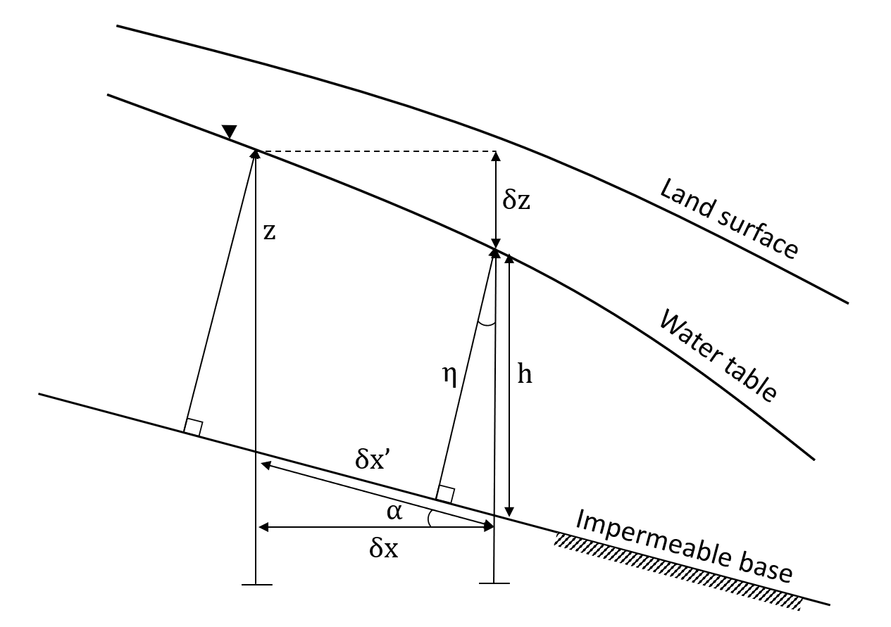
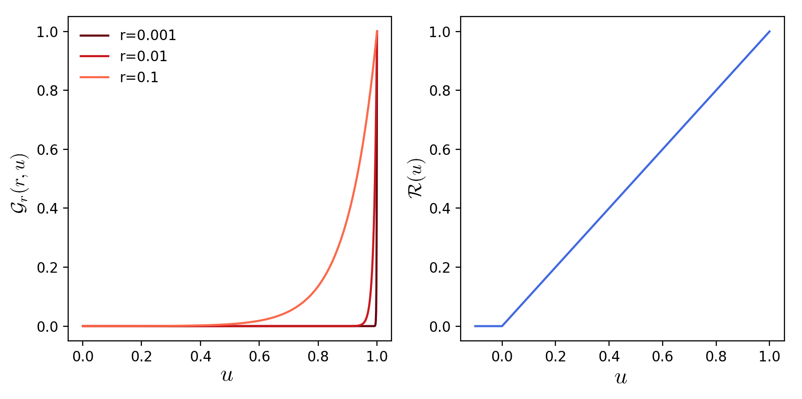

.. _dupuit_theory:

:orphan:

========================================================
Theory and Implementation of GroundwaterDupuitPercolator
========================================================

Governing Equations
===================

Variably-saturated groundwater flow is often assumed to be governed by
the Richards equation, which describes how water content and/or total
energy potential evolve in an idealized porous medium due to fluxes of
water driven by gradients in total potential, :math:`h = z + p/ \gamma`,
where :math:`z` is the elevation head, :math:`p` is the gage pressure,
and :math:`\gamma` is the specific weight of water.

.. math:: \frac{\partial \theta}{\partial t} = \frac{\partial}{\partial x} \bigg( k \frac{\partial h}{\partial x} \bigg) + \frac{\partial}{\partial y} \bigg( k \frac{\partial h}{\partial y} \bigg) + \frac{\partial}{\partial z} \bigg( k \frac{\partial h}{\partial z} \bigg)

Here :math:`\theta` is the volumetric water content of the aquifer and
:math:`k` is the hydraulic conductivity, which may be a function of
:math:`\theta`. Here we use the widely applied Dupuit-Forcheimer
approximation, which is valid when the aquifer is laterally extensive in
comparison to its thickness, and the capillary fringe above the water
table is relatively thin. If this is the case, the component of the
hydraulic gradient normal to the aquifer base can be neglected, and the
water table can be treated as a free surface. Consequently, the total
head is equal to the water table elevation, :math:`h=z`. With these
assumptions, an adjusted governing equation can be written for the time
evolution of the water table elevation:

.. math:: n \frac{\partial h}{\partial t} = \frac{\partial}{\partial x} \bigg( k_{sat} h \frac{\partial h}{\partial x} \bigg) + \frac{\partial}{\partial y} \bigg( k_{sat} h \frac{\partial h}{\partial y} \bigg)

where :math:`n` is the drainable porosity, and :math:`k_{sat}` is the
saturated hydraulic conductivity.

   Aquifer schematic showing vertical aquifer thickness :math:`h`, bed-normal
   aquifer thickness :math:`\eta`, and water table elevation :math:`z`.

When the aquifer base is sloping, the governing equations must be adjusted.
Childs (1971) provides the governing equation for the groundwater specific discharge as:

.. math:: q_{x'} = - k_{sat} \eta \frac{\partial z}{\partial x'}

where :math:`x'` is the coordinate parallel to the impermeable base, and :math:`\eta`
is the aquifer thickness perpendicular to the impermeable base ([2]_).
The `GroundwaterDupuitPercolator` treats two additional fluxes that affect
aquifer storage: groundwater return flow to the surface :math:`q_s`, and
recharge from precipitation :math:`f`. Implementations of the Dupuit-Forcheimer
model often encounter numerical instabilities as the water table intersects the
land surface. To alleviate this problem, we use the regularization approach
introduced by Marcais et al. (2017), which smooths the transition between
surface and subsurface flow ([1]_). The complete governing equations in the
base-parallel reference frame :math:`(x',y')` are:

.. math::

   \begin{aligned}
   n \frac{\partial \eta}{\partial t} &= f \cos(\alpha) - q_s \cos(\alpha) - \nabla' \cdot q \\
   q &= -k_{sat} \eta \big( \nabla' z ) \\
   q_s &= \mathcal{G}_r \bigg( \frac{\eta}{d'} \bigg) \mathcal{R} \big(-\nabla' \cdot q + f \cos(\alpha) \big) \\\end{aligned}

where :math:`\alpha` is the slope angle of aquifer base, and :math:`d'` is the
permeable thickness normal to the aquifer base. The gradient operator
:math:`\nabla'` and divergence operator :math:`\nabla' \cdot` are calculated
with respect to the base-parallel coordinate system. Note that the surface runoff
is the sum of both groundwater return flow and precipitation on saturated area.

The expression for :math:`q_s` utilizes two regularization functions :math:`\mathcal{G}_r` and :math:`\mathcal{R}`:

.. math:: \mathcal{G}_r(r,u) = \exp \bigg( - \frac{1-u}{r} \bigg)

.. math:: \mathcal{R}(u) = u \mathcal{H}(u)

where :math:`r` is a user-specified regularization factor and
:math:`\mathcal{H}(u)` is the Heaviside step function:

.. math::

   \mathcal{H}(u) = \left\{
   \begin{array}{ll}
        0 &  u<0 \\[8pt]
        1 &  u \geq 0
   \end{array}
   \right.

   Regularization functions

To recast the problem in terms of the horizontal coordinate system used by Landlab,
we make the substitutions :math:`\eta = h \cos(\alpha)`, :math:`x = x' \cos(\alpha)`,
and :math:`y = y' \cos(\alpha)`. In the horizontal coordinate system :math:`(x,y)`, the
governing equations are:

.. math::

   \begin{aligned}
   n \frac{\partial h}{\partial t} &= f - q_s - \nabla \cdot q \\
   q &= -k_{sat} \cos^2(\alpha) h \big( \nabla z ) \\
   q_s &= \mathcal{G}_r \bigg( \frac{h}{d} \bigg) \mathcal{R} \big(f - \nabla \cdot q \big) \\\end{aligned}

where :math:`d` is the vertical regolith thickness, and the gradient operator
:math:`\nabla` and divergence operator :math:`\nabla \cdot` are calculated with
respect to the horizontal coordinate system :math:`(x,y)`.

Numerical Implementation
========================

We use an explicit, forward-in-time finite-volume method to solve the
governing equations. In this method, gradients are calculated at links
(between volume centers), and flux divergences are calculated at nodes
(at volume centers). The governing equation with timestep
:math:`\Delta t` is:

.. math:: n \bigg( \frac{h^{t+\Delta t} - h^t}{\Delta t} \bigg) = f^t - q_s^t - \nabla \cdot q^t

Below is a description of the components needed to calculate the right
side of this equation. To calculate the groundwater flux :math:`q`, the
gradients of aquifer base elevation :math:`b` and water table elevation
:math:`z` must be determined. The slope angle of the aquifer base is
calculated from the aquifer base elevation :math:`b`:

.. math::

   \begin{aligned}
       \alpha_{ij} =& \arctan \big( (\nabla b)_{ij} \big) \\
       \big( \nabla b \big)_{ij} =& \frac{b_{i} - b_{j}}{L_{ij}}\end{aligned}

where the subscripts :math:`i` and :math:`j` indicate the nodes at the
head and tail of the link respectively, and :math:`L_{ij}` is the length
of the link. The gradient :math:`\nabla z` is calculated on link :math:`ij` as:

.. math:: \big( \nabla z \big)_{ij} = \frac{z_{i} - z_{j}}{L_{ij}}

Flux divergence is calculated by summing the fluxes into an out of the
links that connect to a node. The divergence of the groundwater flux is:

.. math:: \big( \nabla \cdot q \big)_i = \frac{1}{A_i} \sum_{j \in S} \delta_{ij} q_{ij} \lambda_{ij}

where :math:`A_i` is the area of node :math:`i`, :math:`S` is the set of
nodes that have links that connect to node :math:`i`, and
:math:`\delta_{ij}` is a function that is equal to +1 if the link points
away from the node (the tail of the link is at node :math:`i`), and
equal to -1 if the link points toward the node (the head of the link is
at node :math:`i`). The groundwater flux on the link is :math:`q_{ij}`
and the width of the face through which :math:`q_{ij}` passes is
:math:`\lambda_{ij}`.

References:

.. [1] Marçais, J., de Dreuzy, J. R. & Erhel, J. Dynamic coupling of subsurface and seepage flows solved within a regularized partition formulation.
        Advances in Water Resources 109, 94–105 (2017).
.. [2] Childs, E. C. Drainage of Groundwater Resting on a Sloping Bed. Water Resources Research 7, 1256–1263 (1971).
