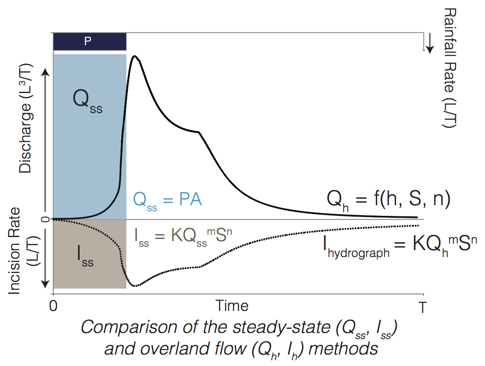
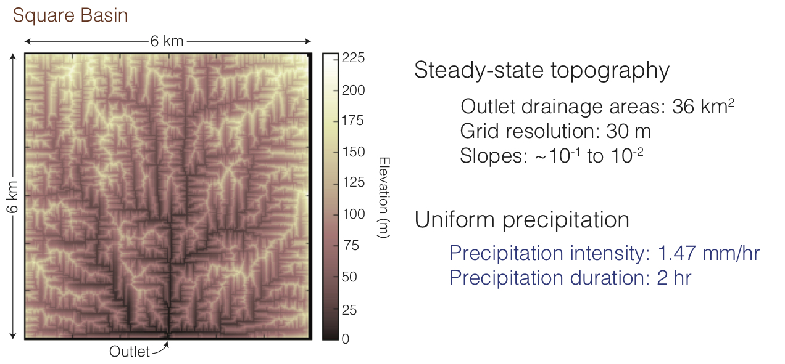
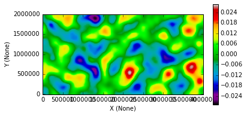
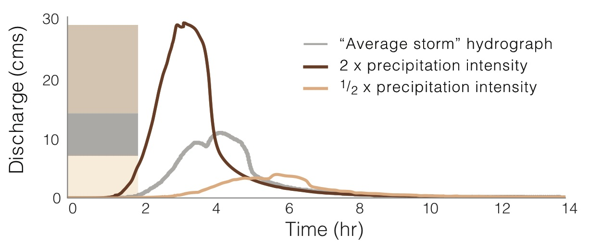
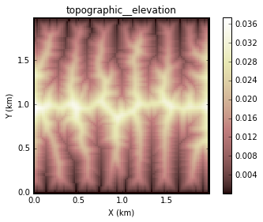

.. _examples:

Examples
========

Welcome to the **Landlab** gallery of examples!

Overland Flow
-------------

Square Basin
------------

Flexure
-------

Hydrograph of Changing Storm Intensity
--------------------------------------

Topographic Elevation
---------------------

CA Transition
-------------

.. image:: images/transition_example.png
    :width: 300px
    :align: center
