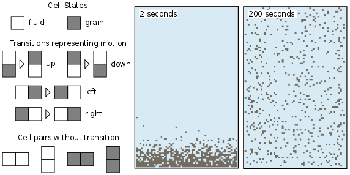

.. _examples:

Examples
========

Welcome to the **Landlab** gallery of examples!

Overland Flow
-------------

.. image:: images/SS_vs_OverlandFlow_Cartoon.jpg
    :width: 300px
    :align: center

Square Basin
------------

.. image:: images/SquareBasin.jpg
    :width: 300px
    :align: center

Flexure
-------

.. image:: images/flexure.png
    :width: 300px
    :align: center
    :target: https://mybinder.org/v2/gh/landlab/landlab/master?filepath=notebooks/tutorials/flexure/lots_of_loads.ipynb

Hydrograph of Changing Storm Intensity
--------------------------------------

.. image:: images/Hydrograph_ChangingIntensity.jpg
    :width: 300px
    :align: center

Topographic Elevation
---------------------

.. image:: images/topographic-elevation.png
    :width: 300px
    :align: center
    :target: https://mybinder.org/v2/gh/landlab/landlab/master?filepath=notebooks/tutorials/component_tutorial/component_tutorial.ipynb

CA Transition
-------------

