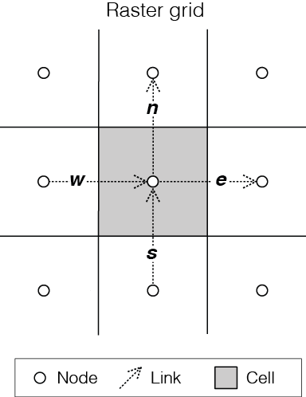
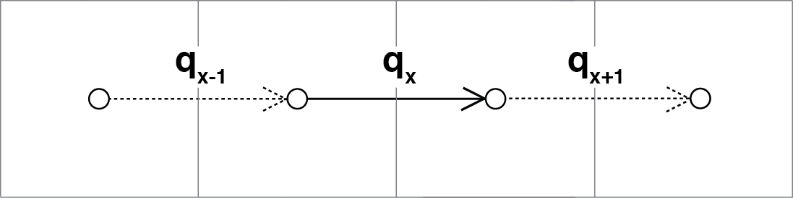
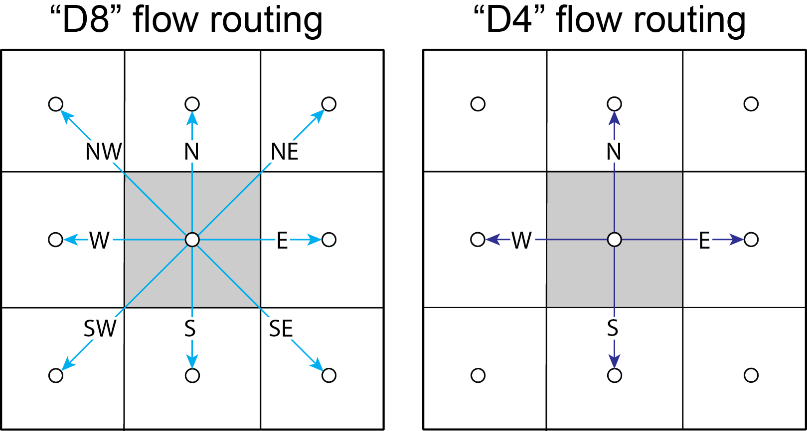
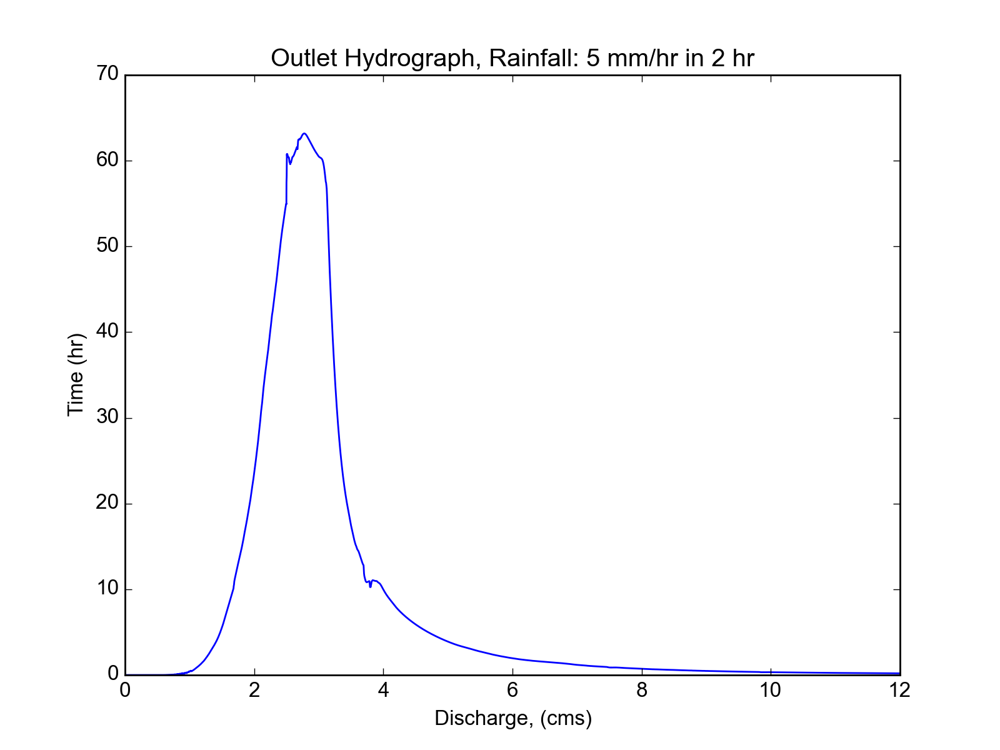
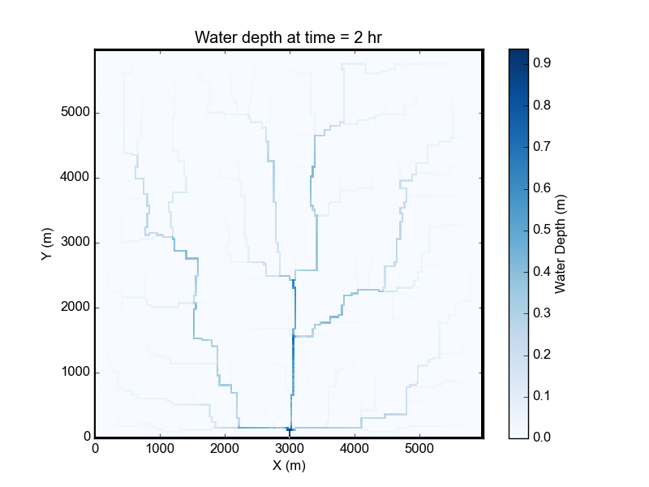

.. _overland_flow_manual:

===================================
Overland Flow Component User Manual
===================================

Background on OverlandFlow component
------------------------------------

The Landlab OverlandFlow component implements a 2-D solution of the shallow water equations, following the algorithm of de Almeida et al., (2012). In this component, an explicit solution simulates a flood wave moving across a gridded terrain, capturing hydrodynamics throughout the system. At each point within the grid, surface water discharge is calculated based on physical properties. This component expands the hydrologic capabilities of Landlab by offering a nonsteady flow routing method as an alternative to the steady-state flow routing regimes found in many geomorphic or landscape evolution models
(such as the Landlab :py:class:`FlowAccumulator<landlab.components.flow_accum.FlowAccumulator>` component).


This User Manual describes how to instantiate, parameterize and plot data using the OverlandFlow component, using an example described in Adams et al., (in press, *Geoscientific Model Development*). For further information about the derivation of the algorithm used in this component, see: Bates et al., (2010) and de Almeida et al., (2012).

**Note**: Currently, the OverlandFlow component can only operate on a structured grid, and so all references to the grid below are specifically referring to the Landlab RasterModelGrid module.

*Prerequisites*: A working knowledge of the Python programming language (any version) and familiarity with the Python libraries NumPy and Matplotlib. A basic understanding of the Landlab modeling framework (Hobley et al., 2017) is also recommended.

Model parameters and variables
------------------------------

**Input parameters**

Parameters listed here are easily tuned by the model user. For a complete list, see
:py:mod:`here<landlab.components.overland_flow>`.

- **Alpha** : Weight on the adaptive time step, ranging between 0.2 - 0.7. For more information, see Hunter et al., (2005).
- **Manning's n** : An empirical value describing surface roughness. See Chow (1959).
- **Theta** : A weighting factor in the de Almeida et al., (2012) equation, suggested value between 0.8 and 0.9

**Model variables**

Variables listed here are updated by the component at the grid locations listed.

- **surface_water__discharge**, *link*, [m^2 s^-1] : At each link in grid, *surface_water__discharge* is calculated using the de Almeida et al., (2012) equation. Discharge is a function of the water depth, adaptive time step, surface water slope and Manning's roughness coefficient.
- **surface_water__depth**, *node*, [m] : At each node in the grid, *surface_water__depth* is updated using the *surface_water__discharge* on links connected to a given node.

Basic steps of an OverlandFlow model
------------------------------------

1. **Import the necessary libraries**: ``OverlandFlow`` is required. Optional libraries include the ``SinkFiller`` component, the Landlab plotting method ``imshow__grid``. Additional packages mentioned here include ``matplotlib.pyplot`` and ``numpy``.
2. **Defining the model domain**: The computational domain of an OverlandFlow model can only work on RasterModelGrid instances as of Landlab version 1.0.0.
3. **Setting the boundary conditions**: If a clipped watershed digital elevation model (DEM) from ArcGIS is imported in ASCII format, the method ``set_watershed_boundary_condition()`` can be used. Alternatively, ``fixed_link`` boundary conditions can be used for discharge inputs on links. Other boundary condition scenarios can be accommodated by setting individual nodes or edges of the grid using Landlab boundary condition handling.
4. **Pre-processing the DEM**: This step is *optional*. If a watershed DEM is used, ArcGIS "D8" pit-filling will not create a continuous network for the "D4" ``OverlandFlow`` algorithm. The ``SinkFiller`` component can pit fill for a "D4" network.
5. **Initializing the OverlandFlow component**: The instance of the ``OverlandFlow`` class is declared, and parameters are set by the user.
6. **Determining precipitation inputs**: A constant precipitation rate can be passed to the ``OverlandFlow`` class, where precipitation persists for the entire model run. Alternatively, a single event can be set within the time loop, and then water can drain from the system when the precipitation event is over.
7. **Time loop**: The main ``OverlandFlow`` methods are called, and grid variables are updated through time. Data can be saved for plotting or later analysis.

Step 1. Import the necessary libraries
``````````````````````````````````````

To build an OverlandFlow model, first the necessary Landlab components and utilities, as well as any necessary Python packages must be imported. Standard Python style dictates all import statements belong in the top of the driver file, after the module docstrings. In this simple example, the OverlandFlow model driver begins as follows:

.. code-block:: python

    """overland_flow_driver.py

    OverlandFlow component example, initializing a 36 km^2 square watershed with a
    grid resolution of 30 m, from an ESRI ASCII file, simulating a 5 mm/hr rainfall
    intensity over 2 hours, the standard storm example from Adams et al.,
    in prep for Geoscientific Model Development

    Written by Jordan Adams, August 2016
    """

    ## Landlab components
    from landlab.components import OverlandFlow, SinkFiller  # SinkFiller is optional

    ## Landlab utilities
    from landlab.io import read_esri_ascii  # OR from landlab import RasterModelGrid
    from landlab.plot import imshow_grid  # plotter functions are optional

    ## Additional Python packages
    import numpy as np
    from matplotlib import pyplot as plt  # plotter functions are optional

To run the test case presented here, two components are needed. First is the required ``OverlandFlow`` component, which will be used to calculate surface water discharge and surface water depth across the model grid. Also presented here is the ``SinkFiller`` component, which can be used optionally to pre-process the DEM. The ``SinkFiller`` component is described in more detail in **Step 4** of this Users Manual.

To create a model domain, a Landlab RasterModelGrid instance must be initialized. In this example, the Landlab input/output suite of tools is used to read in a DEM that is formatted as an ESRI ASCII file ``read_esri_ascii``). Alternatively, a model domain can be manually created by the user. Both of these methods are described in detail in **Step 2** of this Users Manual.

Other Landlab utilities used in this example are the plotting library ``imshow_grid``, which is a utility that can plot a Landlab grid instance and data field in map view, as described in the **Plotting and visualization** section in this Users Manual.

Finally, additional Python packages are imported. In this example, both packages are dependencies of Landlab, which means they are required for Landlab installation and as such, should already be present on the user's machine. The scientific computing library NumPy is used for mathematical operations, and the matplotlib library is used for plotting model output.

Step 2. Defining the model domain
`````````````````````````````````

As previously stated, the algorithm used in the OverlandFlow component was derived to work on remotely-sensed data and, as such, only works on the RasterModelGrid instance in Landlab (e.g. Bates et al., 2010, de Almeida et al., 2012). Shown here is an example of a Landlab raster grid:



**Figure** 1: Example of a Landlab RasterModelGrid instance. Each RasterModelGrid is composed of 3 core elements: nodes, which are points in (x, y) space; cells, a polygon with an area around a node; and links, ordered lines which connect neighboring pairs of node that store directionality.

There are two ways to implement a RasterModelGrid that work with Landlab: reading in remotely-sensed data from a DEM with ``read_esri_ascii()``, or manually setting a generic structured grid using the RasterModelGrid library. Both of these methods are described in detail below.

Reading in a watershed DEM
..........................

Landlab can easily interact with DEM data output by ESRI's ArcGIS software. In this example, the DEM 'Square_TestBasin.asc' represents a single watershed. Reading in the data takes two lines of code, outlined here:

.. code-block:: python

    watershed_dem = "Square_TestBasin.asc"
    (rmg, z) = read_esri_ascii(watershed_dem, name="topographic__elevation")

In this example, the watershed DEM is read in by the ``read_esri_ascii()`` method, and the elevation data from the DEM is automatically assigned to the Landlab data field ``topographic__elevation``, for use by the components.

Setting up a generic RasterModelGrid
....................................

The alternative to reading in a watershed DEM is to set the RasterModelGrid instance manually:

.. code-block:: python

    rmg = RasterModelGrid((number_of_node_rows, number_of_node_columns), dx)
    z = user_defined_elevation_data  # length of number_of_nodes
    rmg["node"]["topographic__elevation"] = z

This example assumes that the model users knows the following information: the number of grid rows (``number_of_grid_rows``), the number of grid columns (``number_of_grid_columns``), the grid resolution (``dx``) and some elevation data for each node. Here, the user must manually set the elevation data. When passing elevation data to the  ``topographic__elevation`` field, the length of ``user_defined_elevation_data`` **must** be equal to the number of nodes in the grid (which can be found using a command such as: ``rmg.number_of_nodes``.

Step 3. Setting the boundary conditions
```````````````````````````````````````

Landlab contains several methods which can set and update boundary conditions
at *node* and *link* grid elements. When modeling water flow across a grid, a
user needs to predetermine locations where water can and cannot flow. If a user
reads in a single watershed DEM, (as described in **Step 2**), there is a
utility within Landlab that can handle the specific boundary conditions needed
to control flow:

.. code-block:: python

    rmg.set_watershed_boundary_condition(z, nodata_values=-9999.0)

By definition, a watershed has only one outlet, or open boundary location,
and therefore all other nodes surrounding the watershed will be closed, or
no flux, boundaries.
The ``set_watershed_boundary_condition()`` method reads the gridded elevation
data, (``z``), identifies the watershed outlet and sets it to an open boundary
(identified by the grid attribute ``grid.BC_NODE_IS_FIXED_VALUE`` in Landlab).
An open boundary allows flux to leave the modeling domain.  Additionally, this
methods also identifies all NODATA nodes (given a default value of -9999) and
sets them to closed, or no flux, boundaries.

**Note**: As of Landlab version 1.0.0., this method only works on single
watersheds, and so assumes that the watershed has been clipped in ArcGIS and
has only one outlet point.

Other boundary condition options
................................

There are other options for boundary condition handling that are more
appropriate for non-DEM modeling domains. (For a complete review of boundary
condition handling in Landlab, review Hobley et al., in submission for
*Earth Surface Dynamics* or Landlab
:ref:`boundary <api.grid.grid_summary.bc>` condition documentation

Here, the ``FIXED_GRADIENT`` boundary condition is described. The
``set_nodata_nodes_to_fixed_gradient()`` method sets all NODATA nodes to
``FIXED_GRADIENT``, and all boundary links (links that connect core nodes
within the model domain to a fixed gradient nodes) are set to ``FIXED_LINK``
status. Then, boundary links can be updated with some input discharge value:

.. code-block:: python

    rmg.set_nodata_nodes_to_fixed_gradient(z)
    rmg.fixed_links = input_discharge_value

This boundary condition can be useful because of how the underlying algorithm in OverlandFlow (de Almeida et al., 2012) updates discharge at each time step. In this model, discharge is calculated as a function of the neighboring discharge values:



**Figure 2**: The algorithm from de Almeida et al., (2012) uses discharge information on neighboring links to calculate discharge. Fixed link boundary conditions allow the user to set discharge on links along the boundary, so that the interior discharges can be updated using those manually-set fluxes.

In this example, calculating discharge on q\ :sub:`x` requires discharge values q\ :sub:`x-1` and q\ :sub:`x+1`. If a link is along the boundary of the domain, the default value is 0. Fixed link boundary statuses allow the user to manually update the discharge value at a boundary link, to simulate some influx of water discharge into the model domain.

If the user desires, these fixed links can also be updated to contain flux value of their nearest interior neighbor. Following the earlier example, if discharge q\ :sub:`x-1` is at on a fixed boundary link, it can be updated to contain the value of its neighboring discharge q\ :sub:`x`. This is done exclusively in the OverlandFlow component. The user simply needs to call  ``default_fixed_links = True`` when initializing the ``OverlandFlow`` component, as described in **Step 5**. This method prevents flow from exiting the edge of the watershed onto NODATA nodes, and does not set an outlet node by default. If the user wants to set an outlet node to an open boundary, that must be done manually, not described here.

Step 4. Pre-processing the DEM (*Optional*)
```````````````````````````````````````````

When modeling surface flow across a DEM and the user wants to ensure all water drains out of the system (that is, water is not trapped in pits or holes on the DEM surface), there must be a continuous flow path. In many applications, flow is allowed to exit a node in 8 directions ('D8'): the cardinal directions (East, North, West, South) and the diagonal directions (Northeast, Northwest, Southwest, Southeast). However, this model restricts flow to only the cardinal directions ('D4'). To create a continuous flow network, GIS applications often include a pit-filling regime to remove divots in the DEM surface so water can exit the pit and travel to the outlet. In ArcGIS, this pit-filling regime operates in 'D8':



**Figure 3**: Comparison of 'D8' and 'D4' flow routing methods. The key difference: in 'D8' methods, flow can move diagonally out of a given node.

However, in Landlab version 1.0.0., the OverlandFlow component is limited to the 'D4' regime. If a watershed DEM has been processed in ArcGIS, the flow network most likely follows a 'D8' path. When using the OverlandFlow component on a 'D8' network, the flow path may not be continuous.

To address this discrepancy, the SinkFiller component in Landlab has been developed to accommodate both 'D8' or 'D4' pit-filling on a DEM. Running this component can take some time, particularly on large grids, so it is *optional* to run the OverlandFlow component. This component can be applied to our DEM in two lines of code, initializing the SinkFiller component and running the ``fill_pits()`` method:

.. code-block:: python

    sf = SinkFiller(rmg, routing="D4", apply_slope=True, fill_slope=1.0e-5)
    sf.fill_pits()


**Note**: For more information about the SinkFiller :py:class:`component <landlab.components.sink_fill.SinkFiller>`.

Step 5. Initializing the OverlandFlow component
```````````````````````````````````````````````

Most Landlab components are structured as a Python class. These classes are imported (as seen in **Step 1**) and then the user must create an instance of the class:

.. code-block:: python

    of = OverlandFlow(rmg, mannings_n=0.03, steep_slopes=True)

When the instance of the class is created, parameters are passed as keywords to the class. All Landlab components take a grid as their first argument. All subsequent keywords are parameters used to control model behavior. Each Landlab component has documentation which lists the parameters. The OverlandFlow documentation is linked in the **Model description** section above. The example script shown here includes  parameters *Manning's n*, which takes a numerical value, and the stability criterion ``steep_slopes`` flag, which is passed a Boolean (``True`` or ``False``) value. Details about the stability criterion are provided in the next subsection.

Stability criteria
..................

The OverlandFlow component is built off the de Almeida et al., (2012) algorithm for urban flood inundation, and is most stable in flat environments. Because of this, instabilities can arise when trying to apply the algorithm to steep landscapes. To adapt this model for use across a variety of terrains, stability criteria (following Coulthard et al., 2013) is implemented to using the ``steep_slopes`` flag. This method reduces flow discharge to keep flow subcritical according to the Froude number less than or equal to 1.0. For more information, see Adams et al., (in prep for *Geoscientific Model Development*).

Step 6. Precipitation inputs
````````````````````````````

Often, the user will want to route a precipitation event or a series of precipitation events across a watershed.There are two methods for setting precipitation parameters in the OverlandFlow component.

**Note**: At the moment, only uniform precipitation events have been tested using this component.

Constant precipitation input
............................

This is the simplest method, and is used when a constant precipitation intensity is routed for the entirety of a model run (model_run_time). In this example, rainfall__intensity (units [m s\ :sup:`-1`]) is passed when the OverlandFlow component is initialized (**Step 5**):

.. code-block:: python

    elapsed_time = 0.0
    model_run_time = 86400.0
    of = OverlandFlow(
        rmg, steep_slopes=True, rainfall_intensity=1.38889 * (10**-6)
    )  # m/s

Single storm event
..................

Alternatively, a user may decide to route an event where rainfall stops, and water drains from the system. The simplest case is a single storm event, presented here:

.. code-block:: python

    elapsed_time = 0.0
    model_run_time = 86400.0

    storm_duration = 7200.0
    rainfall_mmhr = 5.0

In this example, storm characteristics (duration and intensity) are set separately from the OverlandFlow component  initialization. These characteristics are used in a time loop within the model driver (seen in **Step 7**). While elapsed_time in a model is less than storm duration, the precipitation intensity is input across all nodes in the model domain. When the storm event ends, the precipitation intensity is reset to 0 [m s\ :sup:`-1`], allowing the water remaining in the system to drain out.

Step 7. Iterate through time
````````````````````````````

The key part of any Landlab model driver is the time loop, where components recalculate the processes, and update their necessary data values. In the OverlandFlow component, during a time loop, at each time step, surface water discharge and surface water depth are recalculated. A simple example of an OverlandFlow time loop is presented here:

.. code-block:: python

    while elapsed_time < model_run_time:
        of.dt = of.calc_time_step()  # Adaptive time step

        if elapsed_time < (storm_duration):
            of.rainfall_intensity = rainfall_mmhr * (2.777778 * 10**-7)
        else:
            of.rainfall_intensity = 0.0

        of.overland_flow()

        rmg.at_node["surface_water__discharge"] = of.discharge_mapper(
            of.q, convert_to_volume=True
        )

        elapsed_time += of.dt

This code snippet is described here:

- This OverlandFlow example loops through time as a ``while`` loop. After each time loop, ``elapsed_time`` is increased until it exceeds ``model_run_time``.

- An adaptive time step is recommended, and is calculated here at the start of each time loop. (See the next subsection for more information about the adaptive time step).

- Inside the time loop, there is a test to see if the ``elapsed_time`` is less than the ``storm_duration``. If so, the rainfall intensity property of OverlandFlow is updated to the rainfall intensity (here converted from [mm hr\ :sup:`-1` to [m s\ :sup:`-1`).

- If the ``elapsed_time`` is greater than the ``storm_duration``, the rainfall intensity parameter of the OverlandFlow component is reset to 0 [m s\ :sup:`-1`].

- After the rainfall intensity is set, the actual process method ``overland_flow()`` is called. This method calculate discharge as a function of the de Almeida et al., (2012) algorithm and updates the Landlab data fields for ``surface_water__discharge`` and ``surface_water__depth`` on links and nodes respectively.

- To translate the discharge values calculated on Landlab links to nodes, values on links (``of.q``) are summed and mapped to their node neighbors using the method ``of.discharge_mapper``. Using the ``convert_to_volume`` flag, these discharge values are converted from units of [m\ :sup:`2` s\ :sup:`-1`] to [m\ :sup:`3` s\ :sup:`-1`].

- At the end of each loop, ``elapsed_time`` is updated with the adaptive time step.

**Note**: If using the adaptive time step, it may be possible that both the storm duration and model run time may be exceeded if the calculated time step is too large. It is recommended the use add additional logic tests to ensure both the storm_duration and model_run_time are not exceeded. during the time loop.

Adaptive time step
..................

de Almeida et al., (2012) implement an adaptive time step to maintain model stability and computational efficiency. This adaptive time step follows Hunter et al., (2005). By default, the OverlandFlow component calculates this adaptive time step. It is listed explicitly the **Step 7** code for clarity. If that lines was removed from that code, the component would still call ``calc_time_step()`` every time the ``overland_flow()`` method is called.

Alternatively, an explicit time step can be passed to the ``overland_flow()`` method. However, this method cannot guarantee model stability. Numerical instability in the model can drive surface water depth 'checkerboarding' patterns. Additionally, water mass imbalances can be linked to model instability. If an explicit time step must be used, a small time step is recommended to maintain model stability.

**Note**: Model behavior can vary across different parameter space and grid resolution. Stability testing is always recommended.

Plotting and visualization
--------------------------

Hydrographs
```````````

Before time loop:
.................

To plot a hydrograph, the user simply needs to save the discharge value at a given link at each time step. This can be achieved using a Python list object. Before the time loop starts, the user initializes at least two loops, one to save the model time, and one to save the discharge value.

**Note**: Currently, this plotting solution assumes the user has identified a link to sample on. In this example, the active link connecting outlet node to its neighbor core node is selected. If, in other DEMs, more than one active link is identified on the outlet node, the link with the steepest topographic slope is recommended.

.. code-block:: python

    hydrograph_time = []
    discharge_at_outlet = []

During time loop:
.................

The OverlandFlow component calculates discharge in units of [m\ :sup:`2` s\ :sup:`-1`]. In this example (and in Adams et al., *in prep. for Geoscientific Model Development*), discharge is plotted as a volumetric flux. To convert the calculated discharge (*q*) to a volumetric discharge (*Q*), it can be multiplied by the fact width, or grid resolution (*dx*) of the model grid. Similarly, time is converted from units of seconds (*s*) to hours (*hr*)

.. code-block:: python

    hydrograph_time.append(elapsed_time / 3600.0)  # convert seconds to hours
    discharge_at_outlet.append(
        np.abs(of.q[outlet_link]) * rmg.dx
    )  # append discharge in m^3/s

After model run:
................

Once the model is done running, the hydrograph can be plotted using the matplotlib library. This is a simple example, for more customization options, we recommend the matplotlib documentation_.

.. _documentation: https://matplotlib.org//api/pyplot_api.html

.. code-block:: python

    plt.plot(hydrograph_time, discharge_at_outlet)
    plt.ylabel("Time (hr)")
    plt.xlabel("Discharge, (cms)")
    plt.title("Outlet Hydrograph, Rainfall: 5 mm/hr in 2 hr")



**Figure 4**: Sample hydrograph from the test basin, after a storm with intensity of 5 mm/hr for a duration of 2 hr.

Water depth maps
````````````````

The Landlab plotting library includes a utility ``imshow__grid`` which can easily take a grid instance and plot data values from the grid in map view. This method also allows for customization of the plots. An example plotting water depth is shown here:

.. code-block:: python

    imshow_grid(
        rmg,
        "surface_water__depth",
        plot_name="Water depth at time = 2 hr",
        var_name="Water Depth",
        var_units="m",
        grid_units=("m", "m"),
        cmap="Blues",
    )



**Figure 5**: Map of water depths at time = 2 hr, for the sample storm on the square basin (5 mm/hr over duration of 2 hr).

In this example, the water depths are plotted after 2 hours of model run time
``model_run_time`` = 7200 s in **Step 6**). The method ``imshow__grid`` takes a
grid instance and data field by default. Optional methods displayed here
include plot title, color bar title (``var__name``), color bar units
(``var__units``), grid dimension units (``grid_units``), and
matplotlib color map (``cmap``).

**Note**: As of right now, ``imshow__grid`` plots data on nodes and cells.
If the user wants to plot data from link elements, a mapper from link to cell
or link to node must be used first. An extensive list of Landlab
:ref:`mapper <api.grid.grid_summary.mappers>` methods is available in the documentation.

References
----------

Adams, J. M., Gasparini, N. M., Hobley, D. E. J., Tucker, G. E., Hutton, E. W. H., Nudurupati, S. S. and Istanbulluoglu, E. (2017) The Landlab OverlandFlow component: a Python library for modeling the shallow water equations across watersheds, in press.

Bates, P. D., Horritt, M. S., & Fewtrell, T. J. (2010). A simple inertial formulation of the shallow water equations for efficient two-dimensional flood inundation modelling. *Journal of Hydrology*, 387(1), 33-45.

Chow, V.T., 1959, Open-channel hydraulics: New York, McGraw-Hill, 680 p.

Coulthard, T. J., Neal, J. C., Bates, P. D., Ramirez, J., Almeida, G. A., and Hancock, G. R. (2013). Integrating the LISFLOOD-FP 2D hydrodynamic model with the CAESAR model: implications for modelling landscape evolution. *Earth Surface Processes and Landforms*, 38(15), 1897-1906.

de Almeida, G. A., Bates, P., Freer, J. E., & Souvignet, M. (2012). Improving the stability of a simple formulation of the shallow water equations for 2‐D flood modeling. *Water Resources Research*, 48(5).

Hobley, D. E. J., Adams, J. M., Nudurupati, S. S., Gasparini, N. M.,  Hutton, E. W. H., Istanbulluoglu, E. and Tucker, G. E. (2017) Landlab: a new, open-source, modular, Python-based tool for modelling Earth surface dynamics. *Earth Surface Dynamics*, 5(1), 21–46.

Hunter, N. M., Horritt, M. S., Bates, P. D., Wilson, M. D., & Werner, M. G. (2005). An adaptive time step solution for raster-based storage cell modelling of floodplain inundation. *Advances in Water Resources*, 28(9), 975-991.
