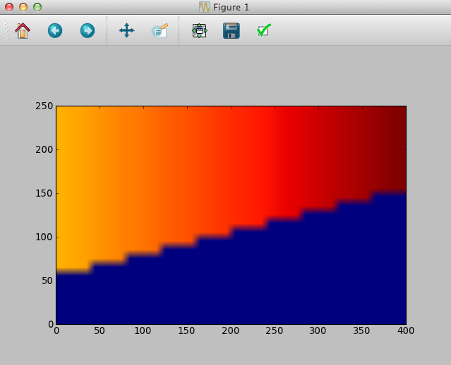
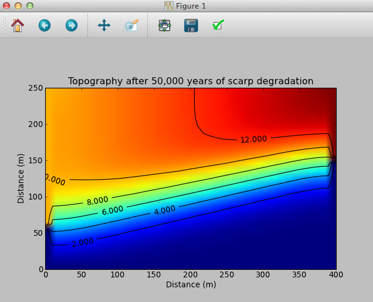
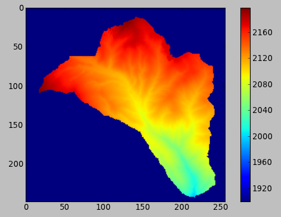

A Quick Tutorial Introduction to Landlab
========================================

(Written by Greg Tucker, December 2013)

Landlab is a Python software package that supports numerical modeling in earth science, and especially those fields that deal with earth-surface dynamics, including geomorphology, hydrology, glaciology, stratigraphy, and related areas. Landlab provides four main resources and capabilities:

(1) A library of *code resources* for building two-dimensional numerical models from scratch. The Landlab library includes a powerful "gridding engine" for creating, managing, and iteratively updating data on structured or unstructured grids. The library also includes support for input and output, including input of digital elevation models (DEMs) in ArcInfo ASCII format, handling of parameter inputs using formatted text files, and netCDF-format input and output.

(2) A set of pre-built *components*, each of which implements a numerical representation of a particular process.

(3) A *framework for building models* by assembling and linking process components.

(4) A *library of models* that have already been created from component(s).

This guide provides a quick tour of some of Landlab's main features and capabilities. Each of the sections below also provides references to additional documentation, where interested users and developers can learn more.

Using Landlab to Quickly Build 2D Models
----------------------------------------

Computer models can be tremendously useful in exploring and visualizing the consequences of scientific hypotheses, and comparing these predictions with data. New ideas and discoveries require new models. In an ideal world, the necessary programming, testing, and debugging would be trivial, leaving us free to focus on the core science. In practice, however, high-quality scientific programming takes time. Landlab was written to make the process of writing models more efficient, by providing pre-built software that handles many of the common tasks, and by providing pre-built process components that save you from having to re-invent the wheel.

The following tutorial examples give a flavor for what this means. The tutorial examples in this Quick Start guide can be typed directly on the command line of any Python interpreter. To try them out, you'll need (1) an installation of Python 2.x, (2) the Numpy, Scipy, and Pylab modules, and (3) Landlab. If you don't already have Numpy and its relatives installed, we recommend  Enthought Canopy (which provides a command-line interpreter, development environment, and the Numpy, Scipy, and Pylab modules all in one convenient package). To install Landlab, see :ref:`install`.

In the first example, we will build a 2D model of the erosional degradation of a fault scarp. Note that ``>>>`` implies that we are on the command line in canopy, or your favorite python frontend.  We start by importing Numpy and Landlab's RasterModelGrid class:

>>> import numpy
>>> from landlab import RasterModelGrid

Next, we create a new raster grid with 40 columns, 25 rows, and a cell spacing of 10 m:

>>> mg = RasterModelGrid(25, 40, 10.0)

This line creates a *grid object*, ``mg``. For this application, we want values of elevation, ``z``, tied to each grid node. We can create such an array by calling the grid's ``add_zeros`` method: 

>>> z = mg.add_zeros('node', 'elevation')

``add_zeros`` is one of many *methods* that belong to the grid object. As those familiar with object-oriented programming will recognize, a method is a function (a.k.a., subroutine) that is attached to a particular *class*, in this case the ``RasterModelGrid`` class. Here, the ``add_zeros`` method creates and returns a Numpy array of floating-point numbers whose length is equal to the number of nodes in the grid. We can test this by finding the length of the array:

>>> len(z)
1000

As the name suggests, the value of each element in the array is initially zero. Let's create a fault scarp running diagonally across the domain by uplifting some of the grid nodes. To do this, we'll first create an array to represent the *y*-coordinate of the fault trace:

>>> fault_y = 50.0 + 0.25*mg.node_x

Here ``node_x`` is a Numpy array containing the *x*-coordinate of each node.

Now, we uplift the portion of the domain where ``y > fault_y``. We'll have this co-seismic uplift increase somewhat to the right:

>>> upthrown_nodes = numpy.where(mg.node_y>fault_y)
>>> z[upthrown_nodes] += 10.0 + 0.01*mg.node_x[upthrown_nodes]

The Numpy ``where`` function finds and returns the array indices where the condition ``mg.node_y > fault_y`` is true; the resulting array ``upthrown_nodes`` contains the indices of the nodes whose elevation we want to raise. We then raise these elevations on the next line. Let's see what this looks like:
 
>>> zr = mg.node_vector_to_raster(z)

This returns a version of ``z`` that has been converted into a 2D Numpy array. Then we display it using the Pylab function ``imshow``:

>>> import pylab
>>> pylab.imshow(zr, cmap=pylab.cm.jet, extent=[0, 400, 0, 250], origin='lower')
>>> pylab.show()

The result looks like this:

Now we'll apply a diffusion model to calculate the degradation of the fault scarp. Start by defining a diffusion coefficient, ``kd``, and a time-step size:

>>> kd = 0.01   # 0.01 m2 per year
>>> dt = 0.2*mg.dx*mg.dx/kd   # CFL condition
>>> dt
2000.0

For boundary conditions, we'll have fixed elevation values along the top and bottom sides, while the right and left sides will be no-flux boundaries. By default, all the grid edges are open boundary nodes, meaning that they are treated as fixed-elevation boundaries. To turn the right and left sides into no-flux boundaries, we use the ``set_closed_boundaries_at_grid_edges`` method:

>>> mg.set_closed_boundaries_at_grid_edges(False, True, False, True)

This method allows you to specify whether each of the four grid edges---counter-clockwise from the bottom---should be *closed*, meaning that it is in effect a no-flux boundary.

We'll also need the ID numbers of those nodes that lie in the core of the grid, because these are the ones whose elevations we will want to iteratively update:

>>> interior_nodes = mg.get_core_nodes()

This returns an array containing the ID numbers of all the core nodes (of which there are (25-2) x (40-2) = 874).

Next, we'll run 50,000 years (25 time steps) of scarp degradation. Here is our loop:

>>> for i in range(25):
... 	g = mg.calculate_gradients_at_active_links(z)
... 	qs = -kd*g
... 	dqsdx = mg.calculate_flux_divergence_at_nodes(qs)
... 	dzdt = -dqsdx
... 	z[interior_nodes] += dzdt[interior_nodes]*dt
    	
Our algorithm starts by calculating gradients at each of the *active links*, which are those that either connect two core nodes, or connect a core node with an open boundary node (top and bottom edges in this example). We then calculate the sediment fluxes associated with these links by using the transport law :math:`q_s = -k_d \nabla z`, where :math:`\nabla z` is the link gradient and :math:`q_s` is the flux per unit width along the link. Note that each link has a direction: it connects a *from node* to a *to node*. The sediment flux is positive when it runs in the same direction as the link, and negative otherwise.

The next step is to add up the net sediment fluxes entering and leaving each cell in the grid. This is handled by a call to the grid's ``calculate_flux_divergence_at_nodes`` method. The result is the net volumetric sediment outflux per unit area for each node, which is our :math:`\nabla q_s`. The conservation of mass law says 

.. math::

	\frac{\partial z}{\partial t} = -\nabla q_s
	
We do this operation on the next line. Finally, on the last line of the loop we calculate elevation changes (by multiplying ``dzdt`` by time-step size) and update the elevations of the interior nodes.

The following commands show a contoured image of the terrain after 50,000 years of hillslope diffusion:

>>> zr = mg.node_vector_to_raster(z)
>>> pylab.imshow(zr, extent=[0,400,0,250], origin='lower')
>>> cs=pylab.contour(zr, extent=[0,400,0,250], hold='on', colors='k')
>>> pylab.clabel(cs)
>>> pylab.xlabel('Distance (m)')
>>> pylab.ylabel('Distance (m)')
>>> pylab.title('Topography after 50,000 years of scarp degradation')
>>> pylab.show()

Here is the resulting image:

For more information about using the ModelGrid module, see *The ModelGrid Guide* (:download:`download pdf <model_grid_guide/model_grid_description_and_guide.pdf>`).

.. _landlab_tools_and_tricks:

Discovering Landlab's Tools and Tricks
--------------------------------------

Landlab provides several useful capabilities, such as formatted input and output. Here are a few examples.

These days, the netCDF file format has become something of a standard. For example, the open-source visualization packages ParaView and VisIt accept netCDF files. Landlab's ModelGrid package provides tools for reading and/or writing netCDF files. Currently, only raster data are supported, but we hope to add unstructured grid data soon. As an example, try writing the diffusion model's elevation field to a netCDF file:

>>> from landlab.io.netcdf import write_netcdf
>>> write_netcdf('degraded_scarp.nc', mg)

If we then import the data into ParaView, we get something like this:

.. image:: scarp_in_paraview.png
   :width: 600 px
   :align: center

Landlab also provides the ``ModelParameterDictionary`` module for reading data in from a formatted text file, such as the following::

	# Comments are preceded by hash marks
	MANNINGS_N: each parameter has a tag line, followed by a value on the next line
	0.03
	PI: by convention, the tags themselves are given in all caps
	3.14159265
	# The next parameter is an integer
	NUMBER_OF_TIME_STEPS
	1000
	# We can do strings too
	NAME_OF_RUN
	my_experiment
	# Boolean values can be used for "on/off" switches
	OPT_NONLINEAR_DIFFUSION
	True
	# Values separated by commas are read in as Numpy arrays
	MEDIAN_GRAIN_SIZES
	0.016, 0.008, 0.004, 0.002, 0.001
	
Code to read this file (which we imagine is called 'my_inputs.txt') might look like the following. Note that when data are read from a file, the result is a Python dictionary. This means that you can access the parameters through their keys, as shown below:

>>> from landlab import ModelParameterDictionary
>>> params = ModelParameterDictionary(from_file='my_inputs.txt')
>>> n = params['MANNINGS_N']
>>> run_name = params['NAME_OF_RUN']

Using `ModelParameterDictionary` together with formatted input files provides an easy way to separate your model code from its parameters, so that you don't need to hard code parameter values.

Landlab also has the ability to read digital elevation models (DEMs) in the ascii format used by ArcGIS. The code below shows how to use this feature by reading a DEM file called ``HalfFork.asc``:

>>> from landlab.io import read_esri_ascii
>>> import numpy, pylab
>>> (grid, elevs) = read_esri_ascii('HalfFork.asc')
>>> elevs[numpy.where(elevs<0.0)] = 1900.0  # Raise elevs of NODATA cells for plotting
>>> elev_rast = grid.node_vector_to_raster(elevs)
>>> pylab.imshow(elev_rast)
>>> pylab.colorbar()

The function ``read_esri_ascii`` creates a ``RasterModelGrid`` of the correct dimensions and cell spacing, and also creates an array of node elevation values. Both are returned (as a two-element Python tuple). The Half Fork DEM is shown below:

Running Landlab Models
----------------------

(coming soon!)

Building Models with Landlab Components
---------------------------------------

(coming soon!)

Where to Learn More
-------------------

(coming soon!)

