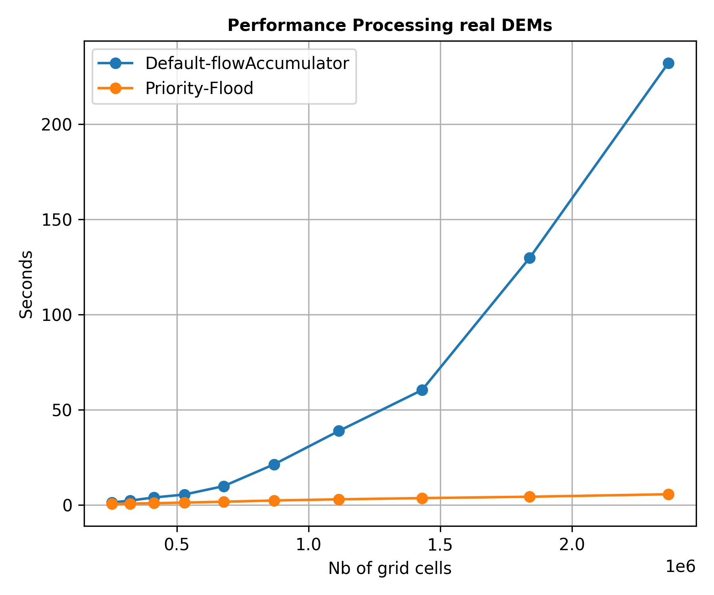
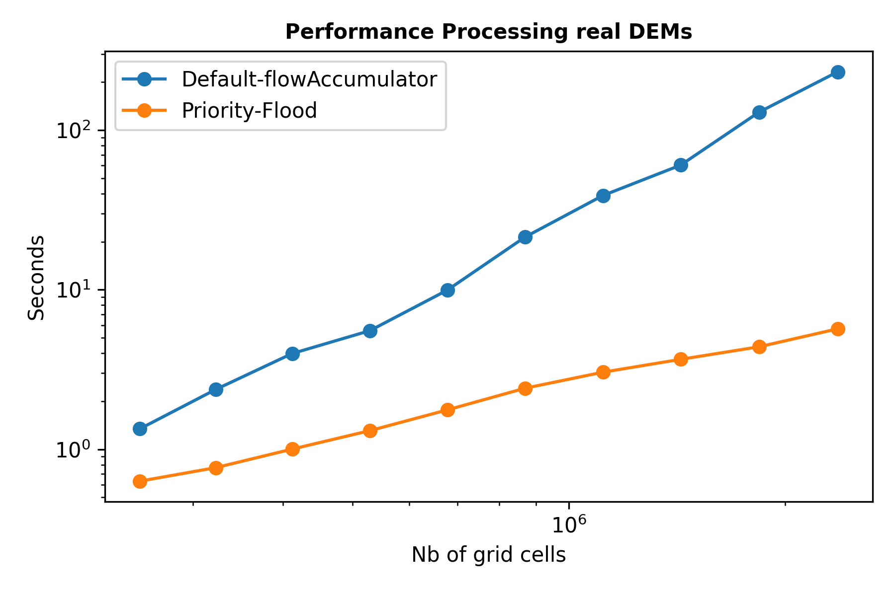
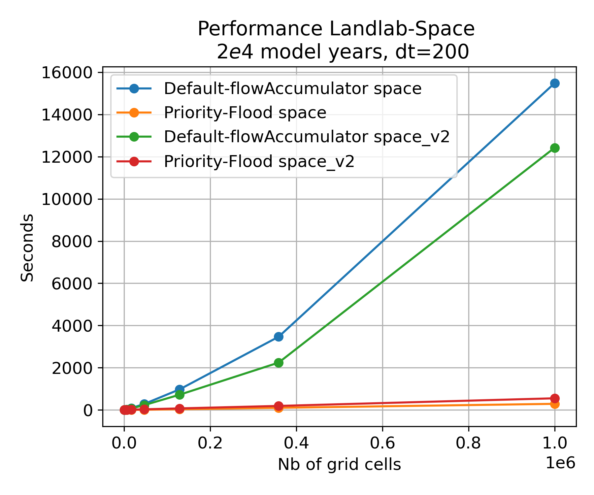
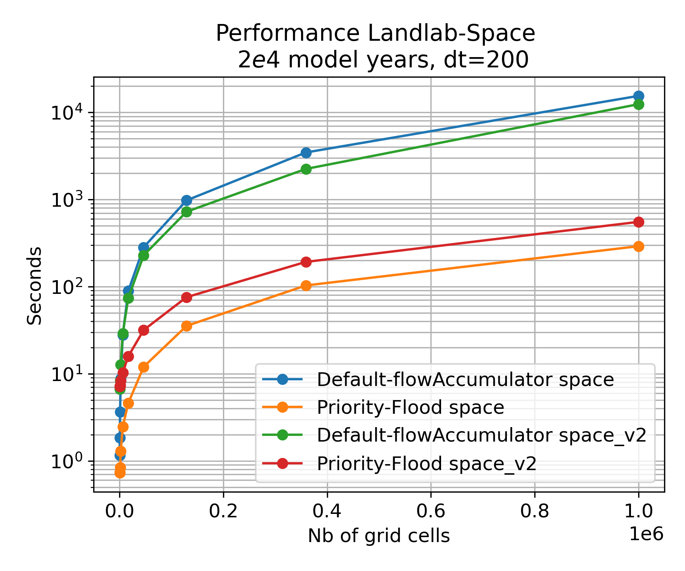

## Introduction

Earth's surface is shaped by processes that mediate the interplay between climate, tectonics and life. Understanding the interplay among Earth's surface processes  relies on geo-spatial software tools that can process topographical datasets over large spatial and temporal domains. Despite the large potential of geo-spatial software to understand Earth surface response to environmental change, applications of current generation LEMs are often hampered by limited model efficiency.

## The Landlab toolkit and terrainbento package

A commonly used geo-spatial software environment to analyze and simulate a wide range of Earth surface processes is ``Landlab``. ``Landlab`` is an open source Python package was originally designed to simplify the development of numerical Earth surface dynamic models  [@Hobley2017Creative, @barnhart2020landlab].  Recently, the ``terrainbento`` package was developed on top of the Landlab Toolkit as package for multi-model analysis in Earth surface dynamics to streamline the development of numerical Landscape Evolution Models depending on a wide variety of ``Landlab`` components [@barnhart2019terrainbento]. One specific kind of LEM is the Stream Power with Alluvium Conservation and Entrainment model  [``SPACE``, @shobe2017space] which is a next generation LEM that simulates the evolution of topographical terrain through time and explicitly simulates interactions between fluvial sediment dynamics and bedrock incision. Thanks to the modular framework of ``Landlab`` in which different process components can be combined, the ``Landlab`` software is currently used for geo-spatial applications that go beyond the numerical simulation of Earth's surface including susceptibility analysis of natural hazards [strauch2018hydroclimatological] and morphologic analysis [].

## The problem: efficiency constraints  

Key to many applications of the ``Landlab`` software and all numerical model combinations facilitated by ``Terrainbento`` is the routing of water over digital terrain to extract hydrological properties. However, flow routing calculations currently supported by Landlab heavily depend on memory availability (RAM) strongly hampering Landlab's performance  when dealing with large digital elevation models (DEMs). This limits the applicability of Landlab as a tool to build Landscape Evolution Models simulating large spatial terrain over geological timescales and hampers the potential of Landlab as a tool to process and analyze large topographical datasets. Moreover, the current version of the ``SPACE`` model is sensitive to numerical instabilities arising from the interaction between sediment dynamics and erosion. This requires relatively small timescales  (ca. 10-20 years) for the model to remain stable further limiting the large scale applicability of currently existing LEMs build using the ``Landlab`` toolkit.  

## Goal: efficient large-scale computation of hydrologic properties

This contribution describes two Landlab components (``FlowDirAccPf`` and ``Space_v2`` ) and a Terrainbento  model (``Basic_PFSa``) that facilitate efficient large-scale analysis of digital elevation models and provide efficient alternatives for large scale mass conservative Landscape Evolution Modeling.

### The ``FlowDirAccPf`` component

``FlowDirAccPf`` is a new ``Landlab`` component that provides an alternative and efficient approach to fill or breach Digital Elevation Models (DEMs), calculate flow directions and update flow accumulations. The component is restricted to structured grids and contains a wrapper for the RichDEM python package [@barnes2016parallel,@barnes2017parallel]. [``RichDEM``](https://richdem.readthedocs.io/en/latest/intro.html) is a set of hydrologic analysis tools using parallel processing to handle large DEMs and calculate hydrologic properties. We integrate three functionalities of ``RichDEM`` in the ``FlowDirAccPf`` component.

1. Depression-filling and depression breaching

   Depression-filling/breaching are highly efficient in ``RichDEM`` due to the use of a linearly scaling parallel procedure [@barnes2016parallel] in combination with the efficient  Priority-Flood filling algorithm [@barnes2014priority].

2. Flow directions

   We wrote a wrapper to calculate all the flow [metrics](https://richdem.readthedocs.io/en/latest/flow_metrics.html) included in ``RichDEM`` on Landalb grids.

3. Flow accumulation

   We use the RichDem parallelized flow accumulator to calculate flow accumulation over a Landlab grid [@barnes2017parallel].

   FlowDirAccPf supports single and multiple flow directors. An instance of FlowDirAccPf can have both a single flow direction structure (e.g. to calculate fluvial metrics) and/or a multiple flow direction structure (e.g. to calculate hillslope metrics). The user can define whether the DEM needs to be filled/breached before calculating each of the flow direction and corresponding flow accumulation properties. In a typical landscape evolution model, it would suffice to only fill/breach the DEM once every time step and calculate both single and multiple flow directions on that filled DEM to save time and increase model performance. Links to ``FlowDirAccPf`` documentation and Jupyter Notebook tutorials are provided in the component [README](https://github.com/BCampforts/landlab/tree/master/landlab/components/flow_dir_acc_pf/README.md).

To test the performance of the ``FlowDirAccPf`` component, we performed a DEM filling, calculated flow directions and updated flow accumulation for DEMs of increasing size. This was done using both the default ``Landlab`` flow accumulator as well as the new Priority flood component (Figure 1).  Links to ``FlowDirAccPf`` documentation and a Jupyter Notebook tutorial that is part of the ``Landlab`` tutorials repository are provided in the component's [README](https://github.com/BCampforts/landlab/tree/master/landlab/components/flow_dir_acc_pf/README.md). ``FlowDirAccPf`` is  tested with tests that are part of the ``Landlab`` test repository.

### The ``Space_v2`` component

``Space_v2`` is an updated version of the original ``Space`` ``Landlab`` component [@shobe2017space]. Contrary to the original version, where sediment deposition was calculated after updating incision rates, we now update sediment deposition rates while updating erosion rates using an iterative procedure coded in Cython. This makes the code fully mass conservative and makes it more robust to larger times steps. Although a slight performance decrease can be noticed in comparison to the original code (Figure 2), increased model stability with larger time steps ultimately results in better performance when simulating Earth surface evolution over geological timescales (> 1 Myr).````Space_v2```` is  tested with tests that are part of the ``Landlab`` test repository.

### The ``Basic_PFSa`` ``terrainbento`` model

To facilitate future landscape evolution model development with the ``FlowDirAccPf`` and ``Space_v2`` components, we also created a new terrainbento model. A new base class (``priority_flood_model``) provides the basis to develop any future model combination that uses either the default Landlab flow directors/accumulator or the new ``FlowDirAccPf`` component to fill DEMs, calculate flow directions and update flow accumulation. To exemplify the use of the new flow director, we created a new derived terrainbento model called ``Basic_PFSa``. ``Basic_PFSa`` simulates fluvial incision and sediment dynamics with the original (Space_v1) or updated Space code (Space_v2). Figure 2 illustrates the performance of different flow routers when calculating Landscape Evolution for  ``Landlab`` grids with an increasing spatial extent. Details on the ``FlowDirAccPf`` are provided in a notebook that is part of the terrainbento notebook repository.

## Tutorials and Notebooks

### ``Landlab``

The ``Landlab`` project maintains a separate repository containing tutorials that introduce core concepts and the use of individual submodules. In addition to the
source code of the [``FlowDirAccPf``](https://github.com/BCampforts/landlab/tree/bc/priority_flood/landlab/components/flow_dir_acc_pf) and the [``Space_v2``](https://github.com/BCampforts/landlab/tree/bc/priority_flood/landlab/components/space_v2) components, a [Jupyter Notebook introducing the use of the new Priority Flow router to analyze hydrological properties of SRTM DEMs ](https://github.com/BCampforts/landlab/blob/bc/priority_flood/notebooks/tutorials/flow_direction_and_accumulation/PriorityFlood_realDEMs.ipynb) is now part of the Landlab tutorials repository. The tutorial also features a new ``Landlab`` plotting feature (``imshow_hs``) that allows plotting spatially explicit data draped over hillshade maps and builds on the recently released ``bmi_topography`` package to download DEMs of various extents. This tutorial was brought into the repository with [Pull Request # ...](). The first release version of the ``Landlab`` tutorials that includes these components and notebook is tagged as v1.5.4 and is archived in Zenodo with the linked DOI:[].

### ``Terrainbento``

The ``terrainbento`` project maintains a separate repository containing tutorials that introduce core concepts and the use of individual submodules. In addition to the [``priority_flood_model``](https://github.com/BCampforts/terrainbento/blob/BC/dev_PriorityFlood/terrainbento/base_class/priority_flood_model.py) and [``Basic_PFSa``](https://github.com/BCampforts/terrainbento/blob/BC/dev_PriorityFlood/terrainbento/derived_models/model_basicPF_Sa.py) source code, a [ [Jupyter Notebook introducing the use of the new Priority Flow when simulating Landscape Evolution using the SPACE model](https://github.com/BCampforts/terrainbento/blob/BC/dev_PriorityFlood/notebooks/different_flowRouters/PriorityFlood_vs_Landlab_flowDirector.ipynb) is now part of the Landlab tutorials repository. This tutorial was brought into the repository with [Pull Request # ...](). The first release version of the ``terrainbento`` tutorials that includes this software and notebook is tagged as v1.5.4 and is archived in Zenodo with the linked DOI:[].

## Figures

# 



**Figure 1**: Performance of of default flow accumulator versus Priority Flood flow accumulator for DEMs of increasing size



**Figure 2**: Performance of of default flow accumulator versus Priorirty Flood flow accumulator for the SPACE numerical landscape evolution model. Note that space_v2 is slightly slower which is due to the structure of the component that facilitates for for bigger timesteps


# Acknowledgements

The authors thank

# References
