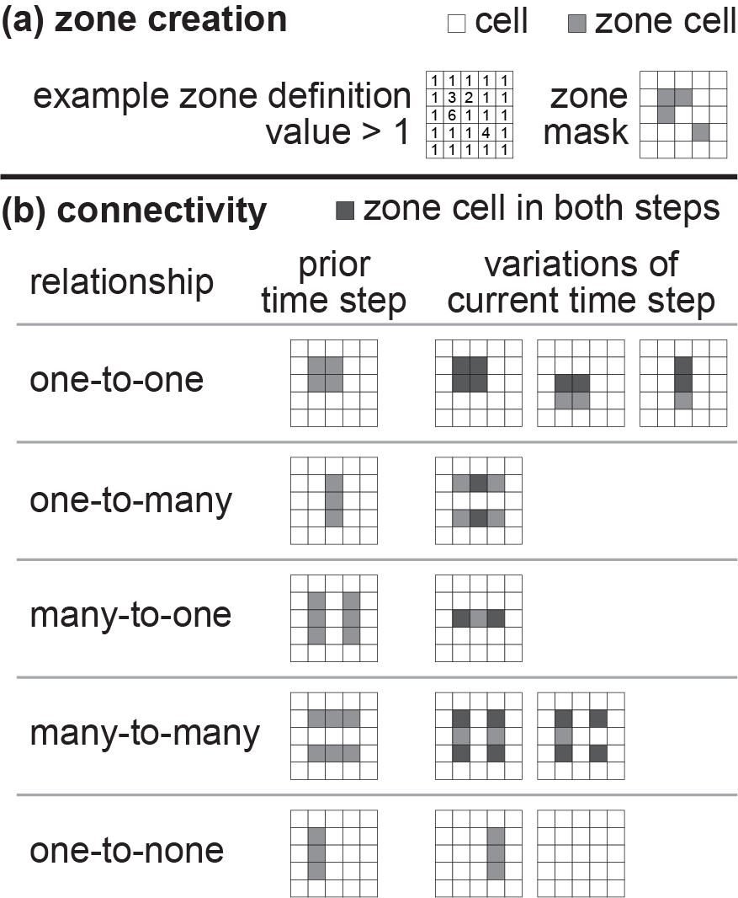

# Introduction and Statement of Need

The surface of the Earth and its biota evolve together. Climate and tectonics ultimately drive the physical and chemical surface processes that evolve landscape structure, including the connectivity of landscape portions that facilitate or impede movement of organismal populations [@Stanley:1979; @Antonelli:2018]. Impeded organismal movement reduces gene flow among populations and genetic diversity within populations, increasing the probability of species extinction [@Bohonak:1999]. Long-term geographic separation of populations (i.e., allopatry) is a mechanism of speciation as populations genetically diverge due to reproductive isolation [@Coyne:1992]. Speciation within the same area (i.e., sympatry) can emerge as subpopulations specialize in different resources, and along environmental gradients (e.g., in surface air temperature) where a continuum of reproductive isolation develops, among other proposed mechanisms [@Dieckmann:1999; @Doebeli:2003]. These macroevolutionary processes—dispersal, extinction, and speciation—determine regional biodiversity [@Taylor:1993].

Biodiversity is influenced by changes in landscape connectivity, nevertheless linking the evolution of a landscape with its biota is complicated by limited landform and genetic preservation, disparate timescales of surface and macroevolutionary processes, and landscape heterogeneity (e.g., species-dense assemblages, lithological variability), among numerous other factors. Discovery of surface dynamics has been aided by numerical landscape evolution models [@Tucker:2010]. These models act as digital laboratories where researchers can apply current theory to simulate complex surface dynamics while quantitatively exploring new ideas. Yet to be developed and widely shared is a modeling tool that integrates macroevolutionary processes with numerical representations of surface processes. Such a tool can help research communities overcome the complications of linking the evolution of life and landscapes.

We built ``SpeciesEvolver`` to simulate biotic evolution at geologic and macroevolutionary timescales. This software is adapted from SEAMLESS (Spatially Explicit Area Model of Landscape Evolution by SimulationS) that models organismal diversification in one-dimensional space [@Albert:2016]. ``SpeciesEvolver`` operates in two-dimensional landscapes, is built for extension, and is a component of the ``Landlab`` modeling toolkit.

``Landlab`` is an open source Python package that provides tools to build numerical models of surface dynamics [@Hobley:2017]. A landscape is represented by a model grid with configurable spatial dimensions. The surface processes components of ``Landlab`` drive change in landscape attributes (e.g., topographic elevation). The use of multiple components in a model effectively couples the processes because the processes work with the same grid and its landscape attributes. Building ``SpeciesEvolver`` into ``Landlab`` allows its users to build landscape-life evolution models to examine biological evolution alongside surface processes-driven landscape evolution.

# Software Extensibility

``SpeciesEvolver`` is adaptable to various modeling approaches and taxa, defined as a group of organisms (e.g., a population, species, or broader taxonomic level). The simulated taxa are implemented as classes with methods for macroevolutionary processes. The base class, ``Taxon`` provides abstract methods and properties that can be expanded or overridden. Software users can readily subclass ``Taxon`` designed for their model, including specialty properties (e.g., body size), behaviors (e.g., dispersal as a function of least cost paths), and taxon composition (e.g., composed of individual organisms).

The built-in implementation of taxon, ``ZoneTaxon`` evaluates macroevolutionary processes using a concept of landscape connectivity analyzed with ``Zone`` objects that manage the location of taxa in the model grid. The software user creates a function that returns the total extent of zones in the grid. Individual zones are automatically identified as the adjacent grid nodes within the total zone extent. In the example in Fig. 1a, zones are created where a grid variable—a variable selected by the user—is greater than 1. Two zones are created in this example because the nodes that meet this condition cluster in two discrete areas.

Landscape connectivity of ``ZoneTaxon`` is determined by the spatiotemporal relationships of zones. At a model time step, the relationship is determined for each zone. This relationship describes the spatial intersection of zones as ‘x-to-y’ where ‘x’ and ‘y’ are the descriptive counts of zones belonging to the intersection in the prior and current time steps, respectively. Zone connectivity relationships are illustrated in Fig. 1b. The relationships and their impact on ``ZoneTaxon`` objects are

* one-to-one: This relationship occurs where a zone in the prior time step either (a) precisely overlaps one zone in the current time step, (b) partially overlaps one zone in the current step, or (c) intersects one zone in the current step with a different shape and/or size. This relationship triggers only dispersal of the ``ZoneTaxon`` to the zone location updated in the current time step.
* one-to-many: A zone in the prior time step is overlapped by multiple zones in the current time step. The taxa in the prior step zone disperse across the multiple zones in the current step. Speciation is triggered following a duration set by the ``allopatric_wait_time`` parameter set for instances of ``ZoneTaxon``, as described in the documentation of this class.
* many-to-one: Multiple zones in the prior time step are overlapped by a zone in the current time step. Taxa extant across the multiple prior step zones exist within the same zone of the current step. By default, taxa in a zone do not affect each other, although predatory and resource-limited dynamics, for example, can be implemented in subclasses of ``ZoneTaxon``.
* many-to-many: Multiple zones in the prior step are overlapped by multiple zones in the current step. Zone counts in both the prior and current steps must be greater than one for the connectivity to be assigned this relationship. Zone counts in these steps do not need to be the same for the connectivity to be assigned this relationship. Taxa extant in prior step zones are relocated to current step zones. Speciation occurs following the ``allopatric_wait_time`` parameter set for the taxon.
* one-to-none: A zone in the prior step overlaps no zones in the current step. Taxa in the zone of the prior step become extinct as of the current time step.

@Lyons:2019 used the built-in taxon type, ``ZoneTaxon`` to investigate how changes in stream network connectivity impacted the diversity of simulated riverine species in this first application of ``SpeciesEvolver``. The species were populated to stream grid nodes and diversification emerged where stream connectivity changed. The flexibility of ``SpeciesEvolver`` with the growing library of surface processes in ``Landlab`` provides ample opportunities to discover links between landscapes and its biota. Links to ``SpeciesEvolver`` documentation and Jupyter Notebook tutorials are provided in the component [README](https://github.com/landlab/landlab/tree/master/landlab/components/species_evolution).

# Figures

# Acknowledgements

Reviewers Fiona Clubb and Evan Goldstein helped to improve this paper and code documentation.

# References
